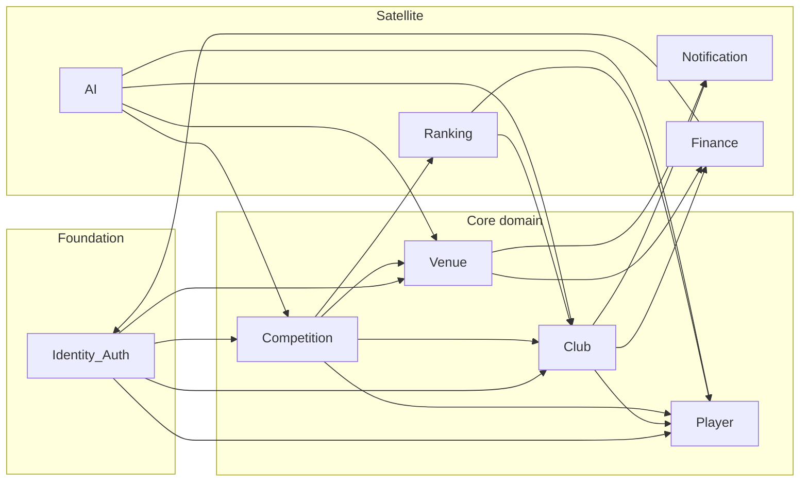
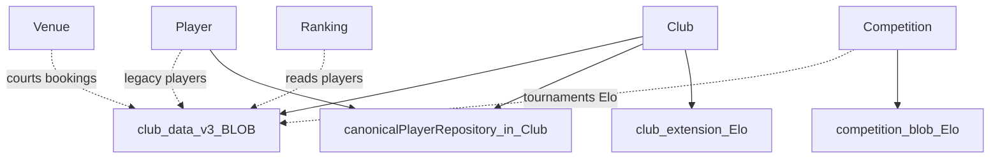

# Dependency Diagram — Club Phase 2A

**Status:** Architecture audit (documentation only)  
**Companion:** [EVENT_OWNERSHIP_MATRIX.md](./EVENT_OWNERSHIP_MATRIX.md), [READ_WRITE_OWNERSHIP.md](./READ_WRITE_OWNERSHIP.md), [CLUB_BOUNDARY_ANALYSIS.md](./CLUB_BOUNDARY_ANALYSIS.md)

---

## 1. Modules in scope

| Module | Home (approx.) |
|--------|----------------|
| **Club** | `src/features/club/` |
| **Player** | `src/features/player/` |
| **Competition** | `src/features/competition-core/` + tournament domain |
| **Venue** | `src/features/venue-court/`, `court-engine/` |
| **Notification** | `src/features/mobile` notifications (+ `features/notifications`) |
| **Finance** | `src/features/finance-ledger/`, `subscription/`, `payments/` |
| **Ranking** | `vpr-ranking`, season standings, Pick_VN rank surfaces |
| **AI** | `src/features/ai-assistant/` (+ scheduling AI core) |

Identity/Auth is assumed underneath all modules (edges omitted for clarity except where elevation matters).

---

## 2. Legend

```text
A ──► B   Allowed dependency: A may call B’s public API / read B’s SoT by contract
A ─x─► B  Forbidden: A must not own or write B’s SoT / must not deep-import internals
A ···► B  Current leak (exists today, should be removed)
A ═► B   Future target (desired)
```

---

## 3. Allowed dependency graph (target)



### Allowed edges (normative)

| From | To | Why |
|------|-----|-----|
| Club | Player | Resolve person for members / pickers |
| Club | Notification | Fan-out schedule/gov alerts via notification API |
| Club | Finance/Subscription | Read plan limits on create; do not own billing |
| Competition | Club | Read membership / roster eligibility; clubId scope |
| Competition | Player | Participant identity |
| Competition | Venue | Court assignment references |
| Competition | Ranking | Publish results for rank pipelines (by contract) |
| Venue | Finance | Bookings → debts/payments |
| Ranking | Player / Club | Read ids & membership; **no** Club writes |
| AI | Player / Club / Venue / Competition | Read-only advisory inputs |
| All | Identity | AuthZ / session |

---

## 4. Forbidden dependency graph

```mermaid
flowchart LR
  Player[Player] -.x.-> ClubWrite[Club_SoT_writes]
  Club[Club] -.x.-> PlayerSoT[Player_profile_SoT]
  Club -.x.-> CompSoT[Competition_engine_SoT]
  Club -.x.-> VenueSoT[Venue_courts_bookings_SoT]
  Club -.x.-> RankWrite[Ranking_writes]
  Venue[Venue] -.x.-> ClubGov[Club_governance_writes]
  Competition[Competition] -.x.-> ClubGov
  Notification[Notification] -.x.-> ClubSoT[Club_SoT]
  Finance[Finance] -.x.-> ClubSoT
  Ranking[Ranking] -.x.-> ClubSoT
  AI[AI] -.x.-> AnySoT[Any_domain_SoT_writes]
```

### Forbidden rules (normative)

| From | Must not |
|------|----------|
| Player | Write `club_members` / governance / create clubs as SoT owner |
| Club | Own person demographics SSOT; own court inventory/bookings; own tournament engine; write platform ranking |
| Venue | Assign club Owner/President or mutate membership |
| Competition | Mutate governance or membership edges |
| Notification | Become Club SoT or invent membership |
| Finance | Redefine membership or governance |
| Ranking | Write club entity or membership |
| AI | Persist domain SoT (membership, bookings, brackets) |

---

## 5. Current state vs target (leaks)



| Leak | Why forbidden long-term | Phase |
|------|-------------------------|-------|
| Many modules ↔ club blob | Shared mega-SoT | 2E / Venue & Competition tracks |
| `canonicalPlayerRepository` under Club | Player should own | 2E |
| Club tournament create in blob | Competition owns tournaments | 2E |
| Dual Elo writers | Single rating contract | 2E |
| Finance keyed only by `clubId` | Venue/tenant commerce | P3 backlog |
| Club UI styles from player pages | Layering inversion | P3 |

---

## 6. Future target architecture (simplified)

```text
                    ┌──────────── Identity ────────────┐
                    │  auth · RBAC · session · audit   │
                    └───────────────┬──────────────────┘
                                    │
          ┌─────────────────────────┼─────────────────────────┐
          ▼                         ▼                         ▼
     ┌─ Player ─┐            ┌── Club ──┐              ┌─ Venue ─┐
     │ person   │◄──reads────│ member   │──link───────►│ courts  │
     │ profile  │            │ govern   │              │ book    │
     └────▲─────┘            │ requests │              └────▲────┘
          │                  └────┬─────┘                   │
          │                       │ reads roster            │ courtId
          │                       ▼                         │
          │                  ┌─ Competition ─┐              │
          └──────────────────│ tournaments   │──────────────┘
                             │ teams / regs  │
                             └──────┬────────┘
                                    │ results
                    ┌───────────────┼───────────────┐
                    ▼               ▼               ▼
              ┌─ Ranking ─┐  ┌─ Notify ─┐   ┌─ Finance ─┐
              │ standings │  │ delivery │   │ plans/$$$ │
              └───────────┘  └──────────┘   └───────────┘

              ┌─ AI ─┐  read-only ports into Player/Club/Venue/Competition
              └───────┘
```

**Club’s public ports (target):**

- `getClub`, `listMembers`, `getActiveMembership`
- `assertMember(userId|playerId, clubId)`
- `onClubScheduleChanged` → Notification
- `getEligibleRoster(clubId)` for Competition
- **No** `saveCourts`, `saveTournamentEngine`, `writePlatformRank`

---

## 7. Dependency direction checklist

| Question | Answer |
|----------|--------|
| May Club import Player public API? | **Yes** (target) |
| May Player import Club membership API? | **Yes** (read membership references) |
| May Club import Competition internals? | **No** — only publish ports Competition calls |
| May Competition write Club membership? | **No** |
| May Venue write Club governance? | **No** |
| May Ranking read Club membership? | **Yes** |
| May Ranking write Club? | **No** |
| May AI write Club? | **No** |
| May Club call Notification API? | **Yes** |
| May Notification call Club writers? | **No** (may read recipients via Club read API) |
| May Finance define max clubs? | **Yes** (Subscription) — Club enforces at create |
| May Club post finance ledger? | **No** |

---

## 8. Flag-sensitive dependency reality

When `VITE_CLUB_STORAGE_V2=true` (Production target):

- Club SoT = cloud tables + RPCs  
- Allowed graph above applies  

When V2 off / offline:

- Local registry + extension act as pseudo-SoT  
- Treat as **dev/rollback only** — do not expand peer dependencies on these paths  

---

## 9. Implications

1. **Phase 2B** should publish the allow-list as the Club peer contract.  
2. **Phase 2E** removes blob and player-repo leaks that violate this diagram.  
3. New features (Invite, Captain/Coach) attach under **Club** only; **Committee is excluded** from Phase 2 and must not pull Venue/Competition SoT into Club.  
4. AI remains a **read-only satellite** relative to Club SoT.
