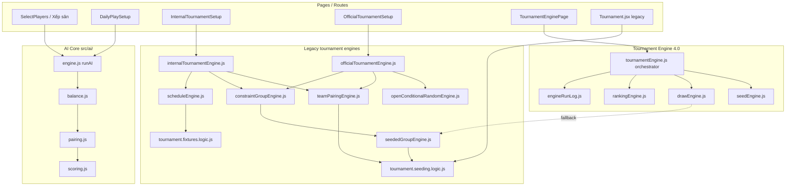
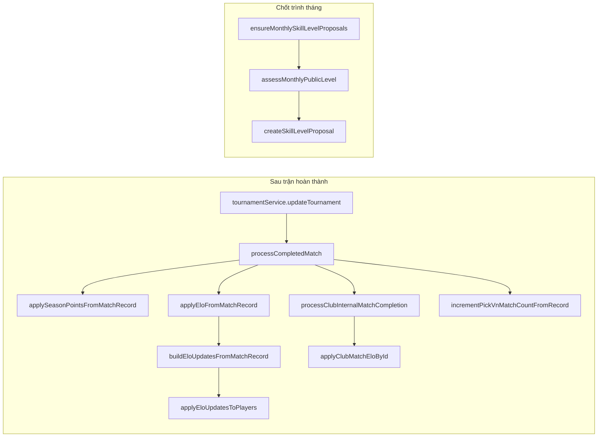

# CC-00 — Engine Call Graph

**Phase:** CC-00 | **Date:** 2026-07-11

Sơ đồ luồng gọi engine theo loại giải và route. Mũi tên = gọi trực tiếp hoặc qua service.

---

## 1. Tổng quan



---

## 2. Rating / Elo call graph



| Caller | Callee | Trigger |
|--------|--------|---------|
| `tournamentService.updateTournament` | `processCompletedMatchById` | `options.processMatchId` |
| `tournamentLifecycle.processCompletedMatch` | `applyEloFromMatchRecord` | leagueId + not daily + not club-only |
| `tournamentLifecycle.processCompletedMatch` | `processClubInternalMatchCompletion` | `type === club_internal` |
| `clubActivityService.createFriendlyClubMatch` | `applyClubMatchEloById` | `applyElo !== false` |
| `SkillLevelsPage` / app init | `ensureMonthlySkillLevelProposals` | UI load |
| `skillLevelChangeService` | manual approve/reject | user action |

---

## 3. Chi tiết theo engine

### 3.1 AI Core — Xếp sân & Daily Play

| Function | Defined | Called from |
|----------|---------|-------------|
| `runAI` | `src/ai/engine.js` | `SelectPlayers.jsx`, `dailyPlayEngine.createFairDailyMatches`, tests |
| `runBalanceEngine` | `src/ai/balance.js` | `engine.js` |
| `runPairingEngine` | `src/ai/pairing.js` | `engine.js` |
| `calculatePairScore` | `src/ai/scoring.js` | `pairing.js`, tests |
| `runWaitingEngine` | `src/ai/waiting.js` | `engine.js` |
| `runHistoryEngine` | `src/ai/history.js` | `engine.js` |

**Input:** players[], enabledCourts[], context (history, rules, policies, competition)  
**Output:** courts[] with teamA/teamB, scores, waiting[]  
**DB:** `commitScheduleResult` → localStorage AI blob nếu `persist: true`  
**Rating:** không cập nhật

---

### 3.2 Team formation

| Function | Defined | Called from |
|----------|---------|-------------|
| `createTeamsFromPlayers` | `tournament.seeding.logic.js` | `teamPairingEngine`, `Tournament.jsx`, tests |
| `createMixedPairsFromPlayers` | `teamPairingEngine.js` | mixed double |
| `suggestEntriesFromPlayers` | `teamPairingEngine.js` | internal/official setup, tests |
| `optimizeTeamsWithConstraints` | `constraintPairingEngine.js` | `suggestTeamsFromPlayers` |

**Input:** players[], eventType, mode, pairingConstraints  
**Output:** entries[] with seed, rating  
**Rating:** reads `player.rating/level`, không write

---

### 3.3 Draw / chia bảng

| Function | Defined | Called from |
|----------|---------|-------------|
| `seedTeamsIntoGroups` | `tournament.seeding.logic.js` | `seededGroupEngine`, animation, legacy UI |
| `assignEntriesToGroupsSnake` | `seededGroupEngine.js` | internal plan, drawEngine fallback, tests |
| `assignEntriesOpenConditional` | `openConditionalRandomEngine.js` | `buildOfficialOpenPlan` |
| `assignGroupsWithConstraints` | `constraintGroupEngine.js` | internal + AI balance official |
| `generateDraw` | `drawEngine.js` | TE 4.0 orchestrator, AI group suggestion |
| `buildSnakeGroupsFromSortedTeams` | `teamGroupSeedEngine.js` | team tournament auto draw |

---

### 3.4 Match schedule (round robin)

| Function | Defined | Called from |
|----------|---------|-------------|
| `buildRoundRobinRounds` | `tournament.fixtures.logic.js` | `scheduleEngine`, animation |
| `buildGroupStageSchedule` | `scheduleEngine.js` | internal/official engines |

---

### 3.5 Standings

| Function | Defined | Called from |
|----------|---------|-------------|
| `buildGroupStandingFromMatches` | `tournament/engines/rankingEngine.js` | legacy bracket, TE 4.0 ranking |
| `buildAllGroupStandings` | same | `bracketEngine.js` |
| `computeRankings` | `features/tournament-engine/engines/rankingEngine.js` | TE orchestrator |
| `computeTeamStandings` | `teamStandingsEngine.js` | team tournament UI |

---

## 4. Route → engine matrix

| Route | Tournament mode | Draw engine | Team engine | Matchmaking | Elo on complete |
|-------|-----------------|-------------|-------------|-------------|-----------------|
| `/select-players` | session | — | — | AI Core | No |
| `/tournament/daily/:id` | daily_play | — | — | AI Core | **No** (explicit skip) |
| `/tournament/internal/:id` | internal_tournament | constraintGroup → snake | teamPairing | round robin | Yes if leagueId; club Elo if club_internal |
| `/tournament/official/:id` open | official_open | openConditional | manual entries | round robin | Yes if leagueId |
| `/tournament/official/:id` AI | official_ai_balance | constraintGroup | teamPairing skill | round robin | Yes if leagueId |
| `/tournaments/:id/engine` | any (TE UI) | generateDraw | generateSeed | generateSchedule | Via match update path |
| `/tournament/team/:id` | team_tournament | teamGroupSeedEngine | roster | team round robin | Team standings only |
| `/pages/Tournament.jsx` | demo | seedTeamsIntoGroups | createTeamsFromPlayers | fixtures | No |

---

## 5. Tournament Engine 4.0 orchestrator

File: `src/features/tournament-engine/orchestrator/tournamentEngine.js`

| Export | Engine | Persists run |
|--------|--------|--------------|
| `runSeedEngine` | `generateSeed` | `appendEngineRun` |
| `runDrawEngine` | `generateDraw` | yes |
| `runScheduleEngine` | schedule | yes |
| `runCourtEngine` | court assign | yes |
| `runTimeEngine` | time prediction | yes |
| `runRankingEngine` | `computeRankings` | yes |
| `runFullPlan` | chained | yes |

**UI:** `TournamentEnginePage` → tabs Seed / Draw / Schedule / Courts / Ranking / Logs  
**Hook:** `useTournamentEngine.js`  
**Adapter:** `tournamentEngineAdapter.js` (build context from tournament settings)

---

## 6. Legacy vs TE 4.0 — overlap

| Nghiệp vụ | Legacy path (production giải) | TE 4.0 path |
|-----------|------------------------------|-------------|
| Seed | `assignSeedsToEntries` in official AI | `generateSeed` |
| Draw | `assignGroupsWithConstraints` / `openConditional` | `generateDraw` (+ fallback snake) |
| Schedule | `buildGroupStageSchedule` | TE schedule engine |
| Ranking | `buildAllGroupStandings` | `computeRankings` |

**Hai luồng không dùng chung code draw** trừ fallback và shared `rankingEngine` import.

---

## 7. Ghi chú cho CC-04 adapter

Legacy routes **không** đi qua `tournamentEngine.js`. CC-04 cần adapter:

```
InternalTournamentSetup
  → competitionCoreAdapter.draw({ mode: 'skill_controlled', ... })
    → [flag off] assignGroupsWithConstraints
    → [flag on]  drawEngineV2
```

Tương tự cho Official Open → `constrained_random` / `pure_random`.
