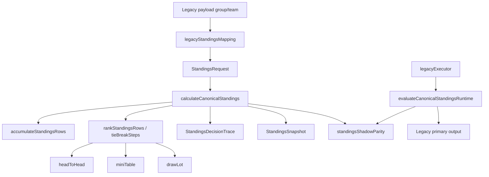

# CC-08 — Standings Call Graph

```mermaid
flowchart TB
  LP[Legacy payload group/team] --> MAP[legacyStandingsMapping]
  MAP --> REQ[StandingsRequest]
  REQ --> CALC[calculateCanonicalStandings]
  CALC --> SCORE[accumulateStandingsRows]
  CALC --> RANK[rankStandingsRows / tieBreakSteps]
  RANK --> H2H[headToHead]
  RANK --> MINI[miniTable]
  RANK --> LOT[drawLot]
  CALC --> TRACE[StandingsDecisionTrace]
  CALC --> SNAP[StandingsSnapshot]
  LEG[legacyExecutor] --> RT[evaluateCanonicalStandingsRuntime]
  RT --> SHADOW[standingsShadowParity]
  RT --> OUT[Legacy primary output]
  CALC --> SHADOW
```

Entry point: `evaluateCanonicalStandingsRuntime()`.

Flag OFF → direct `legacyExecutor()`.

Flag ON → legacy primary + canonical shadow comparison.
