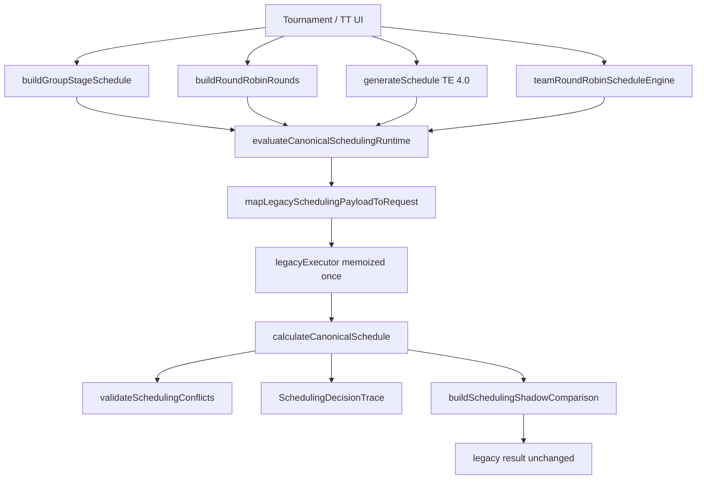

# CC-09 — Scheduling Call Graph

## Nodes (from `LEGACY_SCHEDULING_RUNTIME_INVENTORY`)

| id | function | mode |
|---|---|---|
| legacy-group-stage-schedule | buildGroupStageSchedule | shadow |
| legacy-round-robin-fixtures | buildRoundRobinRounds | shadow |
| legacy-te-generate-schedule | generateSchedule | shadow |
| legacy-team-tournament-schedule | buildStructuredRoundRobinMatchups | shadow |
| legacy-session-scheduling | runAI | legacy_only |
| legacy-director-court-runtime | assignMatchToCourt | legacy_only |
| canonical-scheduling-runtime | evaluateCanonicalSchedulingRuntime | shadow |

## Edges

- group_stage → canonical-scheduling-runtime (shadow)
- team_tournament → canonical-scheduling-runtime (shadow)
- tournament_engine → canonical-scheduling-runtime (shadow)

No edge intercepts persistence, manual UI writes, or session AI scheduling in CC-09.
