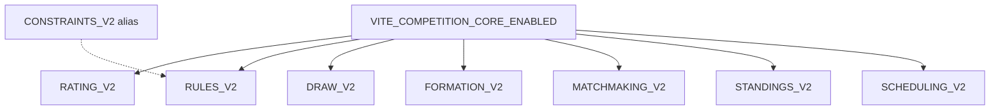

# CC-10 — Flag Dependency Graph

## Resolution order

1. Read raw env via `readEnvBoolean` / `resolveRulesV2Flag`
2. If `CORE=false` → all module gates false
3. If `CORE=true` → evaluate each sub-flag independently
4. `resolveCompetitionCoreExecutionMode` → LEGACY if any gate false
5. Production environment → force LEGACY regardless of flags

No circular dependencies. No module flag implies another module flag.
