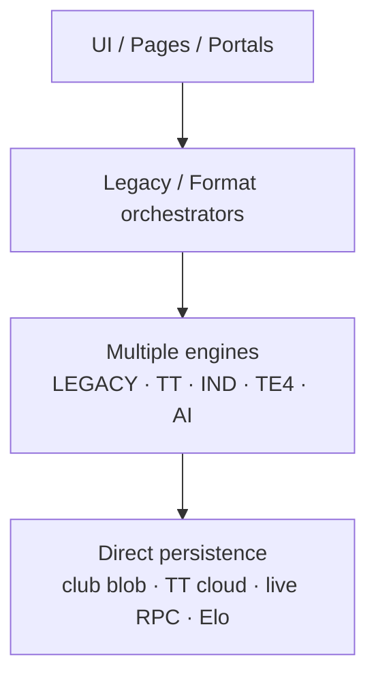

# 02 — Runtime Call Chain Map

**Audit date:** 2026-07-18  
**Rule:** Maps **current Production** paths only. Competition Core adapters are noted where wired as wrappers, not as SSOT.

---

## Current runtime (Mermaid)



---

## 1. Internal tournament plan

```text
InternalTournamentSetup.jsx
  → suggestEntriesFromPlayers (teamPairingEngine)
  → buildInternalTournamentPlan (internalTournamentEngine)
       → runLegacyDrawWithCanonicalAdapter  [wrapper; legacyExecutor still runs]
            → private-pairing / constraint / snake group assign
       → buildGroupStageSchedule (scheduleEngine)
            → buildRoundRobinRounds (pages/tournament.fixtures.logic.js)  [REVERSE DEP]
  → buildInternalTournamentPatch
  → updateTournament / saveClubData
  → lockDraw / publishDraw (publishDrawEngine) → updateTournament
```

| Layer | Path |
|-------|------|
| UI | `src/pages/` Internal setup |
| Orchestrator | `internalTournamentEngine.js` |
| Engines | draw wrappers, schedule, pairing |
| Persistence | `tournamentService` → club blob |

---

## 2. Official Open / AI Balance

```text
OfficialTournamentSetup.jsx
  → buildOfficialOpenPlan | buildOfficialAiBalancePlan (officialTournamentEngine)
       → createOpenEntryFromPlayer / suggestEntriesFromPlayers
       → assignEntriesOpenConditional | constraint group + runLegacyDrawWithCanonicalAdapter
       → buildGroupStageSchedule
  → patch → updateTournament → publishDraw*
```

---

## 3. Individual registration

```text
IndividualRegistrationPage.jsx  (/tournament/:id/register)
  → gatedSubmitRegistration / partner confirm (individual-tournament)
       → registrationEngine + eligibilityEngine
  → updateTournament(activeClubId, …) → club blob
```

---

## 4. Team tournament roster / lineup

```text
TeamTournamentSetup / TeamPortal
  → teamTournamentService (add/remove/submit/lock)
       → teamRosterEngine / lineupEngine / lineupValidationEngine
            → optional isRulesV2Enabled → CC rules bridge (validation only)
  → saveClubData and/or cloudTeamTournamentRepository / RPC
```

Data modes: `VITE_TEAM_TOURNAMENT_DATA_MODE` = legacy | shadow | cloud_primary | cloud_only.

---

## 5. Match complete → rating / season

```text
Score UI / referee / director
  → tournamentService.updateTournament({ processMatchId })
       → processCompletedMatch (tournamentLifecycle)
            → applySeasonPointsFromMatchRecord
            → applyEloFromMatchRecord (eloService)
                 → [if RATING_V2] applyCompetitionEloFromMatchRecord
                      → saveClubData and/or competition_core_apply_match_rating_v2
            → club internal completion / Pick_VN increment
```

Daily Play: Elo skipped for `DAILY_PLAY`.

---

## 6. Daily play

```text
DailyPlaySetup.jsx
  → createDailyMatchesWithAI / dailyPlayEngine
       → runAI (src/ai/engine.js) → balance → pairing → scoring
  → score dialog mutates dailyPlay.matches in tournament settings → save
```

---

## 7. Tournament Engine 4.0 (parallel)

```text
TournamentEnginePage → useTournamentEngine
  → runSeedEngine / runDrawEngine / runScheduleEngine / runCourtAssignmentEngine / runRankingEngine
  → appendEngineRun (engineRunLog → localStorage)
```

**Not** the Internal/Official setup SSOT. Treat as competing stack for cutover planning.

---

## 8. Competition Core adapter pattern (non-SSOT)

```text
Flag OFF → legacyExecutor(payload) only
Flag ON  → map to canonical request → legacyExecutor(payload) → map result + decision trace
Business output = legacyResult
```

Shadow mapping (Phase 2B.3–2B.4) uses `shadowRunner.js` in **tests/QA only** — no Production hook.

---

## 9. Capability → entry point quick map

| Capability | Primary UI entry | Primary orchestrator |
|------------|------------------|----------------------|
| Participant resolution | TT setup/portal, registration, TE adapter | hydration / athlete pool / normalizePlayer |
| Registration / Entry | `/tournament/:id/register`, setup | `registrationEngine` |
| Eligibility | registration gates, roster add | IND + TT `eligibilityEngine` |
| Team / Roster | `/tournament/team/:id` | `teamTournamentEngine` / `teamRosterEngine` |
| Lineup submit/lock | TeamPortal, ops cards | `lineupEngine` / state machine |
| Seeding | Setup, TE seed tab, TT groups | seeding.logic + TE seed + TT seed |
| Draw / grouping | Setup, DrawPublishControls, TE | plan builders + draw engines |
| Pairing | SelectPlayers, Daily, Team AI dialog | AI + teamPairing + TT formation |
| Match gen / schedule | Setup, publish-schedule, TE | `scheduleEngine` + TT RR |
| Court | Director, TE courts | `courtEngine` / TE assignCourts |
| Match lifecycle / scoring | Director, referee portals | matchEngine / matchResultEngine / TT result |
| Standings / tie-break | Standings panels | rankingEngine / teamStandings / TE ranking |
| Publication | publish controls, public gates | publishDraw / publishSchedule / TT atomic publish |

---

## 10. Side-effect hotspots

| Call chain | Side effects |
|------------|--------------|
| Registration | waitlist, partner tokens, fees, audit actions |
| Lineup lock/publish | revision, visibility, deadline RPC |
| Match complete | Elo, season points, club Elo, Pick_VN |
| Publish draw/schedule | public projection gates |
| TT cloud modes | dual blob/cloud writes |
