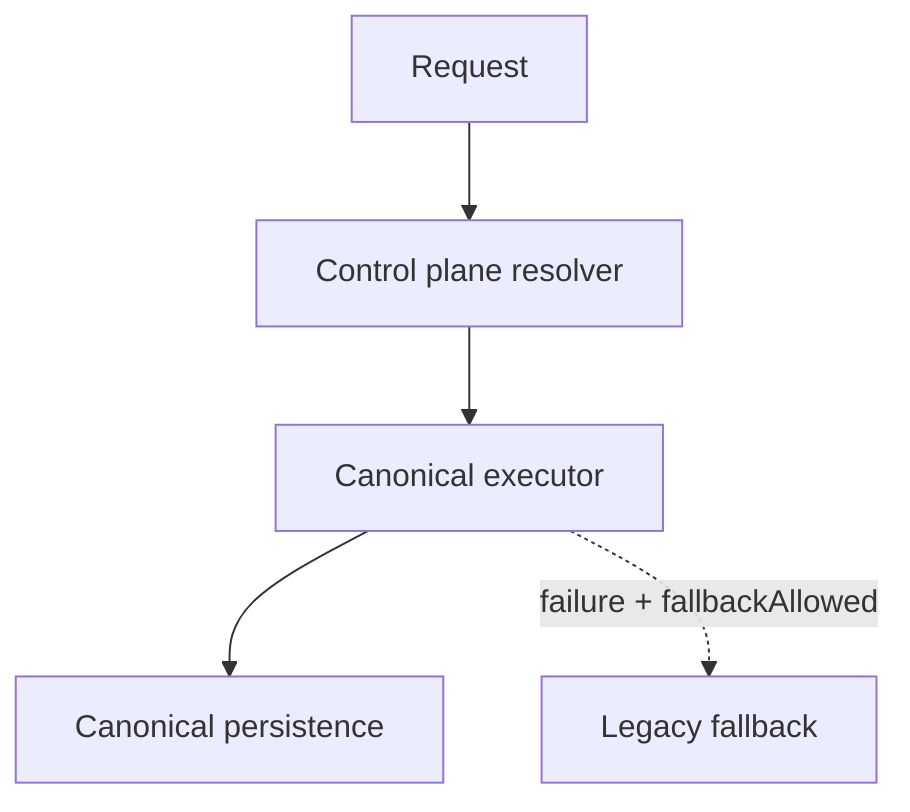

# 05 — Runtime Control Plane

**Status:** Design only — not implemented in Phase 3.0  
**Prerequisite for:** All Phase 3A+ capability work

---

## Purpose

Single resolution layer that decides, for every competition request:

```text
Which mode?
Which executor?
Which read/write SSOT?
Shadow or not?
Kill switch active?
```

---

## Minimum control plane surfaces

| Surface | Role |
|---------|------|
| Global master switch | Entire Competition Core path |
| Capability-level switch | participant, registration, roster, lineup, seeding, draw, pairing, schedule, scoring, standings, publication |
| Format-level switch | teamTournament, individualTournament, dailyPlay, internalTournament, officialTournament |
| Competition-level switch | Per competition metadata override |
| Tenant-level switch | Per club/tenant override |
| Shadow-only mode | Execute canonical without user effect |
| Canonical-read mode | Read from canonical; write legacy (transitional) |
| Canonical-write mode | Dual-write or canonical write |
| Canonical-execute mode | Canonical executor primary |
| Kill switch | Immediate safe mode |
| Rollback marker | Sticky mode + reason + actor |
| Audit log | Who changed what, when |

---

## Proposed hierarchy (extends existing CC flags)

Existing Production keys remain the base (all default OFF). Phase 3A extends conceptually:

```text
competitionCore.enabled                         # maps to VITE_COMPETITION_CORE_ENABLED
competitionCore.killSwitch                      # highest priority safe-off

competitionCore.shadow.enabled
competitionCore.shadow.samplingRate

competitionCore.capabilities.participant
competitionCore.capabilities.registration
competitionCore.capabilities.eligibility
competitionCore.capabilities.roster
competitionCore.capabilities.lineup
competitionCore.capabilities.seeding
competitionCore.capabilities.draw
competitionCore.capabilities.pairing
competitionCore.capabilities.schedule
competitionCore.capabilities.scoring
competitionCore.capabilities.standings
competitionCore.capabilities.publication

competitionCore.formats.teamTournament
competitionCore.formats.individualTournament
competitionCore.formats.dailyPlay
competitionCore.formats.internalTournament
competitionCore.formats.officialTournament

competitionCore.tenants.<tenantId>
competitionCore.competitions.<competitionId>
```

**Repo convention:** Keep `VITE_*` for build-time defaults; add **runtime override store** (remote config / Supabase table / admin RPC) for kill switch and tenant/competition overrides so Production can flip **without redeploy**.

---

## Conflict resolution order (highest wins)

```text
1. Kill switch (global / capability / format / tenant / competition)
2. Global master OFF
3. Rollback marker (forces target mode)
4. Competition override
5. Tenant override
6. Format flag
7. Capability flag
8. Shadow flag (never changes user-facing output by itself)
9. Build-time env defaults
```

### Examples

| Scenario | Result |
|----------|--------|
| Global OFF, tenant ON | **OFF** — legacy |
| Kill switch ON | Immediate LEGACY_FALLBACK or LEGACY_ONLY |
| Capability OFF, format ON | Capability blocked |
| Shadow ON, capability OFF | No shadow (nothing to compare) |
| Shadow ON, all else allow | Legacy primary + canonical shadow |
| Canonical-execute without prior shadow gate | **Rejected** by control plane policy |

---

## Resolver sketch (design)

```js
resolveRuntimeDecision({
  tenantId,
  competitionId,
  format,
  capability,
  flags,
  overrides,
  killSwitches,
  rollbackMarker,
}) → {
  runtimeMode,          // see 06_RUNTIME_MODE_STATE_MACHINE.md
  executor,             // legacy | canonical | dual
  readSource,
  writeDestination,
  shadowEnabled,
  samplingRate,
  reasonCodes[],
}
```

Executors must **not** read `process.env` / `import.meta.env` directly — only via control plane / existing `envReader.js` injection.

---

## Audit requirements

Every override change records:

```text
actorId, actorRole, scope, previousValue, nextValue, reason, requestId, createdAt
```

Roles allowed to set kill switch / global cutover: see `10_FEATURE_FLAGS_AND_KILL_SWITCH.md` and `14_SECURITY_AND_AUTHORIZATION.md`.

---

## Mermaid — canonical primary path (future)


