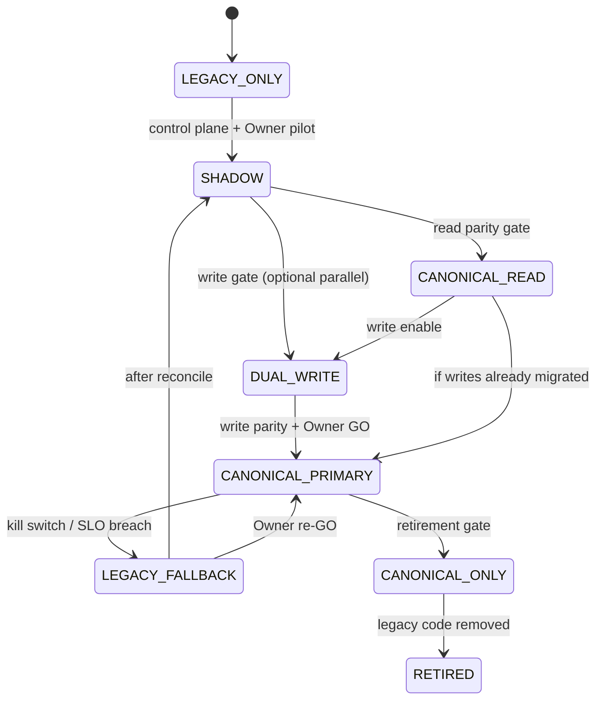

# 06 — Runtime Mode State Machine

**Status:** Design only — Phase 3.0  
**Forbidden transition:** `LEGACY_ONLY → CANONICAL_ONLY` without Owner exception

---

## Modes

| Mode | Read source | Write destination | Executor | User-facing output | Parity logging | Fallback | Rollback | Allowed env |
|------|-------------|-------------------|----------|--------------------|----------------|----------|----------|-------------|
| **LEGACY_ONLY** | Legacy | Legacy | Legacy | Legacy | Off / optional offline | N/A | N/A | All (current Production) |
| **SHADOW** | Legacy | Legacy only | Legacy primary + Canonical shadow | Legacy | On (sampled) | Shadow failure isolated | Disable shadow | Local, Preview, pilot Prod |
| **CANONICAL_READ** | Canonical (fallback Legacy) | Legacy | Legacy execute | From read path / legacy | On | Read miss → Legacy | Drop to SHADOW/LEGACY | Pilot |
| **DUAL_WRITE** | Legacy primary | Legacy + Canonical | Legacy (or dual exec later) | Legacy | On + write audit | Partial write → reconcile | Stop canonical writes; reconcile | Pilot |
| **CANONICAL_PRIMARY** | Canonical | Canonical (+ optional legacy mirror) | Canonical | Canonical | On | Legacy if `legacyFallbackAllowed` | Kill → LEGACY_FALLBACK | Pilot → broad |
| **LEGACY_FALLBACK** | Legacy | Legacy (canonical paused) | Legacy | Legacy | Capture divergence | N/A | Sticky until Owner clear | Emergency |
| **CANONICAL_ONLY** | Canonical | Canonical | Canonical | Canonical | Reduced | None (or read-only safe) | Deploy/version rollback | After retirement window |
| **RETIRED** | Canonical | Canonical | Canonical | Canonical | Off for legacy | N/A | Restore from backup only | Post 3N |

---

## Allowed transitions



---

## Transition rules

1. Every Production capability must pass **SHADOW** with thresholds before leaving LEGACY_ONLY.
2. **DUAL_WRITE** requires idempotency keys + reconciliation playbook.
3. **CANONICAL_PRIMARY** requires tested kill switch → LEGACY_FALLBACK.
4. **CANONICAL_ONLY** requires Legacy read-only window + zero Production callers.
5. Automatic transition only within safety rails (e.g. auto kill on blocker rate); **promotion** is Owner/operator manual.

---

## Per-request evaluation

```text
resolveRuntimeDecision(...) → runtimeMode
if mode == SHADOW:
  run legacy → user output
  isolate { run canonical → compare → record }
if mode == CANONICAL_PRIMARY and error and fallbackAllowed:
  switch LEGACY_FALLBACK for this competition (sticky marker)
```
