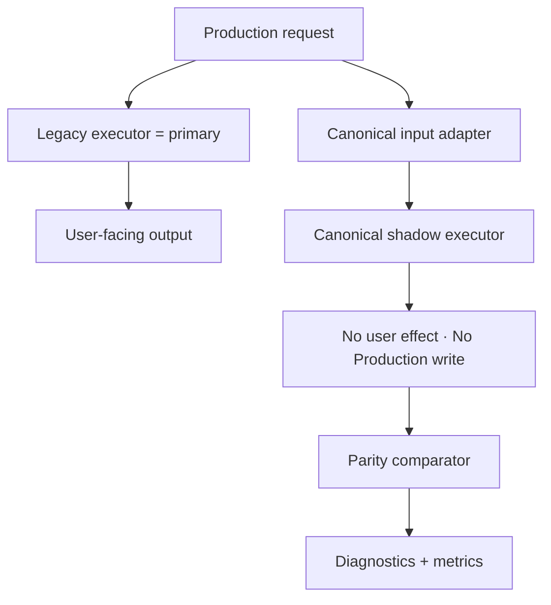

# 07 — Shadow Execution Architecture

**Status:** Design only — builds on Phase 2B.3 `shadowRunner` (test/QA only today)  
**Invariant:** Shadow failure must never break the legacy request.

---

## Flow



---

## Isolation requirements

| Concern | Design |
|---------|--------|
| Exception isolation | Shadow in try/catch; never rethrow to request path |
| Timeout | Hard budget (e.g. min(legacy×2, 500ms) sync or async queue) |
| Async vs sync | Prefer **async fire-and-forget** with bounded queue; sync only in tests |
| Performance overhead | Sampling rate + circuit breaker when queue depth high |
| Sampling rate | Per competition/tenant; default low on Production pilots |
| Sensitive data | Hash IDs; redact PII; no raw phone/email in parity store |
| Deterministic inputs | Freeze `ExecutionContext` (now, timezone, randomSeed, configSnapshot) |
| Random seed | Capture legacy seed or inject shared seed into both paths |
| Date/time | Normalize to context.now / timezone |
| Order-independent compare | Capability comparator (set equality where allowed) |
| Numeric tolerance | Capability-specific (scores exact; ratings may use ε) |
| Missing optional fields | `EXPECTED_DIFFERENCE` / `MISSING_OPTIONAL_DATA` |
| Format extensions | Preserve under `extensions`; do not fail EXACT if declared |
| Non-deterministic schedules | Semantic / policy parity — not deep-equal |
| Retry policy | No automatic retry that doubles load; drop sample on timeout |
| Alert threshold | See `08` and `13` |

---

## Forbidden in shadow

```text
Production persistence write
User-facing mutation
Match generation that mutates blob (unless dry-run clone)
Calling attemptPersist / production executor hooks that write
Blocking the legacy response path
```

Aligns with Phase 2B.3: `attemptPersist` / `attemptExecutor` must throw or no-op in shadow.

---

## Shadow overload protection

```text
if shadow_queue_depth > N OR shadow_p95 > budget:
  drop samples (metric: shadow_dropped_total)
  never slow legacy
```

---

## Relation to existing code

| Asset | Path | Phase 3.0 action |
|-------|------|------------------|
| Shadow runner | `src/tournament/adapters/competition-core/shared/shadowRunner.js` | Design extends; **do not wire Production hook in 3.0** |
| Format adapters | `src/*/adapters/competition-core/*` | Input for shadow mapping |
| Runtime adapters | `competition-core/*/adapters/*` | Still legacy-exec; shadow compares mapped outputs |

Phase 3A implements infrastructure; Production hook remains OFF until Owner GO.
