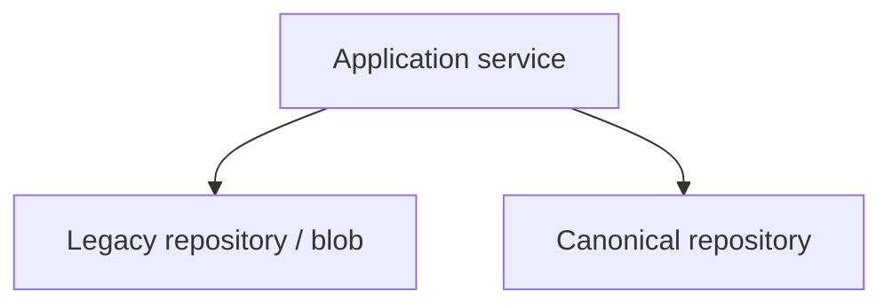

# 09 — Persistence and SSOT Transition

**Status:** Design only — **no SQL** in Phase 3.0  
**Ports today:** stubs + in-memory fakes (`phase-2b2/06_REPOSITORY_PORTS.md`)

---

## Questions answered

| # | Answer (design) |
|---|-----------------|
| 1. New tables vs views on old | **Hybrid (C)** — new canonical tables + compatibility projections during transition |
| 2. Canonical ID independent? | **Yes** — UUID/ULID independent of legacy |
| 3. Mapping ID location | Dedicated mapping store (table or blob section) keyed by `(tenantId, capability, legacyType, legacyId)` |
| 4. Dual-write starts when | First write-capable capability after shadow gates — recommended start: **Participant + Entry** (3B–3C), not draw |
| 5. Write ordering | Legacy first while Legacy SSOT; flip to Canonical first in CANONICAL_PRIMARY |
| 6. Transaction boundary | Per aggregate command (see `16`); cross-store dual-write uses outbox + reconcile |
| 7. Idempotency | Command idempotency keys required for dual-write |
| 8. Optimistic locking | Revision numbers on roster/lineup/registration |
| 9. Revision control | Monotonic `revision`; reject stale writes |
| 10. Audit events | Append-only audit for mutating commands |
| 11. Backfill | Batch jobs from blob/cloud → canonical + mapping; dry-run first |
| 12. Reconciliation | Periodic + on dual-write failure; diverge report |
| 13. Partial dual-write failure | Mark `reconciliation_pending`; do not silently succeed |
| 14. RLS/RBAC | Tenant + competition scope on all new tables; no UI trust |
| 15. Tenant isolation | `tenantId`/`clubId` on every row; RLS mandatory |

---

## Options assessment

### A. Canonical tables only (greenfield)

| Pros | Cons |
|------|------|
| Clean model | Hard cut; long dual-run; high migration risk |
| Clear RLS | Big-bang temptation |

### B. Views/projections on legacy only

| Pros | Cons |
|------|------|
| Fast to expose reads | Canonical IDs leak legacy constraints |
| Less migration | Dual blob/cloud TT remains messy; Core stays coupled |

### C. Hybrid tables + compatibility views — **RECOMMENDED**

| Pros | Cons |
|------|------|
| Independent canonical IDs | More moving parts |
| Mapping + dual-write possible | Needs reconciliation discipline |
| Views ease read cutover | Longer coexistence |

**Recommendation:** **Option C**.

---

## Dual-write Mermaid



Ordering:

```text
LEGACY_ONLY / SHADOW:     write Legacy only
DUAL_WRITE:               write Legacy then Canonical (or outbox)
CANONICAL_PRIMARY:        write Canonical then optional Legacy mirror
CANONICAL_ONLY:           write Canonical only
```

---

## SSOT transition

```text
Legacy SSOT
  → Legacy primary + canonical shadow
  → Legacy read + dual-write
  → Canonical read + dual-write
  → Canonical primary + legacy fallback
  → Canonical SSOT
  → Legacy read-only
  → Legacy retired
```

### SSOT dimensions (must not conflate)

| Dimension | Meaning |
|-----------|---------|
| Execution SSOT | Which executor produces decisions |
| Persistence SSOT | Which store is authoritative for records |
| Read SSOT | Which store serves reads |
| Write SSOT | Which store accepts writes |
| Public API SSOT | Which contracts external callers use |

**Contracts existing ≠ Persistence SSOT.** Competition Core is **not** declared Production SSOT in Phase 3.0.

---

## Mapping store (design)

```text
canonical_id
legacy_id
legacy_system          # blob_tournament | tt_cloud | players | athletes
tenant_id
competition_id?
entity_type            # participant | entry | team | roster | lineup | match
created_at
updated_at
```

---

## TT cloud coordination

TT already has `DATA_MODE` (legacy | shadow | cloud_primary | cloud_only). Phase 3 persistence must **not** invent a third SSOT without Owner decision. Canonical hybrid must either:

1. Sit above TT modes as a future SSOT, or  
2. Treat TT cloud as format persistence behind ports until 3D–3E.

Owner decision required: **OG-3.0C**.
