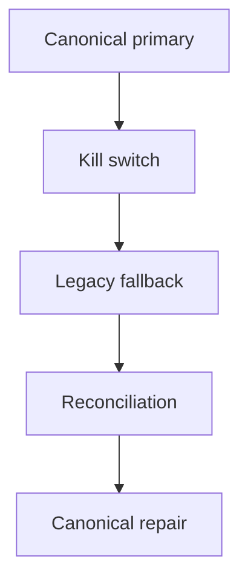

# 12 — Rollback and Reconciliation

**Status:** Design only

---

## Rollback types

| Type | What it reverts | When enough alone |
|------|-----------------|-------------------|
| Execution rollback | Which executor runs | Yes if no dual-write |
| Read rollback | Which store serves reads | Yes if writes still legacy |
| Write rollback | Stop canonical writes | Needs reconcile if already wrote |
| Data reconciliation | Repair divergent stores | Required after dual-write failure |
| Version rollback | Pin executor/adapter/comparator versions | With flags |
| Deployment rollback | Prior build | If bad code shipped |
| Feature flag rollback | Mode demotion | Not enough after canonical-write |



---

## Capability rollback matrix (template)

| Capability | Trigger | Detection | Owner approval | Auto/Manual | Target mode | Data impact | Reconcile | Max window |
|------------|---------|-----------|----------------|-------------|-------------|-------------|-----------|------------|
| Participant | Collision/BLOCKER | Parity blockers | Yes if dual-write | Auto kill → Manual reconcile | LEGACY_FALLBACK | Mapping rows may exist | Yes | 72h |
| Registration/Entry | Duplicate/waitlist error | Parity + support | Yes | Manual | LEGACY_FALLBACK | Entries may diverge | Yes | 48h |
| Roster | Corruption | Validation fail | Yes | Manual | LEGACY_FALLBACK | Revisions | Yes | 24h |
| Lineup | Visibility leak | Security alert | Yes | Auto kill | LEGACY_FALLBACK | Revisions | Audit + yes | Immediate |
| Seed/Draw | Seed drift post-lock | Parity BLOCKER | Yes | Manual | SHADOW or LEGACY | Unpublished discard | Maybe | Before publish |
| Schedule | Conflicts | Ops + parity | Yes | Manual | LEGACY_FALLBACK | Slot rows | Yes | Before event day |
| Lifecycle/Scoring | Result divergence | Parity + referee | Yes | Auto kill | LEGACY_FALLBACK | Scores/Elo | **Yes critical** | Immediate |
| Standings | Rank divergence | Parity | Capability | Manual | LEGACY read | Projection rebuild | Rebuild | 24h |
| Publication | Wrong public state | Public report | Yes | Manual | Legacy publish engines | Snapshots | Republish | Immediate |

---

## Reconciliation strategy

1. **Detect:** dual_write_failure, parity BLOCKER, checksum job.
2. **Quarantine:** mark competition `reconciliation_pending`; prefer Legacy read.
3. **Diff:** mapping + entity hashes; no silent overwrite of locked artifacts.
4. **Repair:** Owner-approved apply direction (legacy→canonical or reverse) per entity type.
5. **Verify:** re-run shadow/parity on repaired set.
6. **Clear:** remove sticky fallback only after Owner GO.

### Write-ordering failure cases

| Case | Action |
|------|--------|
| Legacy OK, Canonical fail | Keep Legacy SSOT; enqueue canonical retry; alert |
| Canonical OK, Legacy fail (CANONICAL_PRIMARY) | Keep Canonical; repair legacy mirror or stop mirror |
| Both fail | Return error; no partial success to UI |

---

## Maximum principle

```text
After any canonical write: kill switch + flag off ≠ complete rollback.
Reconciliation plan is mandatory.
```
