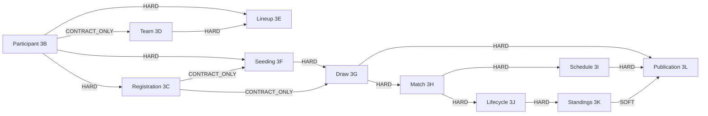

# Capability Dependency Graph — Phase 3P

**Rule:** Classifications reflect **current code + required Phase 3 runtime order**, not aspirational redesign.

## Dependency kinds

| Kind | Meaning |
|------|---------|
| HARD | Consumer cannot implement correctly without producer contracts/runtime |
| SOFT | Useful but can stub / fixture during parallel work |
| CONTRACT_ONLY | Needs stable types/factories only; no runtime executor yet |
| TEST_ONLY | Coupling appears only in tests/fixtures |
| LEGACY_ONLY | Coupled only through legacy Production path (not core) |
| FORMAT_LOCAL | Owned by format module; core must not rewrite |
| NONE | No meaningful dependency |

---

## Answers to required questions

| Question | Answer | Kind |
|----------|--------|------|
| Participant phụ thuộc vào gì? | Foundation: schema/shared helpers, rating snapshot types (optional) | NONE / SOFT (rating) |
| Registration phụ thuộc Participant đến mức nào? | **Must** have stable `ParticipantReference` / participant id for entry+registration | **HARD** |
| Team phụ thuộc Registration hay Participant? | Needs Participant refs for members; Registration not required for TT team create | Participant **CONTRACT_ONLY**; Registration **NONE** (format path) |
| Lineup phụ thuộc Team và Participant thế nào? | Roster membership + participant slots | Team/Roster **HARD**; Participant **HARD** (refs) |
| Seeding phụ thuộc Participant/Team/Rating thế nào? | Seed participants/entries + optional rating | Participant/Entry **HARD**; Team **SOFT/FORMAT_LOCAL**; Rating **SOFT** |
| Draw phụ thuộc Seeding và Registration thế nào? | Seed order feeds draw; field of entries | Seeding **HARD**; Registration/Entry **CONTRACT_ONLY** |
| Match phụ thuộc Draw thế nào? | Match graph usually after groups/draw | Draw **HARD** (individual/group); Daily play **LEGACY_ONLY** / softer |
| Schedule phụ thuộc Match và Resource thế nào? | Needs matches + courts/slots | Match **HARD**; Resource/court **HARD** (legacy/TE) |
| Lifecycle phụ thuộc Match và Result thế nào? | State machine on match instances + score submit | Match **HARD**; Result validation **HARD** |
| Standings phụ thuộc Match Result thế nào? | Ranking from completed results | Match Result **HARD** |
| Publication phụ thuộc Standings/Lifecycle thế nào? | Publish draw/schedule can precede standings; public standings need results | Draw/Schedule **HARD**; Standings **SOFT** for draw publish; Lifecycle **SOFT** for live gates |

---

## Graph (Mermaid)



---

## Hard dependency chain (merge-critical)

```text
Participant (3B)
  → Registration (3C)
  → Seeding (3F)
  → Draw (3G)
  → Match (3H)
  → Schedule (3I) + Lifecycle (3J)
  → Standings (3K)
  → Publication (3L)   [also needs Draw+Schedule]

Team (3D) ──HARD──→ Lineup (3E)
  (Team is FORMAT_LOCAL; Participant CONTRACT_ONLY)
```

## Soft dependency chain

```text
Rating → Seeding (SOFT)
Standings → Publication (SOFT for draw/schedule publish)
Lifecycle → Publication (SOFT for live public gates)
Formation/Matchmaking ↔ Lineup (SOFT / FORMAT_LOCAL bridges)
```

## Format-local ownership edges

```text
Team / Roster / Lineup runtime  = FORMAT_LOCAL (Owner KEEP IN FORMAT)
Core contribution               = ports, identity mapping, shadow, dual-write — not V6 rewrite
```

## Cross-cutting (not phase letters but real)

| Module | Touches |
|--------|---------|
| `runtime-control` | All capabilities (decision + shadow infra) |
| `constraints` | Lineup validation, draw grouping, pairing |
| `rating` | Lifecycle side effects; seeding scores |
| `featureFlags.js` | All V2 gates |

These are **Integrator / shared** — not capability-chat free edits.
