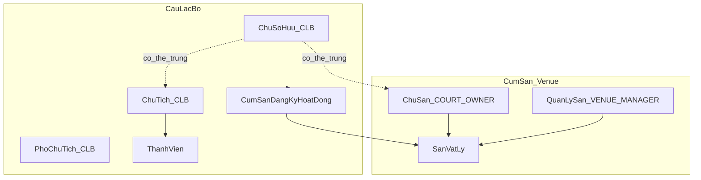
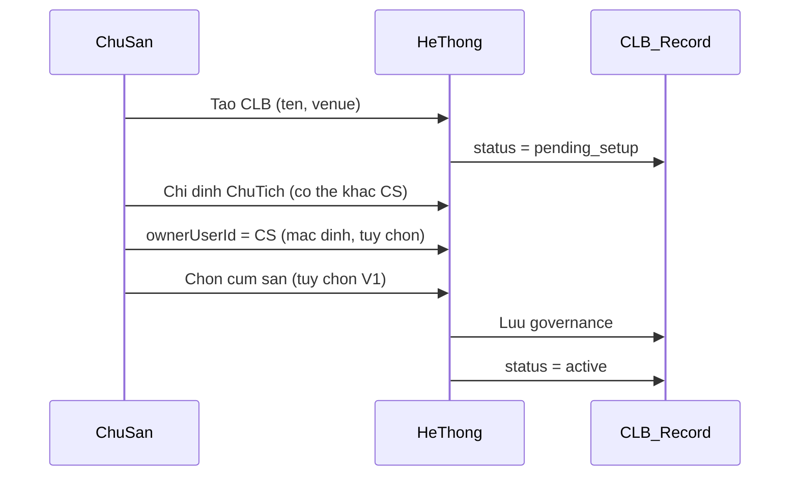

# Club Governance Spec — V5

**Status:** Implemented V1 (app local + `docs/supabase-club-governance-v52.sql` cho staging).  
**Phiên bản:** 1.1  
**Ngày:** 2026-07-07

Tài liệu này làm rõ quy tắc nghiệp vụ cho **Câu lạc bộ (CLB)** trong Pickleball Scheduler Pro V5: cấu trúc quản trị, cụm sân đăng ký hoạt động, và ma trận quyền xem thành viên theo mối quan hệ **chủ sân ↔ chủ sở hữu CLB**.

**Liên quan:** [`RBAC-MATRIX.md`](../RBAC-MATRIX.md), [`V5_ARCHITECTURE_BLUEPRINT.md`](./V5_ARCHITECTURE_BLUEPRINT.md), [`src/features/identity/ARCHITECTURE.md`](../../src/features/identity/ARCHITECTURE.md)

---

## 1. Mục tiêu

1. Mỗi CLB có cấu trúc quản trị rõ ràng: **Chủ sở hữu**, **Chủ tịch**, **Phó chủ tịch**.
2. **Chủ tịch** là vai trò bắt buộc; user đảm nhiệm phải gắn với CLB (`profiles.club_id`).
3. CLB đăng ký **cụm sân hoạt động** (sân vật lý thuộc venue/tenant).
4. **Chủ sân** và **quản lý sân** (`COURT_OWNER`, `VENUE_MANAGER`) không tự động xem toàn bộ thành viên CLB — trừ khi đồng thời là **chủ sở hữu CLB**.
5. Ngoại lệ có kiểm soát: khi **tạo giải đấu mới**, chủ sân được lấy danh sách thành viên để mời (chỉ trong wizard, không mở profile vĩnh viễn).

### 1.1 Quyết định đã chốt (review v1.0 → v1.1)

| # | Quyết định |
|---|------------|
| D1 | **Chỉ Chủ tịch bắt buộc** trước khi CLB `active`; Chủ sở hữu có thể gán sau (`ownerUserId` có thể `null`) |
| D2 | **List tóm tắt** (chủ sân ≠ chủ sở hữu CLB): tên CLB + số lượng thành viên + tên Chủ tịch công khai + cụm sân — **không** danh sách từng VĐV, **không** profile |
| D3 | Chỉ `COURT_OWNER` / `SUPER_ADMIN` được **gán Chủ sở hữu**; Chủ tịch **không** tự gán mình làm Chủ sở hữu |
| D4 | `VENUE_MANAGER` tuân **cùng quy tắc** xem thành viên như chủ sân (§5.1) |
| D5 | V1: một user làm Chủ tịch **tối đa 1 CLB** (khớp `profiles.club_id` hiện tại) |
| D6 | V1: cụm sân đăng ký **không bắt buộc** để `active`; có thể bổ sung sau |

---

## 2. Phân tầng khái niệm

Hệ thống có **ba lớp** tách biệt. Không trộn lẫn khi thiết kế UI, RBAC hay dữ liệu.

| Lớp | Ví dụ | Mục đích |
|-----|-------|----------|
| **Auth RBAC** | `COURT_OWNER`, `CLUB_MANAGER`, `PLAYER` | Đăng nhập, route guard, permission hệ thống |
| **Court cluster (tài sản)** | `court_clusters`, `user_cluster_assignments` | Cụm sân vận hành (Nam Long, Nam Lý) — xem [`COURT_CLUSTER_SPEC.md`](./COURT_CLUSTER_SPEC.md) |
| **Club governance** | Chủ sở hữu, Chủ tịch, Phó chủ tịch | Quản trị nội bộ CLB, hiển thị trên trang CLB |

> **Lưu ý thuật ngữ (Phase 23+):** **Cơ sở hiện tại** (sidebar) và **cụm sân đăng ký CLB** đều tham chiếu entity `court_clusters` (vd. Sân Nam Long), không phải từng sân vật lý hay tên venue/tổ chức.



### 2.1 Thuật ngữ

| Thuật ngữ UI | Thuật ngữ nghiệp vụ | Auth role liên quan |
|--------------|---------------------|---------------------|
| Chủ tổ chức / Chủ cơ sở | Chủ venue (billing org) | `COURT_OWNER` (alias `VENUE_OWNER`, `TENANT_OWNER`) |
| Chủ sân (theo cụm) | Gán qua `user_cluster_assignments` | `CLUSTER_OWNER` scope trên cụm được gán |
| Quản lý sân | Nhân viên vận hành venue | `VENUE_MANAGER` (alias `COURT_MANAGER`) |
| Chủ sở hữu CLB | Người sở hữu pháp lý / tài chính CLB | `COURT_OWNER` hoặc `CLUB_MANAGER` |
| Chủ tịch CLB | Người điều hành hằng ngày | `CLUB_MANAGER` (alias `CLUB_OWNER`) |
| Phó chủ tịch CLB | Phụ tá điều hành | `CLUB_MANAGER` + `governance.vicePresidentUserId` |
| Cụm sân đăng ký hoạt động | Một `court_clusters.id` CLB hoạt động | Không phải auth role |

> **Lưu ý:** Trong code hiện tại, `CLUB_OWNER` hiển thị "Quản lý CLB". Spec này dùng **"Chủ tịch"** cho vai trò nghiệp vụ; khi triển khai UI có thể đổi label mà không đổi role code.

---

## 3. Cấu trúc CLB — 4 phần

Mỗi CLB trên UI phải hiển thị đủ 4 phần sau.

### 3.1 Ví dụ

```
CLB: ACCC
├── Chủ sở hữu:    (chưa gán) hoặc Nguyễn Văn A  (user: uuid-a)
├── Chủ tịch:      Nguyễn Văn B  (user: uuid-b)   ← bắt buộc
├── Phó chủ tịch:  Trần Thị C    (user: uuid-c)   ← tùy chọn
└── Cụm sân đăng ký hoạt động:
      • Sân 1, Sân 2  @ venue-prod-main  (tùy chọn V1)
```

### 3.2 Quy tắc

| # | Quy tắc |
|---|---------|
| G1 | Mỗi CLB **phải** có Chủ tịch trước khi chuyển trạng thái `active` |
| G2 | User Chủ tịch **bắt buộc** có `profiles.club_id` trỏ đúng CLB; **một user tối đa 1 CLB** làm Chủ tịch (V1) |
| G3 | Chủ sở hữu và Chủ tịch **có thể cùng một người** |
| G4 | **Chủ sở hữu không bắt buộc** lúc tạo CLB; có thể gán sau bởi chủ sân hoặc SUPER_ADMIN (§4.2) |
| G5 | Phó chủ tịch là **tùy chọn**; tối đa 1 người (V1); auth role **bắt buộc** `CLUB_MANAGER` |
| G6 | Cụm sân đăng ký = danh sách `courtId` thuộc venue; **không bắt buộc** để `active` (V1) |
| G7 | CLB chưa có Chủ tịch → trạng thái `pending_setup`; **không** cho tạo giải nội bộ |
| G8 | `pending_setup` là **status mới V5**; CLB cũ migrate → `active` + backfill Chủ tịch (§6.4) |

### 3.3 Khác biệt với model hiện tại

| Hiện tại (`src/models/club.js`) | Spec V5 |
|----------------------------------|---------|
| Chỉ có `createdByUserId` | Thêm `governance.ownerUserId`, `presidentUserId`, `vicePresidentUserId` |
| `status`: `active` / `inactive` | Thêm `pending_setup` |
| Courts nằm trong club blob (`club_data_v3.players/courts`) | **Cụm sân đăng ký** = liên kết tới sân vật lý venue |
| Không validate Chủ tịch | Bắt buộc trước khi `active` |

### 3.4 Data model đề xuất (future — chưa migrate)

```javascript
// Mở rộng club record (local registry + cloud)
{
  // ... fields hiện có (id, name, venueId, tenantId, ...)
  governance: {
    ownerUserId: string | null,        // optional — gán sau
    presidentUserId: string,           // required for active
    vicePresidentUserId: string | null,
    registeredClusterId: string | null,   // optional V1 — một cụm sân (court_clusters.id)
    registeredCourtIds: string[],         // legacy read-only — migrate sang registeredClusterId
  },
  status: "pending_setup" | "active" | "inactive",
}
```

---

## 4. Ánh xạ vai trò nghiệp vụ → Auth

| Vai trò nghiệp vụ | Auth role tối thiểu | Ràng buộc dữ liệu |
|-------------------|----------------------|-------------------|
| Chủ tịch | `CLUB_MANAGER` (`CLUB_OWNER`) | `profiles.club_id` = CLB; `governance.presidentUserId` = user.id |
| Chủ sở hữu | `CLUB_MANAGER` hoặc `COURT_OWNER` | `governance.ownerUserId` = user.id |
| Phó chủ tịch | `CLUB_MANAGER` (bắt buộc) | `governance.vicePresidentUserId` = user.id; `profiles.club_id` = CLB |
| Chủ sân (không phải chủ sở hữu CLB) | `COURT_OWNER` | `profiles.venue_id` = venue; không tự động full quyền CLB |
| Quản lý sân (không phải chủ sở hữu CLB) | `VENUE_MANAGER` | Cùng quy tắc xem thành viên như chủ sân (D4) |

### 4.1 Quyền theo vai trò nghiệp vụ

| Vai trò | Quản lý CLB | Quản lý thành viên | Tạo giải nội bộ | Đổi Chủ tịch | Gán Chủ sở hữu |
|---------|-------------|-------------------|-----------------|--------------|----------------|
| Chủ tịch | Có (không xóa CLB) | CRUD đầy đủ | Có | Không | Không |
| Chủ sở hữu | Có (kể cả xóa CLB) | CRUD đầy đủ | Có | Có | Không (chỉ chủ sân / SUPER_ADMIN) |
| Phó chủ tịch | Hạn chế (§4.1.1) | Xem + đề xuất; **không xóa** user | Có | Không | Không |
| Chủ sân ≠ chủ sở hữu | Không | Chỉ list tóm tắt (§5) | Có (giải venue/official) | Không | Có |
| Quản lý sân ≠ chủ sở hữu | Không | Chỉ list tóm tắt (§5) | Có (giải venue/official) | Không | Không |

#### 4.1.1 Phó chủ tịch — quyền hạn chế (V1)

Phó chủ tịch **được**: xem/sửa thông tin CLB (mô tả, ghi chú), xem và đề xuất thêm/sửa thành viên, tạo giải nội bộ, xem ELO/lịch sử.

Phó chủ tịch **không được**: xóa CLB, xóa thành viên, đổi Chủ tịch, gán Chủ sở hữu, đổi cụm sân đăng ký (chỉ Chủ tịch hoặc Chủ sở hữu).

#### 4.1.2 Chủ sở hữu CLB ≠ Chủ tịch

Khi `ownerUserId ≠ presidentUserId`:

| Quyền | Chủ sở hữu | Chủ tịch |
|-------|------------|----------|
| Xem / quản lý thành viên (tab members, profile) | Có | Có |
| Điều hành hằng ngày (giải nội bộ, xếp sân) | Có | Có |
| Đổi Chủ tịch | **Có** | Không |
| Xóa CLB | **Có** | Không |

> Chủ sở hữu CLB (dù không phải Chủ tịch) có quyền xem/quản lý thành viên **đầy đủ** nếu auth role phù hợp. Quyền **đổi Chủ tịch** chỉ dành cho Chủ sở hữu hoặc SUPER_ADMIN.

### 4.2 Gán / chuyển Chủ sở hữu CLB

| Ai thực hiện | Điều kiện |
|--------------|-----------|
| `COURT_OWNER` (chủ sân venue của CLB) | Luôn được gán / đổi `ownerUserId` |
| `SUPER_ADMIN` | Luôn được |
| **Chủ sở hữu hiện tại** (`governance.ownerUserId`) | Được **chuyển** quyền sở hữu cho thành viên active khác (`transferClubOwnership`) |
| Chủ tịch | **Không** được tự gán mình hoặc người khác làm Chủ sở hữu |
| Phó chủ tịch | **Không** |

Khi chủ sân tạo CLB: mặc định `ownerUserId` = chính chủ sân (tùy chọn bỏ tick). Khi Chủ tịch tự đăng ký CLB (§6.1): `ownerUserId` = `null` cho đến khi chủ sân gán hoặc chủ sở hữu sau này chuyển quyền.

UI: **CLB của tôi** (`/my-club`) — menu cấp 2 trong **CLB & Huấn luyện**, hiển thị cho mọi role đã đăng nhập; nội dung theo governance (`MyClubGovernancePanel`).

---

## 5. Ma trận quyền xem thành viên

Quy tắc cốt lõi phân biệt **nhân sự venue** (chủ sân / quản lý sân) và **chủ sở hữu CLB**.

### 5.1 Bảng quyền

| Người xem | Là chủ sở hữu CLB? | Danh sách CLB (list ngoài) | Tab Thành viên / `/players` | Profile VĐV `/players/profile/:id` | ELO / lịch sử chi tiết |
|-----------|-------------------|---------------------------|----------------------------|--------------------------------------|------------------------|
| Chủ tịch | — | Đầy đủ | Đầy đủ + quản lý | Đầy đủ | Đầy đủ |
| Phó chủ tịch | — | Đầy đủ | Đầy đủ (xem + đề xuất; không xóa) | Đầy đủ | Đầy đủ |
| Chủ sở hữu CLB (≠ Chủ tịch) | Có | Đầy đủ | Đầy đủ + quản lý | Đầy đủ | Đầy đủ |
| Chủ sân **là** chủ sở hữu CLB | Có | Đầy đủ | Đầy đủ (như Chủ tịch về member) | Đầy đủ | Đầy đủ |
| Chủ sân **không** phải chủ sở hữu CLB | Không | **List tóm tắt** (§5.2) | **Không** | **Không** | **Không** |
| Quản lý sân **không** phải chủ sở hữu CLB | Không | **List tóm tắt** (§5.2) | **Không** | **Không** | **Không** |
| Thành viên `PLAYER` | — | CLB của mình | Self + BXH công khai | Self | Self |
| `SUPER_ADMIN` | — | Toàn hệ thống | Toàn hệ thống | Toàn hệ thống | Toàn hệ thống |

### 5.2 Định nghĩa "list tóm tắt"

Khi chủ sân hoặc quản lý sân **không** phải chủ sở hữu CLB, card / hàng CLB trên danh sách chỉ hiển thị:

- Tên CLB, mã CLB (nếu có)
- Số lượng thành viên (`memberCount`)
- Tên hiển thị công khai của Chủ tịch (không email/phone)
- Cụm sân đăng ký (tên sân, nếu có; không chi tiết booking)
- Trạng thái CLB (`active` / `inactive` / `pending_setup`)
- Chủ sở hữu: "Chưa gán" hoặc tên công khai (nếu đã gán)

**Không hiển thị:** danh sách tên từng VĐV, ELO, lịch sử thi đấu, số điện thoại, email cá nhân.

### 5.3 Ngoại lệ: tạo giải đấu mới

Áp dụng cho **chủ sân** hoặc **quản lý sân** không phải chủ sở hữu CLB, khi **tạo giải mới** và chọn CLB làm nguồn mời:

| Được phép | Không được phép |
|-----------|-----------------|
| Lấy danh sách thành viên **trong wizard tạo giải** (tên + `playerId` để tick mời) | Vào tab Thành viên CLB sau khi thoát wizard |
| Dùng danh sách cho bước "Chọn VĐV / Mời tham gia" | Mở `/players/profile/:id` |
| Quyền theo `tournamentDraftId` | Giữ quyền xem full list vĩnh viễn |

**Permission đề xuất (future):** `player.view_for_tournament_invite`  
**Scope:** `{ clubId, tournamentDraftId }` — revoke khi wizard hủy hoặc giải đã tạo xong.

### 5.4 So sánh với code hiện tại (gap)

| File / layer | Hành vi hiện tại | Cần đổi khi implement |
|--------------|------------------|----------------------|
| `rolePermissions.js` — `TENANT_OWNER`, `VENUE_MANAGER` | Có `PLAYER_VIEW` full | Gỡ mặc định; cấp theo `isClubOwner(user, clubId)` |
| `clubAccessService.js` | Venue role thấy mọi CLB tenant | Giữ xem CLB; filter member theo §5.1 |
| `getClubMembers()` | Không guard đọc | Filter theo viewer context |
| `ClubMembersTab.jsx` | Render full table | Ẩn nếu venue staff ≠ club owner |
| `PlayerProfile.jsx` | Route guard theo `PLAYER_VIEW` | Chặn venue staff ≠ club owner |
| `supabase-club-v3-rls.sql` | Venue staff đọc full blob | Strip `players[]` trừ khi `ownerUserId` match |

---

## 6. Luồng nghiệp vụ

### 6.1 Tạo CLB mới

**Luồng A — Chủ sân tạo CLB**



**Luồng B — Chủ tịch đăng ký CLB (không qua chủ sân)**

1. User đăng ký làm Chủ tịch CLB mới → `presidentUserId` = user; `ownerUserId` = `null`.
2. CLB ở `pending_setup` cho đến khi **chủ sân venue duyệt** (hoặc `SUPER_ADMIN` bypass).
3. Sau duyệt → `active`; chủ sân có thể gán `ownerUserId` sau (§4.2).

### 6.2 Chuyển Chủ tịch

1. Chỉ **Chủ sở hữu CLB** hoặc `SUPER_ADMIN` được thực hiện (nếu chưa có Chủ sở hữu → chỉ `SUPER_ADMIN` hoặc chủ sân gán owner trước).
2. Cập nhật `governance.presidentUserId`.
3. Cập nhật `profiles.club_id` và role user mới; user cũ giảm quyền hoặc chuyển role.
4. **Sync** extension `members[]` (role `manager` nếu có) với Chủ tịch mới.
5. Ghi `audit_logs` (`club.president.transfer`).

### 6.3 Venue staff xem CLB

```
IF user.role IN (COURT_OWNER, VENUE_OWNER, TENANT_OWNER, VENUE_MANAGER, COURT_MANAGER):
  IF user.id == club.governance.ownerUserId:
    → quyền xem/quản lý thành viên đầy đủ (§5.1)
  ELSE:
    → chỉ list tóm tắt (§5.2)
    → ngoại lệ wizard tạo giải (§5.3)
```

### 6.4 Migration CLB hiện có

CLB đã tồn tại trước V5 governance:

| Bước | Hành động |
|------|-----------|
| M1 | Map `status` → `active` (giữ `inactive` nếu đã inactive) |
| M2 | Backfill `presidentUserId` từ `createdByUserId` hoặc user `CLUB_MANAGER` có `club_id` khớp |
| M3 | Nếu không tìm được Chủ tịch → `pending_setup` + banner admin gán thủ công |
| M4 | `ownerUserId` = `null` hoặc venue `owner_id` nếu chủ sân tạo CLB |
| M5 | `registeredCourtIds` = `[]` (bổ sung sau) |

---

## 7. Cụm sân đăng ký hoạt động

### 7.1 Định nghĩa

**Cụm sân đăng ký hoạt động** là **một cụm sân** (`court_clusters.id`) thuộc venue/tenant mà CLB đăng ký để tổ chức hoạt động (vd. "Cụm sân Nam Long"). Không chọn từng sân vật lý.

### 7.2 Khác với courts trong club blob

| Khái niệm | Nguồn dữ liệu | Mục đích |
|-----------|---------------|----------|
| Cụm sân vận hành | `court_clusters` | Tài sản chủ sân — sidebar "Cơ sở hiện tại" |
| Sân vật lý venue | Court Engine / venue registry | Sân con trong cụm (Sân 1, Sân 2…) |
| Courts trong club blob | `club_data_v3` local | Legacy — xếp sân AI nội bộ |
| Cụm sân đăng ký CLB | `governance.registeredClusterId` | Liên kết CLB ↔ cụm sân venue |

### 7.3 Quy tắc

- Mỗi CLB chỉ đăng ký **một cụm sân** (`registeredClusterId`).
- CLB chỉ đăng ký cụm thuộc **cùng venue** (`club.venueId`).
- Chủ sân quản lý cụm/sân vật lý; CLB **chọn cụm** đã tồn tại.
- **V1:** không bắt buộc có cụm sân để `active`; khi tạo giải nội bộ chưa đăng ký → gợi ý từ toàn bộ sân venue.
- Chỉ Chủ tịch hoặc Chủ sở hữu CLB được sửa `registeredClusterId`.
- Dữ liệu cũ `registeredCourtIds` được migrate client-side sang `registeredClusterId` (ưu tiên cluster xuất hiện nhiều nhất).

---

## 8. Implementation notes (phase sau)

| Layer | Thay đổi cần |
|-------|--------------|
| Permission mới | `player.view_summary`, `player.view_for_tournament_invite`, `club.governance.assign_owner` |
| RBAC matrix | `isClubOwner(user, clubId)` cho full member access; `VENUE_MANAGER` cùng rule chủ sân |
| `src/models/club.js` | Thêm `governance`; status `pending_setup` |
| `clubTenantService.createClub()` | Validate Chủ tịch; luồng duyệt §6.1B |
| Phó chủ tịch | Bắt buộc `CLUB_MANAGER` + `vicePresidentUserId`; không dùng `PLAYER` alone |
| UI `ClubOverviewTab` | 3 vai trò + cụm sân + "Chưa gán" owner |
| UI `ClubFormDialog` | Wizard: Chủ tịch bắt buộc; owner tùy chọn |
| Tournament setup | Scope invite theo `tournamentDraftId` |
| RLS / SQL | `governance` JSONB; policy strip `players[]` |
| Migration | Script §6.4 |
| Tests | `tests/club-governance.test.js`, `tests/rbac.test.js` |

---

## 9. QA checklist

| # | Kịch bản | Kỳ vọng |
|---|----------|---------|
| Q1 | Tạo CLB không Chủ tịch | Từ chối; `pending_setup` |
| Q2 | CLB có Chủ tịch, chưa có Chủ sở hữu | `active`; UI "Chưa gán" owner; chủ sân thấy list tóm tắt |
| Q3 | Chủ tịch = Chủ sở hữu (cùng user) | UI gộp: "Nguyễn A — Chủ sở hữu & Chủ tịch" |
| Q4 | Chủ sân = chủ sở hữu CLB | Tab members + profile VĐV |
| Q5 | Chủ sân ≠ chủ sở hữu | List tóm tắt; không tab members |
| Q6 | Quản lý sân ≠ chủ sở hữu | Giống Q5 |
| Q7 | Chủ sân gán Chủ sở hữu | Thành công; Chủ tịch không gán được |
| Q8 | Chủ sân ≠ owner, tạo giải Official | Wizard mời; sau tạo không vào profile |
| Q9 | Phó chủ tịch | Members xem/sửa; không xóa user; không đổi Chủ tịch |
| Q10 | Đổi Chủ tịch | Audit log; `club_id` + extension sync |
| Q11 | CLB `pending_setup` | Không tạo giải nội bộ |
| Q12 | Chủ tịch đăng ký CLB (luồng B) | Chờ duyệt chủ sân → `active` |
| Q13 | Migration CLB cũ | Backfill Chủ tịch; không mất dữ liệu |

---

## 10. Lịch sử thay đổi

| Phiên bản | Ngày | Nội dung |
|-----------|------|----------|
| 1.0 | 2026-07-07 | Khởi tạo spec: governance 3 vai trò, cụm sân, ma trận quyền chủ sân |
| 1.1 | 2026-07-07 | Review: Chủ sở hữu optional; gán owner; VENUE_MANAGER; Phó chủ tịch = CLUB_MANAGER; owner≠president; migration; QA mở rộng |
