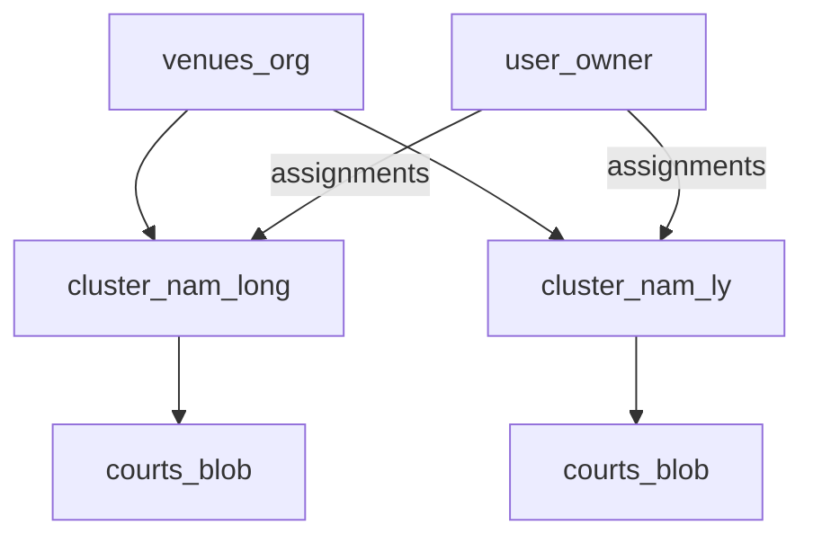

# Court Cluster Spec — V5.2 Phase 23

**Status:** Implemented V1 (local registry + Supabase `court_clusters` / `user_cluster_assignments`)  
**Phiên bản:** 1.0  
**Ngày:** 2026-07-07

Tài liệu định nghĩa **cụm sân** như tài sản vận hành độc lập dưới **tổ chức** (`venues`), với chủ sân gắn theo cụm (một tài khoản có thể quản lý nhiều cụm).

**Liên quan:** [`CLUB_GOVERNANCE_SPEC.md`](./CLUB_GOVERNANCE_SPEC.md), [`PHASE_23_COURT_CLUSTERS.sql`](./PHASE_23_COURT_CLUSTERS.sql), [`RBAC-MATRIX.md`](../RBAC-MATRIX.md)

---

## 1. Mục tiêu

1. Mỗi **cụm sân** (vd. Nam Long 6 sân, Nam Lý 4 sân) có **ID riêng** — là tài sản vận hành.
2. **Thanh toán / gói đăng ký** gắn **tổ chức** (`venues.id` = `tenant_subscriptions.tenant_id`), không tách billing theo cụm.
3. **Chủ sân** được gán một hoặc nhiều cụm qua `user_cluster_assignments`; trên mỗi cụm có cùng bộ chức năng vận hành (sân, booking, court-engine…).
4. **Chủ tổ chức** (`TENANT_OWNER`) thấy mọi cụm trong org; **chủ sân theo cụm** chỉ thấy cụm được gán.

---

## 2. Phân tầng khái niệm

| Khái niệm UI | Entity | Billing | Auth |
|--------------|--------|---------|------|
| Tổ chức / Công ty | `venues` | `tenant_subscriptions` | `profiles.venue_id` |
| Cụm sân (tài sản) | `court_clusters` | — | `user_cluster_assignments` |
| Sân vật lý | `club_data_v3.data.courts[]` + `clusterId` | — | Lọc theo `activeClusterId` |
| Cụm sân đăng ký CLB | `governance.registeredClusterId` | — | Liên kết CLB ↔ `court_clusters` |



---

## 3. Entity

### 3.1 `court_clusters`

| Field | Type | Mô tả |
|-------|------|-------|
| `id` | text PK | `cluster-nam-long` |
| `venue_id` | text FK | Tổ chức cha |
| `name` | text | Tên hiển thị |
| `slug` | text | Unique trong venue |
| `status` | text | `active` / `inactive` |
| `court_count` | int | Cache số sân (tự đếm khi chủ sân thêm sân) |
| `address` | text | Địa chỉ cụm sân |
| `google_maps_url` | text | Link Google Maps (chỉ đường) |
| `owner_user_id` | uuid | Chủ chính (mirror, optional) |

### 3.2 `user_cluster_assignments`

| Field | Type | Mô tả |
|-------|------|-------|
| `user_id` | uuid PK | Profile |
| `cluster_id` | text PK | Cụm |
| `role` | text | `CLUSTER_OWNER` (V1) |

### 3.3 Court blob

Mỗi court thêm `clusterId` (optional). Khi flag bật, court không có `clusterId` được gán cụm mặc định `{venueId}-main`.

---

## 4. Ma trận quyền (V2 — platform quản lý cụm)

| Vai trò | Tạo/sửa/xóa cụm | Gán chủ cụm | Vận hành sân trên cụm được gán |
|---------|-----------------|-------------|--------------------------------|
| `PLATFORM_ADMIN` / `SUPER_ADMIN` | Có | Có | Có |
| `SYSTEM_TECHNICIAN` | Có | Có | Không (trừ khi được gán) |
| `TENANT_OWNER` / `VENUE_OWNER` | **Không** | **Không** | Có (cụm được gán) |
| `VENUE_MANAGER` | **Không** | **Không** | Có (mọi cụm trong org — xem) |
| User có `CLUSTER_OWNER` assignment | Không | Không | Chỉ cụm được gán |
| `CLUB_MANAGER` / `PLAYER` | Không | Không | Theo venue; filter client nếu chọn cụm active |

Permission keys: `cluster.view`, `cluster.manage` (scope `platform`).

Chủ sân thấy địa chỉ + nút **Chỉ đường** (read-only) trên switcher cụm và trang Sân; không vào `/admin/court-clusters`.

SQL patch: [`PHASE_32_COURT_CLUSTER_LOCATION.sql`](./PHASE_32_COURT_CLUSTER_LOCATION.sql)

---

## 5. Migration

1. Mỗi `venues.id` hiện có → tạo cụm `{venueId}-main` tên "Cụm chính".
2. `venues.owner_id` → `user_cluster_assignments` cho cụm mặc định.
3. Courts trong blob → `clusterId = {venueId}-main`.

Script: `scripts/bootstrap-default-clusters.mjs`

---

## 6. Feature flag

`VITE_COURT_CLUSTERS_ENABLED=false` (mặc định): hành vi venue-wide như trước Phase 23.

`VITE_COURT_CLUSTERS_ENABLED=true`: bật cluster context, switcher, filter sân.

QA: [`PHASE_32_QA_CHECKLIST.md`](./PHASE_32_QA_CHECKLIST.md) · Staging verify: `npm run verify:phase32-court-clusters-staging`

---

## 7. Rollback

```sql
drop table if exists public.user_cluster_assignments;
drop table if exists public.court_clusters;
alter table public.court_engine_stores drop column if exists cluster_id;
```
