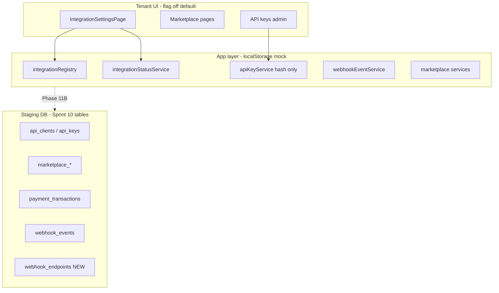

# Phase 11A — Marketplace / API Foundation

**Ngày:** 2026-07-01  
**Branch:** `v5-platform-edition`  
**Supabase staging:** `qyewbxjsiiyufanzcjcq`  
**Production:** không apply SQL Phase 11A

## Mục tiêu

Xây dựng **nền móng** Marketplace + Public API cho Platform v5:

- Integration registry (mock/config only)
- Tenant integration lifecycle
- API key foundation (hash, revoke/rotate design)
- Webhook foundation (events, endpoints, retry, signature design)
- Rate limit design (chưa enforce)
- RLS staging cho bảng Sprint 10

**Không** gọi provider thật, **không** secret trong repo/frontend, **không** mở public API khi chưa có rate limit + key guard.

---

## Tiền đề đã PASS

| Phase | Verdict |
|-------|---------|
| 10D Cross-tenant RLS core | PASS |
| 10E Billing tenant mapping | PASS |
| Court Engine P0 | Closed |

**P2 accepted (không blocker 11A):**

- `qr_tokens` / `checkins` policy harden trước mobile production data
- `PLAYER` đọc `tenant_subscriptions` cùng venue — route vẫn blocked

---

## Phạm vi Phase 11A

### Làm

| Hạng mục | Deliverable |
|----------|-------------|
| Tài liệu | File này |
| Integration registry | `src/features/integrations/constants/integrationRegistry.js` |
| Integration status | `disabled` / `configured` / `error` / `mock_only` |
| Status resolver | `integrationStatusService.js` |
| Webhook design | `webhookFoundation.js` |
| API rate limit design | `src/features/api/constants/rateLimitDesign.js` |
| API key audit design | `src/features/api/constants/apiKeyAudit.js` |
| Staging SQL RLS | `docs/supabase-sprint10-phase11a-rls.sql` |
| Tests | `tests/phase11a-marketplace-api-foundation.test.js` |

### Không làm (Phase 11B+)

- VNPay / MoMo / Stripe / Zalo / SMS / Email **network call thật**
- Secret thật trong repo hoặc `VITE_*` production
- Supabase store layer wired vào UI production
- Edge middleware rate limit enforce
- Public API route mở rộng không guard

---

## Kiến trúc tổng quan



**Feature flags (mặc định tắt):**

- `VITE_API_ENABLED=false`
- `VITE_MARKETPLACE_ENABLED=false`

---

## 1. Integration registry

Canonical providers (`integrationRegistry.js`):

| ID | Label | Category | Default tenant |
|----|-------|----------|----------------|
| `zalo` | Zalo OA | notification | disabled |
| `email` | Email SMTP | notification | disabled |
| `sms` | SMS | notification | disabled |
| `vnpay` | VNPay | payment | disabled |
| `momo` | MoMo | payment | disabled |
| `stripe` | Stripe | payment | disabled |
| `mock_payment` | Mock Payment | payment | disabled (`mock_only` when enabled) |

Registry **không** gọi network — chỉ metadata + field mapping tới `integrationStorage`.

---

## 2. Tenant integration settings

### Lifecycle states

| Status | Ý nghĩa |
|--------|---------|
| `disabled` | Tenant tắt hoặc chưa bật provider |
| `configured` | Tenant bật + env/tenant config hợp lệ (staging: env mock) |
| `error` | Tenant bật nhưng thiếu credential bắt buộc |
| `mock_only` | Chỉ mock payment — không gateway thật |

Resolver: `resolveProviderIntegrationStatus()` / `buildProviderStatusMap()`.

Storage per tenant: `pickleball-integration-settings-v1` (localStorage).  
**Phase 11B:** bảng `tenant_integration_settings` hoặc JSON column trên `venues`.

### Mapping tenant fields

| Provider | Field |
|----------|-------|
| zalo | `zaloEnabled`, `zaloConfig` |
| email | `emailEnabled` |
| sms | `smsEnabled` |
| vnpay | `vnpayEnabled` |
| momo | `momoEnabled` |
| stripe | `stripeEnabled` |
| mock_payment | `mockPaymentEnabled` |

**Thay đổi 11A:** `mockPaymentEnabled` default `false` (trước đây `true`).

---

## 3. API key foundation

### Hiện trạng (Sprint 10 local)

- `apiKeyService.js` — tạo key `pk_<prefix>.<secret>`
- `hashApiKey()` SHA-256 — **chỉ lưu hash**, plain key trả một lần khi tạo
- `revokeApiKey()` — status `revoked`
- Rotate: tạo key mới + revoke key cũ (manual flow)

### DB schema (Sprint 10)

- `api_clients` — tenant_id → `venues.id`
- `api_keys` — `key_prefix`, `hashed_key`, `scopes[]`, `status`
- `api_logs` — request audit

### Audit design (`apiKeyAudit.js`)

| Action | Khi nào |
|--------|---------|
| `api_key.created` | Tạo key |
| `api_key.rotated` | Rotate |
| `api_key.revoked` | Revoke |
| `api_key.auth_success` | Auth OK |
| `api_key.auth_failed` | Sai key |
| `api_key.scope_denied` | Thiếu scope |

**Phase 11B:** persist vào `api_logs` hoặc `billing_audit_logs` pattern.

### Rate limit design (`rateLimitDesign.js`)

| Window | Default quota |
|--------|---------------|
| 1 phút | 120 req |
| 1 giờ | 3,000 req |
| 1 ngày | 30,000 req |
| Burst | +20 |

Key pattern: `ratelimit:{tenantId}:{clientId}:{window}:{bucket}`.

**Enforce:** Phase 11B edge middleware — **không** expose public API trước khi có guard.

---

## 4. Webhook foundation

### Bảng hiện có: `webhook_events`

| Cột | Mục đích |
|-----|----------|
| provider | vnpay, momo, stripe, … |
| event_type | canonical type |
| payload | JSON raw |
| idempotency_key | chống duplicate |
| status | received → processed / failed |

### Bảng mới Phase 11A: `webhook_endpoints`

Outbound subscription per tenant:

- `url`, `event_types[]`, `signing_mode`, `secret_ref` (không raw secret)
- RLS: venue staff manage own tenant

### Event types (`webhookFoundation.js`)

- `payment.succeeded` / `payment.failed` / `payment.refunded`
- `subscription.renewed` / `subscription.cancelled`
- `marketplace.order.paid`
- `notification.delivered` / `notification.failed`

### Retry policy (design)

| Attempt | Delay |
|---------|-------|
| 1 | 1 min |
| 2 | 5 min |
| 3 | 15 min |
| 4 | 1 h |
| 5 | 4 h → dead letter |

### Signature verification (design)

| Mode | Provider |
|------|----------|
| `vnpay_hmac_sha512` | VNPay IPN |
| `momo_hmac_sha256` | MoMo |
| `stripe_signing_secret` | Stripe |
| `generic_hmac_sha256` | Outbound platform webhooks |

Ingress verify: **server-side only** (Edge Function / service role).

---

## 5. Staging SQL

| File | Mục đích |
|------|----------|
| `docs/supabase-sprint10.sql` | Tables Sprint 10 (đã có) |
| `docs/supabase-sprint10-phase11a-rls.sql` | RLS + `webhook_endpoints` |
| `docs/supabase-sprint10-phase11a-rollback.sql` | Rollback |

### RLS pattern

```
tenant_id = profiles.venue_id
SUPER_ADMIN → full access
VENUE_STAFF → CRUD own tenant (api_clients, api_keys, marketplace, webhook_endpoints)
PLAYER → no manage (select own tenant read where applicable)
```

**Chưa apply staging** trong Phase 11A closeout — apply trong Phase 11B QA.

### Không trùng bảng

Đã kiểm tra: `webhook_endpoints` là bảng mới; các bảng Sprint 10 giữ nguyên schema.

---

## 6. Routes UI (không thêm route mới)

| Route | Module | Ảnh hưởng 11A |
|-------|--------|---------------|
| `/settings/integrations` | integrations | Status chip dùng enum mới |
| `/settings/integrations/payments` | payments | Không đổi logic |
| `/marketplace` | marketplace | Flag off |
| `/admin/marketplace` | marketplace | Flag off |
| `/admin/integration-logs` | integrations | Flag off |

---

## 7. Ảnh hưởng module khác

| Module | Ảnh hưởng |
|--------|-----------|
| Billing | Không |
| Court Engine | Không |
| Mobile | Không |
| RBAC | Không — dùng `INTEGRATION_MANAGE` / `INTEGRATION_VIEW` sẵn có |

---

## 8. Tests Phase 11A

`tests/phase11a-marketplace-api-foundation.test.js`:

- Registry list 6 providers + mock — không network
- Default tenant settings — tất cả disabled
- Status resolver — `mock_only` khi bật mock
- Tenant isolation settings — A ≠ B
- API key — stored hash ≠ plain key
- Sprint 10 tests — regression

---

## 9. Phase 11B đề xuất

| Ưu tiên | Hạng mục |
|---------|----------|
| P0 | Apply `supabase-sprint10-phase11a-rls.sql` staging + JWT verify script |
| P0 | Supabase repository layer (`memory` / `local` / `supabase`) cho api + marketplace |
| P1 | Edge API router + rate limit enforce + scope guard |
| P1 | Webhook ingress Edge Function (signature verify, idempotency) |
| P1 | `tenant_integration_settings` persist Supabase |
| P2 | Provider sandbox adapters (VNPay/MoMo/Stripe mock HTTP) |
| P2 | Outbound webhook worker + retry queue |
| P2 | Admin UI API keys wired Supabase |

---

## Verdict Phase 11A

| Gate | Trạng thái |
|------|------------|
| Design doc | ✅ |
| Registry + status code | ✅ |
| Mock foundation default disabled | ✅ |
| Staging RLS SQL + rollback | ✅ (chưa apply) |
| No production SQL | ✅ |
| No real provider calls | ✅ |

**Next:** Phase 11B — staging apply RLS + Supabase store + API guard.
