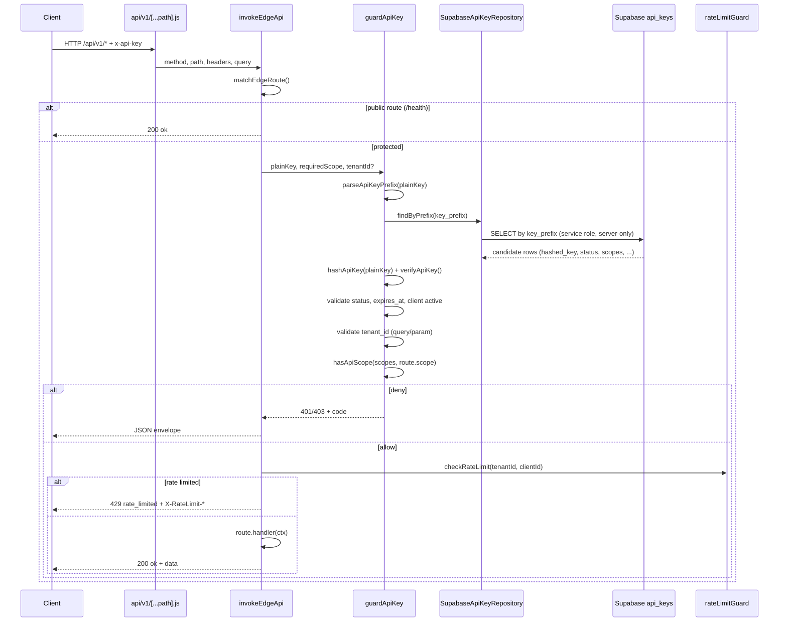

# Phase 11D — Supabase-backed API Key Runtime Verification

**Trạng thái:** P0 implemented — Preview HTTP verify pending (Vercel env + redeploy + bypass secret)  
**Tiền đề:** Phase 11C **PASS** hoàn toàn (commit script fix `25a1779` trên `origin/v5-platform-edition`)  
**Branch:** `v5-platform-edition`  
**Supabase staging:** `qyewbxjsiiyufanzcjcq`  
**Production:** không apply

---

## 1. Objective

Chuyển runtime API key authentication trên **Vercel serverless Preview** từ in-memory/localStorage sang **lookup thật trên Supabase** (`public.api_keys` + `public.api_clients`).

| Yêu cầu | Chi tiết |
|---------|----------|
| Validate key thật | Mọi request HTTP tới `/api/v1/*` (protected) phải resolve key từ Supabase |
| Không mock runtime | Không dùng `localStorage`, in-memory store, hay mock repository cho Preview HTTP thật |
| Enforce đầy đủ | `tenant_id`, `scopes`, `status`, `expires_at`, rate limit |
| Giữ envelope | JSON response chuẩn Phase 11C (`ok`, `code`, `message`, `data`, `requestId`) |
| Đóng gap 11C | 10 scenario Preview HTTP valid-key hiện `NOT_APPLICABLE` → **PASS** qua DB thật |

**Không phải mục tiêu P0:** persist audit Supabase, `integrations:write` route, Redis rate limit, API key management UI.

---

## 2. Current baseline (Phase 11C)

### 2.1 Đã PASS

| Area | Kết quả |
|------|---------|
| Automated verify | `PASS: 31` `FAIL: 0` `BLOCKED: 0` `PARTIAL: 0` |
| Preview HTTP (negative) | health 200, not found 404, missing key 401, invalid key 401 |
| In-memory edge (§D) | 17/17 scenario — valid key, scope, tenant, revoked, expired, rate limit, webhooks |
| Schema / RLS / RBAC | Columns đủ; JWT tenant isolation; `api.manage` gate |
| Runtime safety | Không 500, `FUNCTION_INVOCATION_FAILED`, `localStorage is not defined` |

### 2.2 Còn NOT_APPLICABLE (Phase 11D scope)

Script `scripts/verify-phase11c-api-key-guard-staging.mjs` — `PHASE_11D_PREVIEW_TESTS` (10 tests):

| Test | Lý do defer 11C |
|------|-----------------|
| `preview:valid key` | Serverless không đọc key từ in-memory |
| `preview:missing scope` | Cần key seeded Supabase + HTTP |
| `preview:valid scope` | Cần key có `integrations:read` trên DB |
| `preview:wrong tenant` | Cần key tenant A/B trên DB |
| `preview:revoked key` | Cần row `status=revoked` trên DB |
| `preview:expired key` | Cần `expires_at` quá khứ trên DB |
| `preview:rate limit` | Cần key hợp lệ + 2 request liên tiếp trên Preview |
| `preview:webhook read` | Cần key `webhooks:read` |
| `preview:webhook write denied` | Cần key chỉ `webhooks:read` |
| `preview:webhook write ok` | Cần key `webhooks:write` |

> **Lưu ý:** Tổng `NOT_APPLICABLE: 11` trong run 11C gồm thêm 1 test commit header — không thuộc P0 HTTP matrix.

### 2.3 Code path hiện tại

```
api/v1/[...path].js
  → invokeEdgeApi()          [edgeApiRouter.js]
    → guardApiKey()          [apiKeyGuard.js]
      → findKeyByPlain()
        → loadApiKeys()      [apiStorage.js — runtime memory/localStorage]
    → checkRateLimit()       [rateLimitGuard.js — in-memory Map]
```

Phase 11C đã có helper seed Supabase trong verify script (`seedSupabaseProbeKey`) — chỉ dùng cho RLS probe §E, **chưa** wire vào `guardApiKey` runtime.

---

## 3. Runtime architecture

### 3.1 Request flow (target)



### 3.2 Storage adapter pattern

Tách lookup khỏi `apiStorage.js` bằng interface mỏng:

| Mode | Khi nào | Implementation |
|------|---------|----------------|
| `memory` | Unit tests, §D in-memory verify | `loadApiKeys()` hiện tại |
| `supabase` | Vercel serverless, Preview HTTP | `SupabaseApiKeyRepository` — service role env |

**Selection rule (đề xuất):**

- `API_KEY_STORE=supabase` **và** `SUPABASE_SERVICE_ROLE_KEY` có mặt → Supabase
- Ngược lại → memory (giữ test local không cần DB)

`api/v1/[...path].js` và Preview Vercel **bắt buộc** set `API_KEY_STORE=supabase`.

### 3.3 Supabase lookup query

```sql
-- Pseudocode — application layer, không expose raw key
SELECT k.id, k.client_id, k.tenant_id, k.key_prefix, k.hashed_key,
       k.scopes, k.status, k.expires_at, k.last_used_at,
       c.status AS client_status
FROM public.api_keys k
JOIN public.api_clients c ON c.id = k.client_id
WHERE k.key_prefix = $1
  AND k.tenant_id IS NOT NULL;
```

- Filter theo `key_prefix` trước (index `api_keys_prefix_tenant_idx`)
- Hash + compare trong app (`verifyApiKey`) — không so sánh raw key trong SQL
- Nếu nhiều row cùng prefix (edge case): iterate candidates, constant-time compare
- Map snake_case DB → camelCase model (`keyPrefix`, `hashedKey`, `expiresAt`, …)

### 3.4 Client resolution

`getApiClient(clientId)` hiện đọc memory — Phase 11D P0:

- Join `api_clients` trong cùng query lookup **hoặc**
- Fetch client row sau khi key match

Client `status !== active` → `401 invalid_api_key` (giữ behavior 11C).

### 3.5 Response envelope

Không đổi format Phase 11C — xem `src/features/api/utils/edgeApiResponse.js`.

Success example (`GET /api/v1/tenant`):

```json
{
  "ok": true,
  "code": "ok",
  "message": "OK",
  "data": {
    "tenantId": "venue-staging-a",
    "clientId": "uuid",
    "scopes": ["tenant:read"]
  },
  "requestId": "..."
}
```

---

## 4. Security rules

| Rule | Enforcement |
|------|-------------|
| Không log raw API key | `apiLogService`, `apiKeyAuditService`, verify script redaction |
| Không trả `hashed_key` | Repository sanitize; handlers không include hash |
| Không expose service role | Chỉ env serverless (`SUPABASE_SERVICE_ROLE_KEY`), không `VITE_*` |
| Raw key chỉ hash/compare | `hashApiKey` + `verifyApiKey` tại guard — không persist |
| Logs an toàn | Chỉ `key_prefix`, `requestId`, `tenantId`, `scope`, `status`, `code` |
| Header redaction | `x-api-key` → `[REDACTED]` trong mọi log path |
| Output safety | Verify script tiếp tục `redactSecrets()` + fingerprint tracking |

**Clarification vs Phase 11C note:** "Không dùng service_role bypass RLS" nghĩa là **không** cho phép client/browser hay handler bỏ qua tenant/scope check. Service role trong serverless function chỉ để **đọc** `api_keys` — mọi authorization vẫn enforce trong `guardApiKey`.

### 4.1 Vercel env (Preview staging)

| Variable | Scope | Ghi chú |
|----------|-------|---------|
| `SUPABASE_URL` | Server | Đã có cho app |
| `SUPABASE_SERVICE_ROLE_KEY` | Server only | **Mới** cho API runtime |
| `API_KEY_STORE` | Server | `supabase` trên Preview |
| `VITE_API_ENABLED` | Build | `true` (giữ 11C) |

---

## 5. Route scope mapping

Dùng **naming hiện tại** (`colon` separator) — thống nhất với `src/features/api/constants/apiScopes.js`:

| Method | Path | Required scope | Public |
|--------|------|----------------|--------|
| GET | `/api/v1/health` | — | ✅ |
| GET | `/api/v1/tenant` | `tenant:read` | ❌ |
| GET | `/api/v1/integrations` | `integrations:read` | ❌ |
| GET | `/api/v1/webhooks/test` | `webhooks:read` | ❌ |
| POST | `/api/v1/webhooks/test` | `webhooks:write` | ❌ |

**Tenant override:** `?tenantId=` hoặc route param — nếu khác `auth.tenantId` → `403 tenant_not_found`.

**Reserved P1:** `integrations:write` — chưa có route; không blocker P0.

Source of truth: `EDGE_ROUTES` trong `edgeApiRouter.js` + handler modules (`tenantHandler.js`, `integrationsHandler.js`, `webhooksHandler.js`).

---

## 6. Required staging seed data

### 6.1 Tenants

| Tenant ID | Mục đích |
|-----------|----------|
| `venue-staging-a` | Owner A — key hợp lệ, scope tests |
| `venue-staging-b` | Owner B — cross-tenant deny |

### 6.2 Key fixtures (tối thiểu)

| Fixture ID | Tenant | Scopes | Status | expires_at | Dùng cho |
|------------|--------|--------|--------|------------|----------|
| `key-tenant-a-read` | A | `tenant:read` | active | null | valid key, wrong tenant (B query) |
| `key-tenant-b-read` | B | `tenant:read` | active | null | wrong tenant (A query) |
| `key-tenant-a-integrations` | A | `tenant:read`, `integrations:read` | active | null | valid scope |
| `key-tenant-a-no-integrations` | A | `tenant:read` only | active | null | missing scope |
| `key-tenant-a-revoked` | A | `tenant:read` | revoked | null | revoked |
| `key-tenant-a-expired` | A | `tenant:read` | active | past ISO | expired |
| `key-tenant-a-webhook-rw` | A | `webhooks:read`, `webhooks:write` | active | null | webhook read + write ok |
| `key-tenant-a-webhook-ro` | A | `webhooks:read` | active | null | webhook write denied |

### 6.3 Seed delivery — không commit raw keys

| Cách | Mô tả |
|------|-------|
| **A (khuyến nghị)** | Script `scripts/seed-phase11d-api-keys-staging.mjs` — generate keys, insert hashed rows, in ra env var names **không** in plain key (chỉ prefix + hướng dẫn copy một lần) |
| **B** | Operator paste plain keys vào Vercel env / local `.env.staging` (gitignored): `PHASE11D_KEY_TENANT_A_READ`, … |
| **C** | Verify script tự seed + cleanup trong một run (reuse `seedSupabaseProbeKey` pattern) — plain key chỉ trong process memory |

**Repo chỉ chứa:** fixture metadata (prefix, tenant, scopes, status) — **không** plain key, **không** `hashed_key` của key production.

### 6.4 Cleanup

Script seed/verify phải `cleanup` probe rows (`api_keys` + `api_clients`) sau run — label prefix `Phase11D Probe *`.

---

## 7. Verification matrix

### 7.1 Preview HTTP (P0 — phải PASS)

| # | Scenario | Request | Expected HTTP | Expected `code` | Headers |
|---|----------|---------|---------------|-----------------|---------|
| 1 | Health public | `GET /api/v1/health` | 200 | `ok` | — |
| 2 | No key | `GET /api/v1/tenant` | 401 | `unauthorized` | — |
| 3 | Invalid key | `GET /api/v1/tenant` + `x-api-key: pk_invalid....` | 401 | `invalid_api_key` | — |
| 4 | Valid key tenant A | `GET /api/v1/tenant` + key A | 200 | `ok` | `data.tenantId=A` |
| 5 | Missing scope | `GET /api/v1/integrations` + key chỉ `tenant:read` | 403 | `scope_denied` | — |
| 6 | Valid scope | `GET /api/v1/integrations` + key có `integrations:read` | 200 | `ok` | `data.tenantId=A` |
| 7 | Wrong tenant A→B | `GET /api/v1/tenant?tenantId=venue-staging-b` + key A | 403 | `tenant_not_found` | — |
| 8 | Wrong tenant B→A | `GET /api/v1/tenant?tenantId=venue-staging-a` + key B | 403 | `tenant_not_found` | — |
| 9 | Revoked key | `GET /api/v1/tenant` + revoked key | 401 | `invalid_api_key` | — |
| 10 | Expired key | `GET /api/v1/tenant` + expired key | 401 | `invalid_api_key` | — |
| 11 | Rate limit | 2× `GET /api/v1/tenant` + cùng key (limit=1) | 429 | `rate_limited` | `X-RateLimit-Limit`, `X-RateLimit-Remaining`, `X-RateLimit-Reset`, `Retry-After` |
| 12 | Webhook read | `GET /api/v1/webhooks/test` + key `webhooks:read` | 200 | `ok` | — |
| 13 | Webhook write denied | `POST /api/v1/webhooks/test` + key chỉ read | 403 | `scope_denied` | — |
| 14 | Webhook write ok | `POST /api/v1/webhooks/test` + key write | 200 | `ok` | `data.accepted=true` |
| 15 | Not found | `GET /api/v1/does-not-exist-route` | 404 | `not_found` | — |

### 7.2 Regression (giữ từ 11C)

| Check | Expected |
|-------|----------|
| Không HTTP 500 | PASS |
| Không `FUNCTION_INVOCATION_FAILED` | PASS |
| Không `localStorage is not defined` | PASS |
| stdout không chứa raw key | PASS (redaction test) |
| §D in-memory edge tests | PASS (memory adapter vẫn hoạt động) |
| Schema / RLS / RBAC probes | PASS (không regression) |

### 7.3 Verify command (target)

```bash
VERCEL_AUTOMATION_BYPASS_SECRET=<secret> \
STAGING_PREVIEW_URL=<preview-url> \
SUPABASE_SERVICE_ROLE_KEY=<staging-service-role> \
PHASE11D_KEY_TENANT_A_READ=<from seed env> \
# ... other PHASE11D_KEY_* vars ...
node scripts/verify-phase11d-api-key-runtime-staging.mjs
```

Hoặc mở rộng script 11C với section §G — tùy implement (ưu tiên script riêng để 11C frozen).

---

## 8. Implementation plan

### P0 — Runtime + verify (Phase 11D closeout)

| # | Task | Files (dự kiến) |
|---|------|-----------------|
| 1 | Supabase API key repository | `src/features/api/repositories/supabaseApiKeyRepository.js` (new) |
| 2 | Store adapter / factory | `src/features/api/storage/apiKeyStore.js` (new) |
| 3 | Wire `guardApiKey` → adapter | `src/features/api/guards/apiKeyGuard.js` |
| 4 | Wire client lookup từ DB | `src/features/api/guards/apiKeyGuard.js`, repository |
| 5 | Env detection serverless | `api/v1/[...path].js`, optional `src/features/api/config/apiKeyStoreConfig.js` |
| 6 | Staging seed script | `scripts/seed-phase11d-api-keys-staging.mjs` (new) |
| 7 | Phase 11D verify script | `scripts/verify-phase11d-api-key-runtime-staging.mjs` (new) |
| 8 | Reuse preview HTTP helpers | `scripts/phase11c-preview-http.mjs` (import, không đổi behavior) |
| 9 | Unit tests — Supabase adapter mock | `tests/phase11d-supabase-api-key-runtime.test.js` (new) |
| 10 | Update guard tests nếu cần | `tests/phase11c-edge-api-key-guard.test.js` |
| 11 | Staging QA doc | `docs/v5/PHASE_11D_SUPABASE_API_KEY_RUNTIME_STAGING_QA.md` (sau verify PASS) |
| 12 | Vercel Preview env | Dashboard: `API_KEY_STORE`, `SUPABASE_SERVICE_ROLE_KEY` |

**Production-scale enforcement:** in-memory per-instance on Vercel Preview. Preview HTTP rate limit may be `NOT_APPLICABLE` when requests hit different serverless instances (distributed limit → P2).

**Env override (fixed P0):** `resolveMinuteRateLimit()` — explicit `limits` > `API_RATE_LIMIT_REQUESTS_PER_MINUTE` > default 120. Router passes `limits: {}` (not `DEFAULT_API_RATE_LIMITS`) so env applies on serverless.

### P1 — Audit + write scope

| Task | Mô tả |
|------|-------|
| `integration_audit_logs` persistence | `apiKeyAuditService` → Supabase insert |
| `integrations:write` scope | Route POST/PATCH placeholder khi cần |

### P2 — Scale + UI

| Task | Mô tả |
|------|-------|
| Distributed rate limit | Redis hoặc Supabase counter table |
| API key management UI | `IntegrationSettingsPage` — **ngoài scope** hiện tại (đã stash riêng) |

---

## 9. Acceptance criteria

| Gate | Criteria |
|------|----------|
| `npm test` | PASS |
| `npm run build` | PASS |
| `npm run lint` | 0 errors |
| Phase 11D staging verify | PASS — `FAIL=0` `BLOCKED=0` `PARTIAL=0` |
| Preview HTTP P0 matrix | 15/15 PASS — **không** `NOT_APPLICABLE` cho valid-key scenarios |
| Phase 11C regression | Script 11C vẫn PASS khi chạy lại (hoặc frozen commit) |
| Safety | Không 500, `FUNCTION_INVOCATION_FAILED`, `localStorage is not defined` |
| Secret hygiene | Không raw key trong stdout, logs, docs, git |

---

## 10. Non-goals

- Không deploy Production
- Không build marketplace UI lớn
- Không API key management UI (P2)
- Không refactor billing / global RBAC ngoài API key runtime path
- Không webhook outbound thật
- Không payment/provider network calls
- Không thay đổi legacy `invokeApi()` Sprint 10 routes

---

## Appendix A — Files reference (hiện có)

| File | Vai trò |
|------|---------|
| `api/v1/[...path].js` | Vercel entry |
| `src/features/api/router/edgeApiRouter.js` | Router + guard pipeline |
| `src/features/api/guards/apiKeyGuard.js` | Key auth (cần adapter) |
| `src/features/api/guards/rateLimitGuard.js` | In-memory rate limit |
| `src/features/api/storage/apiStorage.js` | Memory store |
| `src/features/api/utils/hashKey.js` | SHA-256 hash/compare |
| `scripts/phase11c-preview-http.mjs` | Preview fetch isolation |
| `scripts/verify-phase11c-api-key-guard-staging.mjs` | 11C verify (frozen baseline) |
| `docs/supabase-sprint10-phase11c-api-key-guard.sql` | `expires_at` + indexes (đã apply) |

## Appendix B — SQL prerequisites

Đã apply staging (Phase 11A + 11C):

- `public.api_clients`
- `public.api_keys` (+ `expires_at`, indexes)
- RLS policies Phase 11A
- `public.integration_audit_logs` (P1 persist)

**Không cần SQL mới cho P0** trừ khi phát hiện gap column — nếu có, tách patch `docs/supabase-sprint10-phase11d-*.sql`.

## Appendix C — Handoff từ Phase 11C

| 11C deliverable | 11D action |
|-----------------|------------|
| In-memory guard logic | Giữ — extract shared validation |
| Preview negative HTTP | Giữ — regression |
| `seedSupabaseProbeKey` | Mở rộng thành seed script đầy đủ |
| `PHASE_11D_PREVIEW_TESTS` stub | Implement thật trong verify 11D |
| Commit `25a1779` script fix | Baseline frozen; 11D script mới |

---

*Document version: 2026-07-02 — P0 implemented.*

---

## 14. P0 implementation (2026-07-02)

| File | Vai trò |
|------|---------|
| `src/features/api/config/apiKeyStoreConfig.js` | `API_KEY_STORE` resolution; fail-fast supabase |
| `src/features/api/storage/apiKeyStore.js` | Store selector + `findApiKeyByPlain` |
| `src/features/api/repositories/memoryApiKeyRepository.js` | Memory/localStorage lookup |
| `src/features/api/repositories/supabaseApiKeyRepository.js` | Supabase service-role lookup |
| `src/features/api/guards/apiKeyGuard.js` | Wired adapter; `last_used_at` best-effort |
| `src/features/api/guards/rateLimitGuard.js` | `API_RATE_LIMIT_REQUESTS_PER_MINUTE` env override |
| `scripts/seed-phase11d-api-keys-staging.mjs` | Seed + cleanup probe keys |
| `scripts/verify-phase11d-api-key-runtime-staging.mjs` | Preview HTTP verify |
| `tests/phase11d-supabase-api-key-runtime.test.js` | Unit tests |

### Vercel Preview env (bắt buộc)

```
API_KEY_STORE=supabase
SUPABASE_SERVICE_ROLE_KEY=<staging service role>
SUPABASE_URL=<staging url>   # hoặc VITE_SUPABASE_URL
VITE_API_ENABLED=true
API_RATE_LIMIT_REQUESTS_PER_MINUTE=1   # staging verify rate limit
```

### Verify command

```bash
VERCEL_AUTOMATION_BYPASS_SECRET=<secret> \
STAGING_PREVIEW_URL=<preview-url> \
SUPABASE_SERVICE_ROLE_KEY=<staging-service-role> \
node scripts/verify-phase11d-api-key-runtime-staging.mjs
```

**Staging QA:** `docs/v5/PHASE_11D_SUPABASE_API_KEY_RUNTIME_STAGING_QA.md`

