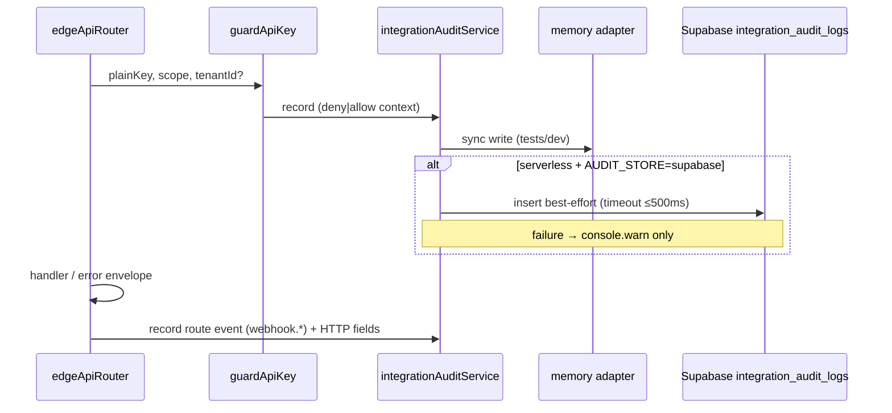

# Phase 11E — Persistent Integration Audit Logs & Write Scope Verification

**Trạng thái:** ✅ **P0 implemented** — local gates PASS; staging Preview HTTP verify **pending** (deploy 11E + `VERCEL_AUTOMATION_BYPASS_SECRET`)  
**Tiền đề:** Phase 11D **PASS** (staging verify 2026-07-02, commit `7e5017f`)  
**Branch:** `v5-platform-edition`  
**Supabase staging:** `qyewbxjsiiyufanzcjcq`  
**Production:** không apply

---

## 1. Objective

| # | Yêu cầu | Chi tiết |
|---|---------|----------|
| A | Persist audit | Ghi `integration_audit_logs` trên Supabase thay vì chỉ `localStorage`/memory |
| B | Audit security | Không raw API key, không `hashed_key`, metadata an toàn |
| C | `integrations:write` | Enforce scope trên route write; read-only key → 403 `scope_denied` |
| D | Staging verify | Script riêng assert HTTP + audit rows trên Preview (`API_KEY_STORE=supabase`) |

**Không phải mục tiêu P0:** API key management UI, distributed rate limit, Production deploy, marketplace UI lớn, pop stash `IntegrationSettingsPage.jsx`.

---

## 2. Closeout Phase 11D (baseline)

| Gate | Kết quả |
|------|---------|
| Staging verify | **PASS** — `PASS: 16` `FAIL: 0` `BLOCKED: 0` `PARTIAL: 0` |
| `npm test` | 712 pass, 0 fail |
| `npm run build` | PASS |
| `npm run lint` | 0 errors |
| Closeout doc | `7e5017f` — `docs/v5/PHASE_11D_SUPABASE_API_KEY_RUNTIME_STAGING_QA.md` |

### Commits liên quan

| Commit | Mô tả |
|--------|-------|
| `ac98479` | `feat(api): add Phase 11D Supabase API key runtime` |
| `00ee490` | `fix(api): apply Phase 11D rate limit env override` |
| `091e289` | `fix(api): isolate Phase 11D webhook rate-limit verification` |
| `7e5017f` | `docs(v5): close Phase 11D Supabase API key runtime QA` |

### Code path hiện tại (audit)

```
edgeApiRouter.invokeEdgeApi()
  → guardApiKey()                    [apiKeyGuard.js]
    → recordApiKeyAudit()            [apiKeyAuditService.js]
      → getRuntimeStorage()          [localStorage | in-memory Map]
  → route.handler()
```

Phase 11D đã wire Supabase cho **key lookup** (`apiKeyStore` → `supabaseApiKeyRepository`). Audit vẫn **chỉ** ghi runtime storage — trên Vercel serverless là in-memory per instance, **không durable**.

---

## 3. Schema target — `integration_audit_logs` (Phase 11E)

**Migration:** `docs/supabase-sprint10-phase11e-integration-audit.sql`  
**Rollback indexes:** `docs/supabase-sprint10-phase11e-rollback.sql`

```sql
create table if not exists public.integration_audit_logs (
  id uuid primary key default gen_random_uuid(),
  request_id text,
  tenant_id text,                    -- nullable (deny trước auth)
  api_client_id text,
  api_key_id text,
  key_prefix text,
  event_type text not null,
  route text,
  method text,
  status_code integer,
  result_code text,
  scope_required text,
  scopes_granted jsonb default '[]'::jsonb,
  metadata jsonb default '{}'::jsonb,
  created_at timestamptz not null default now()
);
```

| Cột | Kiểu | Ghi chú |
|-----|------|---------|
| `id` | `uuid` | PK |
| `request_id` | `text` | Envelope `requestId` |
| `tenant_id` | `text` nullable | Null khi missing/invalid key |
| `api_client_id` | `text` | UUID string, không FK P0 |
| `api_key_id` | `text` | UUID string, không FK P0 |
| `key_prefix` | `text` | `pk_xxxxxxxx` only |
| `event_type` | `text NOT NULL` | `api_key.used`, `webhook.read`, … |
| `route` | `text` | e.g. `/api/v1/integrations` |
| `method` | `text` | GET, POST, … |
| `status_code` | `integer` | HTTP status |
| `result_code` | `text` | Envelope `code` |
| `scope_required` | `text` | Route scope |
| `scopes_granted` | `jsonb` | Array scopes key được cấp |
| `metadata` | `jsonb` | Safe extras (`reason`, `probeTag`) — **không secret** |
| `created_at` | `timestamptz` | Default `now()` |

**Indexes:** `created_at`, `(tenant_id, created_at)`, `request_id`, `(event_type, created_at)`, `(key_prefix, created_at)`  
**RLS:** select own venue; insert venue staff (`tenant_id` not null); super_admin all.  
**Serverless insert:** service role bypass RLS (giống `supabaseApiKeyRepository`).

### Legacy Phase 11B (nếu đã apply trước)

Bảng cũ có `action`, `actor_id`, `meta`. Migration 11E:

- Backfill `event_type` ← `action`
- Backfill `metadata` ← `meta`
- Giữ cột legacy (không drop P0)
- `action` / `meta` → **nullable** (Phase 11E code không ghi legacy columns)
- `tenant_id` → nullable

### Trạng thái apply staging

| SQL | Trạng thái |
|-----|------------|
| `docs/supabase-sprint10-phase11e-integration-audit.sql` | **Apply trước verify 11E** — idempotent (create hoặc upgrade từ 11B) |

---

## 4. Gap analysis — đã đóng bằng migration 11E

| Trường yêu cầu | Phase 11E column | Ghi chú |
|----------------|------------------|---------|
| `request_id` | ✅ `request_id` | |
| `tenant_id` | ✅ `tenant_id` | Nullable |
| `api_client_id` | ✅ `api_client_id` | `text` |
| `api_key_id` | ✅ `api_key_id` | `text` |
| `key_prefix` | ✅ `key_prefix` | |
| `event_type` | ✅ `event_type` | Thay `action` (legacy backfill) |
| `route` | ✅ `route` | |
| `method` | ✅ `method` | |
| `status_code` | ✅ `status_code` | `integer` |
| `result_code` | ✅ `result_code` | |
| `scope_required` | ✅ `scope_required` | |
| `scopes_granted` | ✅ `scopes_granted` | `jsonb` array |
| `created_at` | ✅ `created_at` | |
| metadata an toàn | ✅ `metadata` | Thay `meta` (legacy backfill) |

**Mapper code P0:** `API_KEY_AUDIT_ACTIONS.*` → cột `event_type`; `buildApiKeyAuditEntry` meta → `metadata` + top-level columns.

---

## 5. Event types (tối thiểu)

### Hiện có (`apiKeyAudit.js`)

| Constant | `event_type` value | Nguồn hiện tại |
|----------|----------------|----------------|
| `CREATED` | `api_key.created` | `apiKeyService.createApiKey` |
| `REVOKED` | `api_key.revoked` | `apiKeyService.revokeApiKey` |
| `USED` | `api_key.used` | `guardApiKey` success |
| `DENIED` | `api_key.denied` | `guardApiKey` deny paths |
| `SCOPE_DENIED` | `api_key.scope_denied` | `guardApiKey` thiếu scope |

### Thêm Phase 11E

| Constant (mới) | `event_type` value | Khi nào |
|----------------|----------------|---------|
| `WEBHOOK_READ` | `webhook.read` | `GET /webhooks/test` success |
| `WEBHOOK_WRITE` | `webhook.write` | `POST /webhooks/test` success |

**Quy ước ghi audit:**

| Tình huống | Event |
|------------|-------|
| Guard deny (missing/invalid/revoked/expired/tenant) | `api_key.denied` |
| Guard thiếu scope | `api_key.scope_denied` |
| Guard allow — route integrations/tenant | `api_key.used` |
| Guard allow — `GET /webhooks/test` | `webhook.read` (+ optional `api_key.used` **không** duplicate — chỉ `webhook.read`) |
| Guard allow — `POST /webhooks/test` | `webhook.write` |
| Guard allow — `POST /integrations/.../test-write` | `api_key.used` (scope `integrations:write`) |
| Seed/admin create key | `api_key.created` (nếu flow chạy) |
| Revoke key | `api_key.revoked` (nếu flow chạy) |

---

## 6. Runtime architecture (target)



### Adapter pattern (mirror `apiKeyStore`)

| Mode | Khi nào | Persist |
|------|---------|---------|
| `memory` | `NODE_ENV=test`, local dev | Runtime storage only |
| `supabase` | Vercel Preview/Production serverless | Insert Supabase + memory (tests) |

**Env (đề xuất):**

| Variable | Giá trị | Ghi chú |
|----------|---------|---------|
| `AUDIT_STORE` | `supabase` \| `memory` | Default: `supabase` khi `API_KEY_STORE=supabase` + service role có |
| `AUDIT_INSERT_TIMEOUT_MS` | `500` | Optional; `Promise.race` |

**Nguyên tắc:**

- Audit insert **không** fail request chính.
- Không `await` unbounded — timeout ngắn hoặc fire-and-forget có `.catch(warn)`.
- Không gọi `localStorage` trên serverless cho audit durable path.

---

## 7. Scope `integrations:write`

### Hiện trạng

`integrationsHandler.js` chỉ có:

| Method | Path | Scope |
|--------|------|-------|
| `GET` | `/integrations` | `integrations:read` |

**Chưa có** route `integrations:write`.

### Route placeholder P0 (đề xuất)

Thêm vào `integrationsRoutes`:

```javascript
{
  method: "POST",
  path: "/integrations/:provider/test-write",
  scope: API_SCOPES.INTEGRATIONS_WRITE,
  handler: ({ auth, params, body, requestId }) => ({
    accepted: true,
    mode: "placeholder",
    tenantId: auth.tenantId,
    provider: params.provider || "unknown",
    received: body ?? null,
    requestId,
    note: "Không ghi settings thật — chỉ verify scope write.",
  }),
}
```

**HTTP matrix:**

| Case | HTTP | `code` |
|------|------|--------|
| Key có `integrations:write` | 200 | `ok` |
| Key chỉ `integrations:read` | 403 | `scope_denied` |
| Missing key | 401 | `unauthorized` |
| Invalid key | 401 | `invalid_api_key` |

**Ví dụ verify:** `POST /api/v1/integrations/zalo/test-write` với body `{ "probe": true }`.

---

## 8. Audit security (bắt buộc)

| Rule | Enforcement |
|------|-------------|
| Không raw API key trong audit | `sanitizeAuditMeta()` strip `plainKey`, `x-api-key`, `hashed_key`, `hashedKey` |
| Không `hashed_key` trong DB audit | Repository reject keys trong meta |
| `key_prefix` only | `pk_xxxxxxxx` (8 chars) — đã có trong guard |
| Safe metadata | `reason`, `probeTag`, `provider` — không secret |
| Output safety test | Tiếp tục PASS — redact service role, bypass, key secret segment |

**Trường HTTP ghi từ router** (sau khi biết `statusCode` + envelope `code`):

- `request_id`, `route`, `method`, `status_code`, `result_code`
- `scope_required` từ `route.scope`
- `scopes_granted` từ `auth.scopes` khi auth ok

**Guard deny:** ghi audit ngay trong guard; router bổ sung HTTP fields nếu có `requestId` (truyền context object xuống guard hoặc ghi lại tại router sau `finish()`).

**Đề xuất P0:** router gọi `recordIntegrationAudit()` **một lần** tại `finish()` với đủ HTTP context; guard chỉ set in-memory pending context hoặc gọi service với `deferHttpFields: true`. Tránh duplicate rows.

---

## 9. Staging seed

### Reuse Phase 11D

`scripts/seed-phase11d-api-keys-staging.mjs` — tenants `venue-staging-a`, `venue-staging-b`, prefix `Phase11D Probe`.

### Bổ sung Phase 11E fixtures

| Fixture ID | Tenant | Scopes | Mục đích |
|------------|--------|--------|----------|
| `tenantAIntegrationsWrite` | A | `integrations:read`, `integrations:write` | Write route 200 |
| (reuse) `tenantAIntegrations` | A | `integrations:read` | Write route 403 |
| (reuse) `tenantAWebhookRo` | A | `webhooks:read` | Webhook read |
| (reuse) `tenantAWebhookRw` | A | `webhooks:read`, `webhooks:write` | Webhook write |
| (reuse) `tenantBRead` | B | `tenant:read` | Tenant isolation |
| (reuse) `tenantARevoked` / `tenantAExpired` | A | — | Denied audit |

**Cách triển khai:** mở rộng seed 11D **hoặc** `scripts/seed-phase11e-audit-fixtures.mjs` import reuse cleanup/insert helpers.

**Không** commit raw key; script trả handles in-process (object), không `console.log` plain key.

### Audit probe cleanup

Trước/sau verify, xóa rows:

```sql
delete from integration_audit_logs
where metadata->>'probeTag' = 'phase11e'
   or (metadata->>'probeTag' is null and key_prefix like 'pk_%' and created_at > :run_start);
```

Ưu tiên `metadata.probeTag = 'phase11e'` khi insert từ verify probes.

---

## 10. Verify script

**File:** `scripts/verify-phase11e-integration-audit-staging.mjs`

### Env

```bash
VERCEL_AUTOMATION_BYPASS_SECRET=<secret> \
STAGING_PREVIEW_URL=<preview-url> \
SUPABASE_SERVICE_ROLE_KEY=<staging-service-role> \
node scripts/verify-phase11e-integration-audit-staging.mjs
```

### Flow

1. Probe `integration_audit_logs` EXISTS (+ columns 11E nếu migration applied)
2. Seed fixtures (keys + optional audit cleanup)
3. Clear audit rows `probeTag=phase11e`
4. Preview HTTP matrix (reuse `scripts/phase11c-preview-http.mjs`)
5. Poll/query Supabase assert audit rows (delay nhỏ 1–2s cho async insert)
6. Output safety check (redaction)
7. Cleanup fixtures + audit probe rows
8. Summary `PASS` / `FAIL` / `BLOCKED` / `PARTIAL`

### Verification matrix (tối thiểu)

| # | Scenario | HTTP assert | Audit assert |
|---|----------|-------------|--------------|
| 1 | seed fixtures | — | — |
| 2 | `GET /health` | 200 `ok` | optional skip (public) |
| 3 | integrations read + read key | 200 `ok` | `api_key.used` + `scope_required=integrations:read` |
| 4 | integrations write + write key | 200 `ok` | `api_key.used` + `integrations:write` |
| 5 | integrations write + read-only key | 403 `scope_denied` | `api_key.scope_denied` |
| 6 | missing key | 401 `unauthorized` | `api_key.denied` |
| 7 | invalid key | 401 `invalid_api_key` | `api_key.denied` |
| 8 | revoked/expired key | 401 `invalid_api_key` | `api_key.denied` |
| 9 | webhook read | 200 `ok` | `webhook.read` |
| 10 | webhook write | 200 `ok` | `webhook.write` |
| 11 | audit used row fields | — | `request_id`, `key_prefix`, `status_code`, `result_code` present |
| 12 | audit denied row | — | `api_key.denied` |
| 13 | audit scope_denied row | — | `api_key.scope_denied` |
| 14 | output safety | — | no raw key / service role in stdout |

**Regression:** `scripts/verify-phase11d-api-key-runtime-staging.mjs` vẫn PASS (frozen baseline).

---

## 11. Implementation plan — P0

| # | Task | Files (dự kiến) |
|---|------|-----------------|
| 1 | Migration audit schema | `docs/supabase-sprint10-phase11e-integration-audit.sql`, rollback |
| 2 | Event constants `webhook.*` | `src/features/api/constants/apiKeyAudit.js` (hoặc `integrationAudit.js`) |
| 3 | Sanitize + row mapper | `src/features/api/models/integrationAuditModels.js` (new) |
| 4 | Supabase audit repository | `src/features/api/repositories/supabaseIntegrationAuditRepository.js` (new) |
| 5 | Memory audit adapter | giữ trong `apiKeyAuditService.js` hoặc tách `integrationAuditService.js` |
| 6 | Audit store config | `src/features/api/config/auditStoreConfig.js` (new) |
| 7 | Wire guard → audit service | `src/features/api/guards/apiKeyGuard.js` |
| 8 | Wire router `finish()` HTTP fields | `src/features/api/router/edgeApiRouter.js` |
| 9 | `integrations:write` route | `src/features/api/router/handlers/integrationsHandler.js` |
| 10 | Webhook route audit events | `edgeApiRouter.js` hoặc `webhooksHandler.js` |
| 11 | Seed fixtures write key | `scripts/seed-phase11d-api-keys-staging.mjs` hoặc `seed-phase11e-*.mjs` |
| 12 | Verify script | `scripts/verify-phase11e-integration-audit-staging.mjs` (new) |
| 13 | Unit tests | `tests/phase11e-integration-audit.test.js` (new) |
| 14 | Update guard tests | `tests/phase11c-edge-api-key-guard.test.js`, `tests/phase11d-supabase-api-key-runtime.test.js` |
| 15 | Staging QA doc (sau PASS) | `docs/v5/PHASE_11E_INTEGRATION_AUDIT_LOGS_STAGING_QA.md` |

### Vercel Preview env (giữ từ 11D)

```
API_KEY_STORE=supabase
AUDIT_STORE=supabase          # mới
SUPABASE_SERVICE_ROLE_KEY=<server only>
SUPABASE_URL=<staging url>
VITE_API_ENABLED=true
```

---

## 12. Acceptance criteria

| Gate | Criteria |
|------|----------|
| `npm test` | PASS |
| `npm run build` | PASS |
| `npm run lint` | 0 errors |
| Phase 11E staging verify | `FAIL=0` `BLOCKED=0` `PARTIAL=0` |
| Audit rows | Asserted on staging Supabase |
| Secret hygiene | No raw API key / service role in stdout, logs, docs, audit `metadata` |
| Runtime safety | No 500, `FUNCTION_INVOCATION_FAILED`, `localStorage is not defined` |
| Phase 11D regression | Verify 11D script PASS |

---

## 13. Non-goals

- Production deploy
- API key management UI
- Marketplace UI lớn
- Distributed rate limit (Redis) — P2
- Pop stash `IntegrationSettingsPage.jsx`
- Refactor billing / global RBAC
- Webhook outbound thật
- Thay đổi legacy `invokeApi()` Sprint 10

---

## 14. Rủi ro chính

| Rủi ro | Mức | Mitigation |
|--------|-----|------------|
| `integration_audit_logs` chưa apply staging (11B PENDING) | **Cao** | Pre-flight probe trong verify script; apply `phase11b-persistence.sql` trước |
| Duplicate audit rows (guard + router) | Trung bình | Single write tại `finish()` hoặc idempotency `request_id` + `event_type` |
| Async insert race — verify query quá sớm | Trung bình | Poll 1–2s; hoặc `await` có timeout trong serverless (≤500ms) |
| `tenant_id NOT NULL` vs missing-key deny | Trung bình | Migration nullable `tenant_id` |
| In-memory audit tests vs Supabase path | Thấp | `AUDIT_STORE=memory` trong unit tests; mock repository |
| Audit insert chậm làm timeout function | Thấp | Best-effort + timeout; không block response |
| Meta jsonb vs dedicated columns — drift | Thấp | Mapper single source; migration P0 |

---

## Appendix A — Files reference (hiện có)

| File | Vai trò |
|------|---------|
| `src/features/api/services/apiKeyAuditService.js` | Audit localStorage/memory |
| `src/features/api/guards/apiKeyGuard.js` | Gọi `recordApiKeyAudit` |
| `src/features/api/router/edgeApiRouter.js` | Pipeline + `requestId` |
| `src/features/api/router/handlers/integrationsHandler.js` | Chỉ GET read |
| `src/features/api/router/handlers/webhooksHandler.js` | GET/POST test webhooks |
| `src/features/api/repositories/supabaseApiKeyRepository.js` | Pattern service-role Supabase |
| `docs/supabase-sprint10-phase11b-persistence.sql` | Base table |
| `scripts/phase11c-preview-http.mjs` | Preview HTTP helpers |
| `scripts/seed-phase11d-api-keys-staging.mjs` | Seed keys |
| `scripts/verify-phase11d-api-key-runtime-staging.mjs` | 11D frozen baseline |

## Appendix B — Handoff từ Phase 11D

| 11D deliverable | 11E action |
|-----------------|------------|
| Supabase key lookup | Giữ — không đổi |
| In-memory audit | Thay bằng Supabase persist (serverless) |
| `integrations:read` only | Thêm write route + seed |
| Webhook scope tests | Thêm `webhook.read`/`webhook.write` audit events |
| Verify 11D PASS | Regression + script 11E mới |

---

*Document version: 2026-07-03 — P0 implemented; staging Preview verify pending.*
