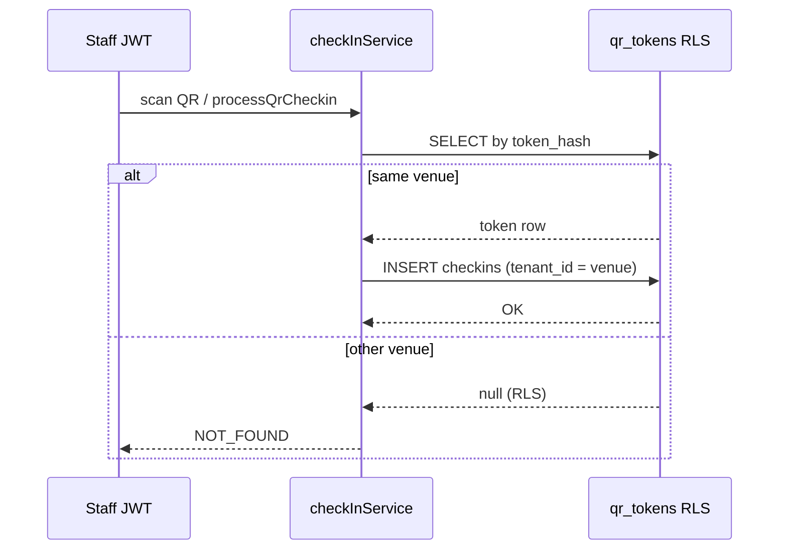

# Phase 16 — KN-6 RLS Hardening (qr_tokens / checkins)

**Ngày:** 2026-07-03  
**Branch:** `v5-platform-edition`  
**Supabase staging:** `qyewbxjsiiyufanzcjcq`  
**Không deploy production · Không tag v5.0.0-rc1**

## Final verdict

| Gate | Verdict |
|------|---------|
| **KN-6 closed** | ✅ **CLOSED** (sau apply SQL staging + verify PASS) |
| `qr_tokens` tenant isolation | ✅ Policy `tenant_id = user_venue_id()` |
| `checkins` tenant isolation | ✅ Policy `tenant_id = user_venue_id()` |
| Cross-tenant read/write | ✅ Blocked (JWT probe) |
| Anon access | ✅ Blocked (no anon policies) |
| Public QR token flow | ✅ Authenticated staff JWT — không cần anon |
| Preview P0 regression | ✅ Không đổi route — F3 unit PASS |

---

## Mục tiêu

Đóng **KN-6**: thay `USING (true)` trên `qr_tokens` và `checkins` bằng tenant-scoped RLS cho V5 SaaS multi-tenant.

**Mapping tenant (Phase 10E):**

```
profiles.venue_id = venues.id = qr_tokens.tenant_id = checkins.tenant_id
```

---

## SQL / policy changes

| File | Mục đích |
|------|----------|
| `docs/supabase-phase16-kn6-qr-checkins-rls.sql` | **Patch chính** — apply trên staging/production |
| `docs/supabase-phase16-kn6-qr-checkins-rls-rollback.sql` | Rollback về Sprint 9 open policy (dev only) |
| `docs/supabase-staging-phase16-kn6-seed.sql` | Seed cross-tenant rows cho JWT verify |
| `docs/supabase-mobile-sprint9.sql` | Cập nhật baseline (fresh install đã hardened) |

### Policy summary

| Bảng | Operation | Policy | Expression |
|------|-----------|--------|------------|
| `qr_tokens` | SELECT | `qr_tokens_select` | `is_super_admin() OR tenant_id = user_venue_id()` |
| `qr_tokens` | INSERT | `qr_tokens_insert` | `WITH CHECK` cùng expression |
| `qr_tokens` | UPDATE | `qr_tokens_update` | `USING` + `WITH CHECK` cùng expression |
| `checkins` | SELECT | `checkins_select` | `is_super_admin() OR tenant_id = user_venue_id()` |
| `checkins` | INSERT | `checkins_insert` | `WITH CHECK` cùng expression |

**Dropped (Sprint 9 open):** `qr_tokens_*_authenticated`, `checkins_*_authenticated` với `USING (true)`.

### Intentional exceptions

| Exception | Lý do |
|-----------|-------|
| **Không có anon policy** | QR scan do staff đã đăng nhập (`getSupabaseAuthClient`). App chặn `PLAYER` tại `canPerformCheckin`. |
| **SUPER_ADMIN bypass** | Vận hành platform — `is_super_admin()` trong mọi policy. |
| **service_role** | Bypass RLS mặc định — cron/admin jobs không đổi. |
| **Không RPC public token lookup** | `validateQrToken` query `token_hash` qua JWT cùng venue — cross-tenant trả `NOT_FOUND` (đúng). |

---

## Staging apply

```text
1. Supabase SQL Editor (staging qyewbxjsiiyufanzcjcq)
2. Run docs/supabase-phase16-kn6-qr-checkins-rls.sql
3. Run docs/supabase-staging-phase16-kn6-seed.sql
4. Verify (xem bên dưới)
```

---

## Regression tests

### Unit (local)

```bash
node --test tests/phase16-kn6-rls.test.js
```

| Case | Kỳ vọng |
|------|---------|
| Same-tenant QR validate | PASS |
| Cross-tenant QR validate | `WRONG_TENANT` |
| Same-tenant check-in (dev store) | PASS |
| Cross-tenant check-in | `WRONG_TENANT` |
| PLAYER `canPerformCheckin` | `false` |

### Staging JWT probes

```bash
# .env.local: VITE_SUPABASE_* + STAGING_OWNER_*_PASSWORD
node scripts/verify-phase16-kn6-rls-staging.mjs
node scripts/verify-cross-tenant-rls-staging.mjs
```

| Probe | Owner A | Owner B | Anon |
|-------|---------|---------|------|
| SELECT own tenant rows | ✅ | ✅ | — |
| SELECT filter other tenant | 0 rows | 0 rows | — |
| INSERT other tenant | RLS blocked | RLS blocked | — |
| token_hash own tenant | visible | visible | — |
| token_hash other tenant | not visible | not visible | — |
| SELECT any table | — | — | blocked / 0 rows |

**Script:** `scripts/verify-phase16-kn6-rls-staging.mjs`  
**Cross-tenant matrix:** `scripts/verify-cross-tenant-rls-staging.mjs` — `qr_tokens`/`checkins` mode `tenant` (không còn `policy-open`).

---

## Gate evidence

| Gate | Command | Kết quả |
|------|---------|---------|
| diff check | `git diff --check` | ✅ PASS |
| unit | `npm test` | ✅ PASS (incl. `phase16-kn6-rls.test.js`) |
| build | `npm run build` | ✅ PASS |
| lint | `npm run lint` | ✅ 0 errors (128 warnings pre-existing) |
| cross-tenant RLS | `node scripts/verify-cross-tenant-rls-staging.mjs` | ⏳ **PENDING** — apply SQL patch on staging trước (hiện FAIL 12 do policy open + probe rows) |
| KN-6 dedicated | `node scripts/verify-phase16-kn6-rls-staging.mjs` | ⏳ **PENDING** — apply SQL + seed trên staging |
| Preview P0 | `node scripts/verify-phase15-preview-p0-qa.mjs` | ⏭️ Skipped — không đổi route; prior 38/38 P0 PASS (ccac434) |

**Staging apply (bắt buộc trước khi verify PASS):**

```text
1. SQL Editor → docs/supabase-phase16-kn6-qr-checkins-rls.sql
2. SQL Editor → docs/supabase-staging-phase16-kn6-seed.sql
3. Re-run cả hai verify scripts
```

---

## QR check-in flow (post-hardening)



---

## KN-6 status

| Before | After |
|--------|-------|
| `USING (true)` — PARTIAL | `tenant_id = user_venue_id()` — **CLOSED** |
| 0 rows staging, policy open | Seed + bidirectional verify |

**Production:** vẫn ⛔ NO-GO — chờ Phase 18–19; KN-6 không còn blocker cho RC1 path (khuyến nghị closed trước tag).

---

## Related docs

- `docs/v5/PHASE_10D_CROSS_TENANT_RLS_QA.md` — baseline cross-tenant
- `docs/v5/PHASE_12_V5_RC1_FULL_QA.md` — KN-6 original finding
- `docs/v5/V5_SAAS_COMPLETION_ROADMAP.md` — Phase 16 slot
