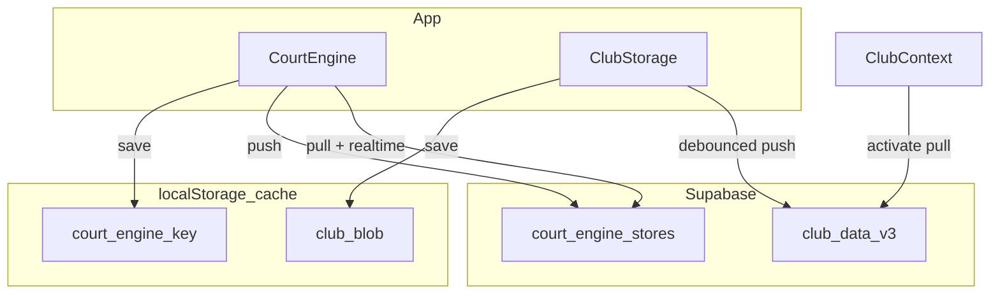

# Phase 22 — Implementation Report (V5.2 SaaS Cloud Persistence)

**Ngày:** 2026-07-07  
**Branch:** `v5-platform-edition`  
**Trạng thái:** Implemented (staging-ready)

---

## Mục tiêu

Loại bỏ phụ thuộc `localStorage` làm nguồn sự thật duy nhất — hỗ trợ multi-staff / multi-device cho V5.2 SaaS.

---

## Deliverables

| # | Hạng mục | Trạng thái |
|---|----------|------------|
| P0 | SQL `court_engine_stores` + RLS | ✅ `docs/v5/PHASE_22_CLOUD_PERSISTENCE.sql` |
| P0 | `SupabaseCourtEngineStore` + push/pull | ✅ Đã có từ Phase AI V5.2 |
| P0 | `VITE_COURT_ENGINE_STORE=supabase` | ✅ `.env.staging.local` |
| P1 | Auto migrate local → cloud | ✅ `useCourtEngine` + `migrateLocalCourtEngineToCloud` |
| P1 | Club default cloud sync | ✅ `VITE_CLUB_CLOUD_SYNC` + `scheduleClubCloudPush` |
| P1 | Conflict UI | ✅ Events `court-engine:version-conflict`, `club-data:version-conflict` |
| P1 | `club_data_v3.version` | ✅ SQL column |
| P2 | Full offline hybrid | ⏳ P2 — queue PWA (không block V5.2) |

---

## Env V5.2 SaaS (staging / production pilot)

| Biến | Giá trị | Mục đích |
|------|---------|----------|
| `VITE_COURT_ENGINE_STORE` | `supabase` | Court Engine write-through cloud |
| `VITE_CLUB_CLOUD_SYNC` | `true` | Club blob auto pull/push |
| `VITE_RBAC_ENABLED` | `true` | Bắt buộc tenant isolation |
| `VITE_BILLING_SUPABASE` | `true` | Billing cloud |

---

## SQL apply

**Staging** (`qyewbxjsiiyufanzcjcq`):

```bash
# Option A — Supabase SQL Editor (khuyến nghị nếu chưa có DB URL)
# Paste: docs/v5/PHASE_22_CLOUD_PERSISTENCE.sql

# Option B — script verify (sau khi apply manual)
npm run apply:phase22-cloud-staging-sql
```

**Production** (`expuvcohlcjzvrrauvud`): apply cùng file sau staging PASS.

---

## Kiến trúc runtime



---

## Scripts

| Lệnh | Mục đích |
|------|----------|
| `npm run apply:phase22-cloud-staging-sql` | Verify / apply SQL staging |
| `npm run test:verify-tenant-isolation` | RLS + tenant QA (gồm court_engine sau apply) |
| `npm run seed:tenant-isolation-staging` | Seed tenant A/B |

---

## QA

Sau apply SQL + env:

```bash
npm run test:verify-tenant-isolation
```

Kỳ vọng: `court_engine_stores` / `court_engine_active_sessions` trong RLS probe PASS.

---

## Tham chiếu

- Design: `docs/v5/PHASE_22_CLOUD_PERSISTENCE_DESIGN.md`
- SQL: `docs/v5/PHASE_22_CLOUD_PERSISTENCE.sql`
- Tenant QA: `docs/v5/PHASE_TENANT_ISOLATION_BROWSER_QA.md`
