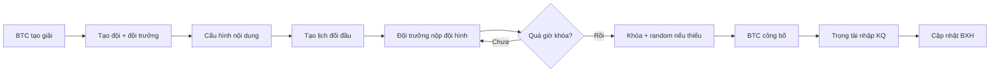

# Phase 23 — Giải đồng đội Pickleball (Team Tournament)

## Mục tiêu

Bổ sung loại giải `team_tournament` tách biệt khỏi giải cá nhân/đôi hiện tại, hỗ trợ:

- Đội + đội trưởng + danh sách VĐV
- Nội dung thi đấu cấu hình tùy ý (không hard-code 4 nội dung)
- Nộp đội hình theo từng lượt đối đầu
- Khóa / random / công bố đội hình
- Kết quả trận con + kết quả chung cuộc
- BXH đội + tie-break cấu hình được
- RBAC + audit log

## Kiến trúc module

```
src/features/team-tournament/
  constants.js          — trạng thái, policy, audit actions
  models/index.js       — normalize teamData (disciplines, teams, matchups, lineups)
  engines/
    lineupValidationEngine.js
    lineupEngine.js
    lineupRandomEngine.js
    teamResultEngine.js
    teamStandingsEngine.js
    teamPermissionEngine.js
    teamTournamentEngine.js
  services/
    teamTournamentService.js  — persist vào club blob
    teamAuditService.js
```

## Dữ liệu (club blob)

Giải đồng đội dùng record tournament hiện có với:

```javascript
{
  mode: "team_tournament",
  events: [],              // không dùng events cá nhân/đôi
  teamData: {
    disciplines: [],
    teams: [],
    matchups: [],
    lineups: { "matchupId::teamId": {...} },
    standings: [],
    settings: {
      missingLineupPolicy: "random",
      allowPlayerReusePerMatchup: false,
      tiebreakOrder: ["wins","subMatchDiff","pointsScored","headToHead","manual"]
    }
  }
}
```

**Không ảnh hưởng** tournament `internal_tournament`, `official_tournament`, `daily_play`.

## Quy trình vận hành



## RBAC

| Permission | Mô tả |
|------------|-------|
| `team.manage` | BTC quản lý đội |
| `team.view` | Xem đội |
| `team.lineup.submit` | Đội trưởng nộp đội hình |
| `team.lineup.lock` | Khóa đội hình |
| `team.lineup.publish` | Công bố cặp đấu |
| `team.lineup.randomize` | Random khi quá hạn |
| `team.match.result.manage` | Trọng tài nhập KQ |
| `team.standings.view` | Xem BXH |

Đội trưởng chỉ thao tác đội mình qua `teamPermissionEngine`.

## Trạng thái đội hình

`not_submitted` → `draft` → `submitted` → `locked` → `published`

## Chính sách khi không nộp

Ưu tiên giai đoạn 1: `missingLineupPolicy = random` (chế độ B).

## Tests

`tests/team-tournament.test.js` — 10 test cases cho toàn bộ luồng core.

## SQL cloud (tùy chọn)

`docs/v5/PHASE_23_TEAM_TOURNAMENT.sql` — schema Supabase multi-tenant cho persistence cloud Phase 22+.

## UI

| Route | Đối tượng |
|-------|-----------|
| `/tournament/team/:id` | BTC setup |
| `/team-portal/:tournamentId` | Đội trưởng/đội phó nộp đội hình |
| `/team-referee/:tournamentId` | Trọng tài nhập tỷ số (mobile-first) |
| Tab Đội / Nội dung / Lịch / BXH trong `TeamTournamentSetup.jsx` |

## Triển khai tiếp (Phase 23B)

- [x] Trang đội trưởng `/team-portal/:tournamentId`
- [x] Referee mobile view `/team-referee/:tournamentId`
- [x] RPC Supabase + RLS cho cloud sync (Phase 23C)
- [ ] Chế độ A (BTC chọn thay) và C (thua kỹ thuật)
