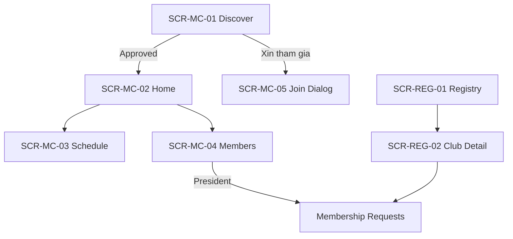
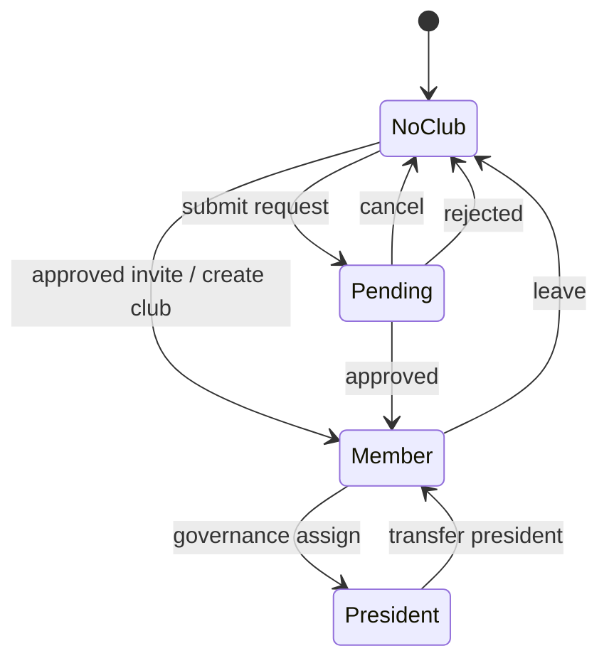

# Phase 42X — Club UX & Information Architecture Blueprint

**Status:** Design-only blueprint (no code, no migration, no deploy)  
**Version:** 1.0  
**Date:** 2026-07-10  
**Audience:** Phase 42J → 42M implementation teams

**Related assets:**
- Mockups: `docs/v5/mockups/my-club-home-redesign.png`, `my-club-discover-redesign.png`, `my-club-schedule-redesign.png`
- Architecture: `PHASE_42_CLUB_STORAGE_CLEAN_RESET.md`, `CLUB_GOVERNANCE_SPEC.md`
- Governance SQL/RPC: Phase 42B–42I (already shipped)

---

## Executive summary

Module **CLB** hiện bị chia đôi giữa `/my-club` (player hub) và `/club` + `/manage/clubs` (operations/admin). Dữ liệu membership đang chuyển sang cloud SSOT (`club_members`) nhưng UI vẫn mang di sản legacy (`profiles.club_id`, LocalStorage blob).

Blueprint này chốt **một mental model duy nhất**:

| Khái niệm | Định nghĩa UX |
|-----------|---------------|
| **CLB của tôi** | Hub cá nhân theo membership + governance của user |
| **Quản lý CLB** | Hub vận hành cho president/owner/tenant staff |
| **Sổ đăng ký CLB** | Registry tenant-scoped cho venue staff |
| **Membership** | `club_members.status = active` (không dùng `profiles.club_id`) |
| **Governance** | `club_owner` / `president` / `vice_president` qua assignments |

Các phase triển khai **không được** quyết định lại IA; chỉ implement theo blueprint.

---

## 1. Product vision — Module CLB

### 1.1 Tầm nhìn

Pickleball Scheduler Pro không chỉ “có bảng CLB” — module CLB là **hệ điều hành cộng đồng pickleball** trong một tenant:

- VĐV tìm CLB, xin gia nhập, theo dõi lịch sinh hoạt, tham gia giải nội bộ.
- Ban điều hành (chủ tịch / phó / chủ sở hữu) duyệt thành viên, quản lý cơ cấu, mùa giải.
- Chủ sân / tenant staff vận hành sổ đăng ký CLB, phê duyệt CLB mới, gán chủ sở hữu.
- Platform admin quan sát và can thiệp có kiểm soát — **không** tự động trở thành thành viên CLB.

### 1.2 Nguyên tắc sản phẩm (bắt buộc)

1. **Một nguồn sự thật:** UI phản ánh `club_members` + `club_governance_assignments` + RPC response — không suy diễn từ session legacy.
2. **Một hub chính cho VĐV:** `/my-club` là điểm vào duy nhất cho player journey.
3. **Phân tách rõ ba luồng phê duyệt:**
   - Đăng ký **CLB mới** (`clubs.status = pending_approval`)
   - **Xin gia nhập** CLB (`club_membership_requests.status = pending`)
   - **Gán governance** (owner/president/VP) — không nhầm với join request
4. **Governance ≠ Auth RBAC:** UI hiển thị “Chủ tịch”, “Phó chủ tịch” từ governance; không gọi PLAYER là “Quản lý CLB” trừ khi elevation có chủ đích.
5. **Progressive disclosure:** Member thường thấy tóm tắt; president/owner thấy panel quản trị; tenant staff thấy registry.
6. **Mobile-first cho player; desktop-first cho registry.**

### 1.3 Không phạm vi Phase 42X

- Không thiết kế lại module Giải đấu / Xếp sân / Coaching (chỉ link-out).
- Không thay đổi schema/RPC (đã chốt Phase 42B–42I).
- Không thiết kế public portal `/clubs` production-ready (giữ mock → Phase sau).

### 1.4 North-star outcomes

| Persona | Outcome |
|---------|---------|
| VĐV chưa có CLB | Tìm và gửi yêu cầu gia nhập trong &lt; 3 thao tác |
| VĐV chờ duyệt | Luôn thấy trạng thái pending + nút hủy |
| Member | Một màn hình home đủ: CLB, lịch, shortcut giải |
| President | Duyệt request, quản lý VP, lịch tuần — không rời `/my-club` |
| Owner | Gán / nhìn owner slot; không bắt buộc trùng president |
| Tenant staff | Registry + approve club registration + review membership (nếu có quyền) |
| Super Admin | Read-only cross-tenant trừ khi có governance assignment |

---

## 2. User journeys

### 2.1 PLAYER — chưa có CLB

```mermaid
journey
  title PLAYER chưa có CLB
  section Khám phá
    Mở app --> Menu CLB của tôi: Trang mặc định Discover
    Discover --> Lọc/tìm CLB theo tên
  section Tham gia
    Chọn CLB --> Xin tham gia + message tuỳ chọn
    Xin tham gia --> Trạng thái card: Đang chờ duyệt
  section Thay thế
    Tạo CLB mới --> Wizard tạo CLB pending_approval HOẶC active nếu self-create 42G
    Tạo CLB mới --> Trở thành president/owner theo flow tạo
```

**Entry:** `/my-club` → auto view `discover`  
**CTA chính:** `Xin tham gia` | `Tạo CLB` (nếu `club.create`)  
**Không hiển thị:** Lịch tuần CLB, danh sách thành viên đầy đủ, nút duyệt request

### 2.2 PLAYER — đang chờ duyệt

```mermaid
journey
  title PLAYER chờ duyệt membership
  section Trạng thái
    Có pending request --> Card CLB badge cam: Đang chờ duyệt
    Home tab --> Banner pending nổi bật
  section Hành động
    Hủy yêu cầu --> Confirm --> Request cancelled
    Được duyệt --> Notification --> Auto chuyển Member home
    Bị từ chối --> Notification --> Vẫn ở Discover, card hiện Đã từ chối
```

**Ràng buộc:** User **không** có `club_members.active` trong lúc pending  
**Không cho:** Gửi request thứ hai cùng CLB khi đã pending

### 2.3 MEMBER (thành viên thường)

```mermaid
journey
  title MEMBER
  section Hàng ngày
    Home --> Xem tóm tắt CLB + shortcut Giải đấu CLB
    Schedule --> Lịch sinh hoạt tuần read-only
    Members --> Danh sách thành viên read-only
  section Rời CLB
    Rời CLB --> Confirm --> RPC leave --> Quay Discover
```

**Không hiển thị:** Duyệt request, gán governance, chỉnh lịch tuần, quản lý mùa giải

### 2.4 PRESIDENT (chủ tịch)

Kế thừa MEMBER + thêm:

| Bước | Hành động |
|------|-----------|
| Duyệt request | Tab Members → panel Yêu cầu gia nhập → Approve/Reject + note |
| Cơ cấu CLB | Schedule tab → card Cấu trúc CLB → Nhượng chức / gán VP |
| Lịch tuần | Schedule → + Thêm buổi / sửa slot |
| Mùa giải | Link `/club` hoặc embedded card “Mùa giải đang diễn ra” |

**Elevation menu:** PLAYER + president → sidebar có thêm “Lịch sinh hoạt” (`/club`) qua `governanceRoleElevation`

### 2.5 OWNER (chủ sở hữu CLB)

| Trường hợp | UX |
|------------|-----|
| Owner ≠ President | Home hiện slot “Chủ sở hữu: [tên]”; president quản trị hàng ngày |
| Owner = President | Badge “Chủ sở hữu & Chủ tịch” (mockup home) |
| Owner chưa gán | “Chủ sở hữu: Chưa gán” + CTA gán (chỉ tenant owner / SA) |

Owner **có thể** duyệt membership nếu có governance assignment `club_owner` active.

### 2.6 TENANT STAFF (VENUE_OWNER, TENANT_OWNER, CLUB_MANAGER, STAFF có quyền)

```mermaid
journey
  title Tenant staff
  section Registry
    Danh sách CLB --> /manage/clubs
    CLB pending_approval --> Approve/Reject registration
  section Chi tiết CLB
    Club detail --> Tabs: Overview, Members, Ratings, History, Tournaments
    Members tab --> Review membership nếu có club.membership.review
  section Không làm
    Không auto-join CLB khi review
    Không xem profile VĐV ngoài scope tenant
```

### 2.7 SUPER ADMIN

| Được | Không được |
|------|------------|
| Xem registry cross-tenant (future platform view) | Duyệt membership chỉ bằng global permission |
| Audit logs | Tự động hiện như member CLB |
| Gán owner (theo spec D3) | Bypass governance gate (Phase 42I.1) |

**UX rule:** SA thấy cùng UI tenant staff **chỉ khi** impersonate hoặc có governance assignment tại CLB đó.

---

## 3. Information Architecture

### 3.1 Domain objects (user-facing)

```
Tenant (venue)
 └── Club Registry
      ├── Club entity (name, code, status, cluster)
      ├── Governance (owner, president, VP[])
      ├── Members[] (active | left | removed)
      ├── MembershipRequests[] (pending | approved | rejected | cancelled)
      ├── ActivitySchedule (weekly slots)
      └── Seasons/Leagues (link → /club operations)
```

### 3.2 User mental model layers

| Layer | User sees | Technical SoT |
|-------|-----------|---------------|
| **Identity** | Tên, avatar, auth role | `profiles`, RBAC |
| **Membership** | “CLB của bạn” | `club_members` |
| **Governance** | Chủ tịch / Phó / Chủ sở hữu | `club_governance_assignments` |
| **Operations** | Mùa giải, giải nội bộ | Legacy blob → migrate read model 42K |

### 3.3 Content grouping (My Club hub)

| Zone | Content | Visibility |
|------|---------|------------|
| **Hero** | Club avatar, name, status badge, cluster | Member+ |
| **Governance strip** | President, owner, member count | Member+ (labels); edit president+ |
| **Primary tabs** | Home, Schedule, Members, Discover | Theo membership state |
| **Action bar** | Join, Leave, Create club | State-driven |
| **Secondary links** | Giải đấu CLB, Hồ sơ thi đấu | Member+ |

### 3.4 Content grouping (Manage Clubs)

| Zone | Content |
|------|---------|
| List | Filter status, sync cloud, create |
| Detail header | Club meta + governance panel |
| Tabs | Overview \| Members \| Ratings \| Match history \| Tournaments |

### 3.5 Terminology chuẩn (UI copy)

| Dùng | Không dùng |
|------|------------|
| Chủ tịch | Quản lý CLB (khi nói governance) |
| Chủ sở hữu | Chủ sân (khi nói club owner) |
| Xin tham gia | Đăng ký (tránh nhầm đăng ký CLB mới) |
| Đang chờ duyệt | Pending |
| CLB của bạn | My club (trong UI Việt) |
| Rời câu lạc bộ | Xóa tài khoản |

---

## 4. Navigation tree

```
App
├── CLB & Huấn luyện (group)
│   ├── CLB của tôi          → /my-club                    [ALL authenticated]
│   ├── Lịch sinh hoạt       → /club                       [club.view, NOT plain PLAYER]
│   ├── Danh sách CLB        → /manage/clubs               [club.view, NOT plain PLAYER]
│   └── Vui chơi mỗi ngày    → /daily-play                 [tournament.view, NOT PLAYER]
├── Giải đấu                 → /tournament                 [linked from club home]
└── Hồ sơ của tôi            → /profile                    [linked from club home]

Legacy redirects (giữ đến 42J xong):
  /clubs/discover  → /my-club?view=discover
  /club/activity   → /my-club?view=schedule
```

### 4.1 My Club internal tabs (sub-nav)

```
/my-club
├── ?view=home      (default khi có membership)
├── ?view=schedule
├── ?view=members
└── ?view=discover  (default khi chưa có membership)
```

**Phase 42J target:** Pretty routes `/my-club/discover`, `/my-club/schedule`, … (alias `?view=`)

### 4.2 Manage club detail

```
/manage/clubs/:clubId
├── (default) overview
├── ?tab=members
├── ?tab=ratings
├── ?tab=history
└── ?tab=tournaments
```

---

## 5. Route structure

### 5.1 Canonical routes (target state post-42J)

| Route | Component | Guard | Notes |
|-------|-----------|-------|-------|
| `/my-club` | `MyClubPage` | Auth | Redirect to discover/home |
| `/my-club/discover` | `MyClubDiscoverPanel` | Auth | |
| `/my-club/home` | `MyClubSummaryCard` + panels | Auth + active membership | |
| `/my-club/schedule` | `MyClubSchedulePanel` | Auth + active membership | |
| `/my-club/members` | `MyClubMembersPanel` | Auth + active membership | |
| `/club` | `ClubManagement` | `club.view` + elevation | Seasons/leagues ops |
| `/manage/clubs` | `ClubListPage` | `club.view` | Registry |
| `/manage/clubs/:clubId` | `ClubDetailPage` | `club.view` | |
| `/clubs` | `PublicClubsPage` | Public | Mock → future |

### 5.2 Route resolution logic

```text
on /my-club load:
  if !authenticated → login
  membership = resolveMyActiveClubMembership()  // V2 RPC
  pending = listMyPendingRequests()
  if !membership && !pending → default discover
  if !membership && pending → discover + pending banner
  if membership → default home (unless deep link)
```

### 5.3 Post-login default paths (cập nhật 42J)

| Condition | Default path |
|-----------|--------------|
| PLAYER, no membership | `/my-club/discover` |
| PLAYER, pending request | `/my-club/discover` |
| PLAYER, member | `/my-club/home` |
| PLAYER, president/VP | `/my-club/home` (ops link to `/club`) |
| CLUB_MANAGER / TENANT_OWNER | `/manage/clubs` or `/club` (tenant setting) |
| SA | Platform dashboard (not auto `/my-club`) |

---

## 6. Menu matrix — role × membership state

Legend: ● = visible | ○ = hidden | ◐ = visible read-only | ◑ = visible + actions

### 6.1 Sidebar — CLB & Huấn luyện

| Menu item | PLAYER no club | PLAYER pending | PLAYER member | PLAYER president | TENANT staff | SA no gov |
|-----------|----------------|----------------|---------------|------------------|--------------|-----------|
| CLB của tôi | ● | ● | ● | ● | ● | ● |
| Lịch sinh hoạt `/club` | ○ | ○ | ○ | ● | ● | ○ |
| Danh sách CLB | ○ | ○ | ○ | ○ | ● | ●* |
| Vui chơi mỗi ngày | ○ | ○ | ○ | ● | ● | ○ |

\* SA: registry read-only platform view (future); không duyệt membership

### 6.2 My Club tabs

| Tab | no club | pending | member | president/owner | VP |
|-----|---------|---------|--------|-----------------|-----|
| Discover | ● default | ● default | ◐ | ◐ | ◐ |
| Home | ○ | ○ banner only | ● | ● | ● |
| Schedule | ○ | ○ | ◐ | ● | ● |
| Members | ○ | ○ | ◐ | ● + review | ● + review |

### 6.3 My Club actions

| Action | no club | pending | member | president | owner | tenant staff |
|--------|---------|---------|--------|-----------|-------|--------------|
| Xin tham gia | ● | ○ | ○ | ○ | ○ | ○ |
| Hủy yêu cầu | ○ | ● | ○ | ○ | ○ | ○ |
| Tạo CLB | ●* | ○ | ○ | ○ | ○ | ● |
| Rời CLB | ○ | ○ | ● | ○** | ○** | ○ |
| Duyệt request | ○ | ○ | ○ | ● | ● | ●*** |
| Nhượng chức CT | ○ | ○ | ○ | ● | ○ | ○ |
| Gán chủ sở hữu | ○ | ○ | ○ | ○ | ○ | ●**** |

\* `club.create` permission  
\** President/VP blocked until transfer  
\*** `club.membership.review` + tenant scope; governance bypass  
\**** `club.governance.assign_owner` — tenant owner / SA

---

## 7. Permission matrix

### 7.1 Auth permissions (catalog)

| Permission ID | Label UI | Scope |
|---------------|----------|-------|
| `club.view` | Xem CLB | CLUB |
| `club.create` | Tạo CLB | VENUE |
| `club.update` | Sửa CLB | CLUB |
| `club.delete` | Xóa CLB | CLUB |
| `club.governance.assign_owner` | Gán chủ sở hữu CLB | VENUE |
| `club.governance.approve` | Duyệt đăng ký CLB | VENUE |
| `club.membership.review` | Duyệt yêu cầu gia nhập | CLUB |

### 7.2 Role defaults (client matrix)

| Role | club.view | club.create | club.update | club.membership.review | club.governance.* |
|------|-----------|-------------|-------------|------------------------|-------------------|
| PLAYER | — | ● | — | — | — |
| CLUB_MANAGER | ● | ● | ● | ● | — |
| TENANT_OWNER | ● | ● | ● | ● | ● |
| VENUE_MANAGER | ● | — | — | — | — |
| STAFF | — | — | — | custom | — |
| PLATFORM_ADMIN | all | all | all | **not auto** | all |

### 7.3 Governance overrides (RPC `phase42_can_review_membership`)

| Actor | List pending | Review request |
|-------|--------------|----------------|
| president / VP / club_owner (active assignment) | ● | ● |
| tenant staff + `club.membership.review` + tenant match | ● | ● |
| PLATFORM_ADMIN / SUPER_ADMIN without assignment | ○ FORBIDDEN | ○ FORBIDDEN |
| PLATFORM_ADMIN with VP/owner assignment at club | ● | ● |
| plain member | ○ | ○ |

### 7.4 Visibility — member list privacy (spec D2)

| Viewer | Member list detail |
|--------|-------------------|
| Club member | ● full roster |
| Club president/owner/VP | ● + governance actions |
| Tenant staff (not club owner) | ◐ summary only on registry |
| Club owner (governance) | ● full |
| Public | ○ |

---

## 8. Screen map

### 8.1 Player zone

| Screen ID | Route | Component | Priority |
|-----------|-------|-----------|----------|
| SCR-MC-01 | `/my-club/discover` | Discover grid | P0 |
| SCR-MC-02 | `/my-club/home` | Home summary | P0 |
| SCR-MC-03 | `/my-club/schedule` | Weekly schedule + org chart | P0 |
| SCR-MC-04 | `/my-club/members` | Roster + requests panel | P0 |
| SCR-MC-05 | modal | JoinClubDialog | P0 |
| SCR-MC-06 | modal | Create club wizard | P1 |
| SCR-MC-07 | modal | Assign owner | P1 |
| SCR-MC-08 | modal | Transfer president | P1 |
| SCR-MC-09 | modal | Leave club confirm | P0 |

### 8.2 Operations zone

| Screen ID | Route | Component | Priority |
|-----------|-------|-----------|----------|
| SCR-CL-01 | `/club` | ClubManagement | P0 |
| SCR-CL-02 | `/club` tabs | Seasons, leagues, rounds | P1 |

### 8.3 Admin registry

| Screen ID | Route | Component | Priority |
|-----------|-------|-----------|----------|
| SCR-REG-01 | `/manage/clubs` | ClubListPage | P0 |
| SCR-REG-02 | `/manage/clubs/:id` | ClubDetailPage | P0 |
| SCR-REG-03 | dialog | ClubFormDialog | P0 |
| SCR-REG-04 | panel | ClubGovernancePanel | P0 |
| SCR-REG-05 | tab | ClubMembersTab | P0 |

### 8.4 Screen relationship diagram



---

## 9. Wireframes — mức khái niệm

> Tham chiếu pixel: `docs/v5/mockups/my-club-*-redesign.png`

### 9.1 SCR-MC-02 Home (có CLB)

```
┌─────────────────────────────────────────────────────────────┐
│ CLB của tôi                          [Rời câu lạc bộ]      │
├─────────────────────────────────────────────────────────────┤
│ [Trang chủ] [Lịch sinh hoạt] [Thành viên] [Khám phá]       │
├─────────────────────────────────────────────────────────────┤
│ ┌─────────────────────────────────────────────────────────┐ │
│ │ (AC)  CLB ACCC  [● Đang hoạt động]                     │ │
│ │ 📍 Cụm sân: Pickleball NAM LONG sports                  │ │
│ │ ┌──────────┐ ┌──────────┐ ┌──────────┐                  │ │
│ │ │👥 12 TV  │ │👑 Chủ tịch│ │🏛 Chủ SH │                  │ │
│ │ │          │ │ Huỳnh... │ │ Chưa gán │                  │ │
│ │ └──────────┘ └──────────┘ └──────────┘                  │ │
│ │ [🏆 Giải đấu CLB]  [📋 Hồ sơ thi đấu]                   │ │
│ └─────────────────────────────────────────────────────────┘ │
└─────────────────────────────────────────────────────────────┘
```

### 9.2 SCR-MC-01 Discover

```
┌─────────────────────────────────────────────────────────────┐
│ CLB của tôi                                                 │
├─────────────────────────────────────────────────────────────┤
│ [Trang chủ] [Lịch sinh hoạt] [Thành viên] [Khám phá●]      │
│                              [+ Tạo CLB]  (nếu có quyền)    │
│ 🔍 Tìm theo tên CLB...                                      │
├─────────────────────────────────────────────────────────────┤
│ ┌─────────────┐ ┌─────────────┐ ┌─────────────┐            │
│ │ CLB ACCC    │ │ CLB Long    │ │ CLB HN      │            │
│ │[CLB của bạn]│ │             │ │[Chờ duyệt]  │            │
│ │ 12 thành viên│ │ 24 thành... │ │ 12 thành... │            │
│ │ CT: Huỳnh   │ │ CT: Minh    │ │ CT: Lan     │            │
│ │             │ │[Xin tham gia]│ │[Hủy yêu cầu]│            │
│ └─────────────┘ └─────────────┘ └─────────────┘            │
└─────────────────────────────────────────────────────────────┘
```

**Card states:** `your-club` | `joinable` | `pending` | `rejected` (muted)

### 9.3 SCR-MC-03 Schedule (president)

```
┌─────────────────────────────────────────────────────────────┐
│ ┌─ Cấu trúc CLB ─────┐  ┌─ Lịch sinh hoạt tuần ───[+Thêm]┐ │
│ │ 👑 Chủ tịch: ...   │  │ T2  T3  T4* T5  T6  T7  CN    │ │
│ │    [Nhượng chức]   │  │     [18-21h slot]           │ │
│ │ ⭐ Phó CT 1 (trống)│  └─────────────────────────────┘ │
│ │ ⭐ Phó CT 2 (trống)│                                   │
│ │ 12 thành viên      │  ┌─ Mùa giải & Giải nội bộ ────┐ │
│ └────────────────────┘  │ Mùa 2026 [● Đang diễn ra] > │ │
│                         └─────────────────────────────┘ │
└─────────────────────────────────────────────────────────────┘
```

### 9.4 SCR-MC-04 Members + review panel

```
┌─────────────────────────────────────────────────────────────┐
│ ⚠ Yêu cầu gia nhập (2)                                      │
│ ┌─────────────────────────────────────────────────────────┐ │
│ │ Nguyễn Văn A — "Muốn chơi tối T4"  [Từ chối] [Duyệt]   │ │
│ └─────────────────────────────────────────────────────────┘ │
│ Danh sách thành viên (12)                                   │
│ [Avatar] Hoàng Lương — Thành viên                           │
│ [Avatar] Huỳnh Văn Anh — Chủ tịch                           │
└─────────────────────────────────────────────────────────────┘
```

### 9.5 SCR-REG-01 Registry (tenant staff)

```
┌─────────────────────────────────────────────────────────────┐
│ Danh sách CLB                    [Đồng bộ] [+ Tạo CLB]      │
│ Filter: [Tất cả ▼] [Active] [Chờ duyệt]                    │
├─────────────────────────────────────────────────────────────┤
│ Tên CLB      │ Mã    │ Chủ tịch   │ TV  │ Trạng thái │ ... │
│ CLB ACCC     │ ACCC  │ Huỳnh...   │ 12  │ Active     │ >   │
│ CLB mới X    │ ...   │ —          │ 0   │ Chờ duyệt  │ >   │
└─────────────────────────────────────────────────────────────┘
```

---

## 10. Component map

### 10.1 Design system alignment

Reuse MUI + existing `myClubUiStyles.js` tokens. Phase 42M chuẩn hóa spacing/typography theo mockups.

### 10.2 Component inventory

| Component | Path (current) | Blueprint role | Reuse |
|-----------|----------------|----------------|-------|
| `MyClubPage` | `pages/player/MyClubPage.jsx` | Shell + state orchestration | Refactor 42J |
| `MyClubActionBar` | `myClub/MyClubActionBar.jsx` | Tab nav + global CTAs | Extend |
| `MyClubSummaryCard` | `myClub/MyClubSummaryCard.jsx` | Home hero | Restyle 42M |
| `MyClubDiscoverPanel` | `myClub/MyClubDiscoverPanel.jsx` | Discover grid | Restyle 42M |
| `MyClubSchedulePanel` | `myClub/MyClubSchedulePanel.jsx` | Schedule + org | Merge w/ mockup |
| `MyClubMembersPanel` | `myClub/MyClubMembersPanel.jsx` | Roster | Add review slot |
| `MyClubMembershipRequestsPanel` | `myClub/...` | Review list | Extract shared 42K |
| `MyClubGovernancePanel` | `myClub/...` | Org chart edit | |
| `JoinClubDialog` | `myClub/JoinClubDialog.jsx` | Join flow | |
| `ClubListPage` | `pages/clubs/ClubListPage.jsx` | Registry | |
| `ClubDetailPage` | `pages/clubs/ClubDetailPage.jsx` | Admin detail | |
| `ClubGovernancePanel` | `pages/clubs/...` | Owner assign | Share w/ my-club 42L |

### 10.3 New shared components (42K–42M)

| Component | Responsibility |
|-----------|----------------|
| `ClubStatusBadge` | active / pending_approval / pending_setup / inactive |
| `MembershipRequestBadge` | pending / rejected / your-club |
| `ClubCard` | Discover grid item — props: `variant` |
| `GovernanceRoleChip` | Chủ tịch / Phó / Chủ sở hữu |
| `MembershipReviewActions` | Approve/Reject + note — dùng chung my-club + registry |
| `ClubEmptyState` | Illustration + CTA theo persona |
| `ClubPendingBanner` | Sticky banner khi có pending request |
| `ClubLeaveConfirmDialog` | Block president w/o transfer message |

### 10.4 Data hooks (42K read model)

| Hook | Source |
|------|--------|
| `useMyClubMembership()` | `resolveMyActiveClubMembership()` |
| `useMyPendingRequests()` | RPC list own requests |
| `useClubDiscover()` | `listDiscoverableClubs()` |
| `useCanReviewMembership(clubId)` | governance + permission guard |
| `useClubGovernance(clubId)` | assignments |

---

## 11. UX rules — trạng thái KHÔNG được phép

### 11.1 Hard prohibitions

| # | Rule |
|---|------|
| U1 | **Không** hiển thị “CLB của bạn” khi `club_members` không có row `active` |
| U2 | **Không** cho duyệt membership khi user là SA/PLATFORM_ADMIN không có governance assignment |
| U3 | **Không** hiển thị nút “Rời CLB” cho president/VP chưa nhượng chức |
| U4 | **Không** hiển thị member list đầy đủ cho venue staff không phải club owner (spec D2) |
| U5 | **Không** dùng `profiles.club_id` để quyết định hasClub |
| U6 | **Không** cho gửi 2 pending request cùng CLB |
| U7 | **Không** hiển thị tab Schedule/Home khi chưa có active membership (trừ deep link → redirect discover) |
| U8 | **Không** auto-join CLB khi tenant staff approve request |
| U9 | **Không** hiển thị “Chủ tịch: Chưa gán” trên CLB `active` (validation server) |
| U10 | **Không** silent fallback LocalStorage khi V2 RPC fail |
| U11 | **Không** gọi PLAYER “Quản lý CLB” trong header khi chỉ là president (dùng “Vận động viên” + governance chip) |
| U12 | **Không** hiển thị reclaim/local president banner khi `VITE_CLUB_STORAGE_V2=true` |

### 11.2 Soft guidelines

- Pending request → ưu tiên badge cam trên card, không modal intrusive.
- Rejected request → card muted, CTA “Gửi lại” (future) hoặc ẩn 30 ngày.
- Owner unassigned → neutral copy, không error tone.

---

## 12. Empty, loading, error & success states

### 12.1 Empty states

| Context | Message | CTA |
|---------|---------|-----|
| Discover, no clubs | Chưa có CLB nào trong hệ thống | Tạo CLB (nếu có quyền) |
| Discover, no search results | Không tìm thấy “{q}” | Xóa bộ lọc |
| Members, only self | Bạn là thành viên đầu tiên | Mời bạn bè (future) |
| Schedule, no slots | Chưa có lịch sinh hoạt | + Thêm buổi (president+) |
| Review panel, no requests | Không có yêu cầu chờ duyệt | — |
| Registry, empty tenant | Chưa có CLB trong tenant | + Tạo CLB |

### 12.2 Loading

| Surface | Pattern |
|---------|---------|
| My Club shell | Skeleton hero + tab bar |
| Discover grid | 3 card skeletons |
| Members list | Avatar rows skeleton |
| Review action | Button spinner + disable duplicate click |
| Registry table | Table skeleton 5 rows |

**Rule:** Loading &gt; 3s → inline “Đang tải…” + retry link.

### 12.3 Error states

| Code | UI |
|------|-----|
| `NOT_AUTHENTICATED` | Redirect login |
| `FORBIDDEN` | Inline alert “Bạn không có quyền…” — không toast-only |
| `NOT_FOUND` | Empty w/ “CLB không tồn tại” |
| `VERSION_CONFLICT` | Dialog “Dữ liệu đã thay đổi” + [Tải lại] |
| `AUDIT_WRITE_FAILED` | “Không thể hoàn tất. Thử lại.” (admin) |
| Network | Banner top + retry |

### 12.4 Success states

| Action | Feedback |
|--------|----------|
| Submit join request | Toast “Đã gửi yêu cầu” + card → pending |
| Cancel request | Toast “Đã hủy yêu cầu” |
| Approve member | Toast “Đã duyệt {name}” + remove from queue |
| Reject | Toast + optional note shown in audit only |
| Leave club | Toast + redirect discover |
| Create club | Toast + redirect home/pending state |

---

## 13. Notification & confirmation rules

### 13.1 Confirm dialogs (bắt buộc)

| Action | Confirm copy |
|--------|--------------|
| Rời CLB | “Bạn sẽ mất quyền truy cập lịch và giải nội bộ. Tiếp tục?” |
| Hủy yêu cầu gia nhập | “Hủy yêu cầu gia nhập {clubName}?” |
| Từ chối request | “Từ chối {name}? Có thể thêm ghi chú.” |
| Nhượng chức chủ tịch | “Chuyển chức chủ tịch cho {name}?” |
| Xóa CLB | Double confirm + type club name |

### 13.2 Non-confirm actions

- Approve membership (undo không có → cân nhắc soft confirm nếu &gt; 10 members)
- Tab switch, search filter

### 13.3 Notifications (in-app)

| Event | Recipient | Channel |
|-------|-----------|---------|
| Request submitted | President/VP/owner + tenant reviewer | In-app badge on Members tab |
| Approved | Applicant | Toast on next login + optional push |
| Rejected | Applicant | Toast + discover card state |
| Club registration approved | President creator | Email (future) + toast |

### 13.4 Audit visibility

Mọi approve/reject hiển thị trong admin audit (`club.membership_request.review`) — UI **không** cần hiện audit ID cho end user.

---

## 14. Responsive guidelines

### 14.1 Breakpoints

| Breakpoint | Layout |
|------------|--------|
| &lt; 600px (mobile) | Single column; tabs → scrollable chip bar; bottom nav giữ “CLB của tôi” |
| 600–960px (tablet) | 2-column discover grid; schedule week horizontal scroll |
| &gt; 960px (desktop) | 3–4 column discover; schedule side-by-side org chart (mockup) |

### 14.2 Mobile-specific

- FAB `+` cho president: thêm buổi lịch (schedule tab).
- Swipe tabs trên My Club (optional 42M).
- Join dialog full-screen mobile.
- Registry table → card list trên mobile (42M).

### 14.3 Touch targets

Minimum 44×44px cho CTA primary (Xin tham gia, Duyệt, Rời CLB).

---

## 15. Accessibility checklist

| # | Requirement | Implementation note |
|---|-------------|---------------------|
| A1 | Tab order logical | Action bar → content → dialogs |
| A2 | `aria-current` on active tab | `MyClubActionBar` |
| A3 | Status badges có text, không chỉ màu | “Đang chờ duyệt” + icon |
| A4 | Confirm dialogs trap focus | MUI Dialog default |
| A5 | Loading skeletons `aria-busy` | |
| A6 | Error alerts `role="alert"` | |
| A7 | Club card keyboard activatable | Enter = primary action |
| A8 | Contrast ≥ 4.5:1 cho badge cam pending | |
| A9 | Governance icons có `aria-label` | “Chủ tịch”, không chỉ crown emoji |
| A10 | Review actions: announce result | `aria-live="polite"` toast region |

---

## 16. Vấn đề UX hiện tại & giải pháp

| # | Vấn đề | Root cause | Giải pháp (phase) |
|---|--------|------------|-------------------|
| X1 | Hai hub `/club` vs `/my-club` gây confusion | Lịch sử v3.5 + v5 song song | 42J: consolidate schedule vào `/my-club/schedule`; `/club` = seasons/leagues only |
| X2 | Menu “Lịch sinh hoạt” trỏ `/club` nhưng schedule ở `/my-club` | Split routes | 42L: president thấy schedule trong my-club; menu `/club` đổi label “Vận hành CLB” |
| X3 | `hasClub` từ session legacy | `profiles.club_id` / `user.clubId` | 42K: `useMyClubMembership()` sole gate |
| X4 | Reclaim president banner 20s timeout | Local blob migration | 42K: tắt reclaim khi V2 on |
| X5 | PLAYER header “Vận động viên” dù là chủ tịch | Auth role ≠ governance | 42M: thêm governance chip cạnh tên |
| X6 | Discover tab label “Danh sách CLB” vs “Khám phá” | Copy inconsistency | 42M: chốt “Khám phá” |
| X7 | Tenant staff không duyệt được default | Matrix thiếu permission | Đã fix 42I SQL; 42L expose UI khi có quyền |
| X8 | SA từng duyệt được nhầm | Permission bypass | Đã fix 42I.1; 42M: không hiện review UI cho SA |
| X9 | Public `/clubs` mock data | Chưa nối registry | Out of scope 42J–42M; backlog |
| X10 | `pending_setup` vs `pending_approval` | Hai pending concepts | 42M: badge copy riêng; tooltip giải thích |
| X11 | Member count stale sau approve | Client cache | 42K: invalidate read model sau RPC |
| X12 | Idempotency invisible to user | Technical | 42J: disable double-submit on review buttons |

---

## 17. Lộ trình triển khai

### Phase 42J — Route & Flow

**Mục tiêu:** Canonical routes, redirect legacy, post-login resolution từ V2 membership.

| Deliverable | Detail |
|-------------|--------|
| Pretty routes | `/my-club/{discover,home,schedule,members}` |
| Redirects | `/clubs/discover`, `/club/activity` → new paths |
| `resolveInitialView` | Dùng RPC membership, không `user.clubId` |
| `getDefaultHomePath` | Cập nhật theo §5.3 |
| Flow tests | E2E: no club → join → pending → approve |

**Exit criteria:** Không còn `?view=` trong URL bar sau redirect; PLAYER journey E2E pass.

---

### Phase 42K — Registry & Read Model

**Mục tiêu:** Single read layer; tách UI khỏi legacy blob cho membership/governance.

| Deliverable | Detail |
|-------------|--------|
| `useMyClubMembership` hook | Wrap `clubActiveMembershipService` |
| `useClubDiscover` hook | Unified discover + pending states |
| Shared `MembershipReviewActions` | RPC V2 only |
| Cache invalidation | Sau approve/reject/leave |
| Tắt reclaim path | Khi `VITE_CLUB_STORAGE_V2=true` |
| Registry sync indicator | ClubListPage cloud status |

**Exit criteria:** MyClubPage không import legacy `clubExtensionStorage` cho membership.

---

### Phase 42L — Role-based Navigation

**Mục tiêu:** Menu + tabs đúng matrix §6; governance elevation nhất quán.

| Deliverable | Detail |
|-------------|--------|
| Menu matrix enforcement | `clubCoachingMenu.js` + `navigationConfig` |
| Tab gating | `MyClubActionBar` theo membership + governance |
| `useCanReviewMembership` | Client guard mirror RPC |
| President elevation | Sidebar “Vận hành CLB” khi president |
| SA guard | Ẩn review panel |

**Exit criteria:** QA matrix §6 pass cho 7 personas.

---

### Phase 42M — Professional UI

**Mục tiêu:** Pixel-aligned mockups; polish states §12–15.

| Deliverable | Detail |
|-------------|--------|
| Restyle `ClubCard` | 4 variants per mockup discover |
| Home hero | Match `my-club-home-redesign.png` |
| Schedule layout | Org chart + week grid per schedule mockup |
| `ClubStatusBadge`, `GovernanceRoleChip` | Design tokens |
| Mobile responsive | §14 |
| A11y pass | §15 checklist |
| Copy audit | Terminology §3.5 |

**Exit criteria:** Design review sign-off vs 3 mockups; Lighthouse a11y ≥ 90 trên `/my-club`.

---

## Appendix A — Membership state machine (UI)



## Appendix B — Mockup reference index

| File | Screen | Tab |
|------|--------|-----|
| `my-club-home-redesign.png` | SCR-MC-02 | home |
| `my-club-discover-redesign.png` | SCR-MC-01 | discover |
| `my-club-schedule-redesign.png` | SCR-MC-03 | schedule |

## Appendix C — RPC touchpoints (read-only reference)

| UX action | RPC |
|-----------|-----|
| Submit join | `club_submit_membership_request` |
| Cancel join | `club_cancel_membership_request` |
| List pending (reviewer) | `club_list_pending_requests` |
| Approve/reject | `club_review_membership_request` |
| My membership | `club_get_my_active_membership` |
| Leave | `club_leave_membership` |
| Create club | `club_create` |

---

**Checkpoint:** Phase 42X complete. Await `GO PHASE 42J` before implementation.
