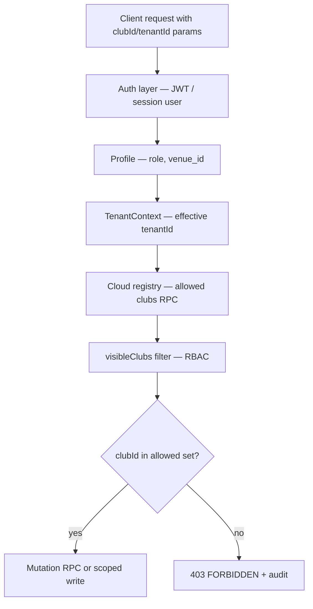

# Phase 43A — Scope Resolution Architecture

Goal: **Never trust client-supplied `clubId`, `tenantId`, or `venueId` for authorization.**

---

## Layers



---

## Resolution rules

### 1. Authenticated user

| Input | Authority |
|-------|-----------|
| `user.id` | JWT / Supabase session |
| `user.role` | `profiles.role` |
| `tenantId` | `resolveEffectiveTenantId(user)` — not raw param |
| `clubId` (active) | `club_get_my_active_membership` or registry |

**File:** `src/features/tenant/services/tenantService.js`, `clubActiveMembershipService.js`

### 2. API handlers (P0-5)

**Today (gap):** Handlers build tenant-filtered list but may not verify query `clubId`.

**Target:**

```javascript
const allowed = await resolveAllowedClubIds(authContext);
if (requestedClubId && !allowed.has(requestedClubId)) {
  return forbidden("CLUB_OUT_OF_SCOPE");
}
```

**Files:** `src/features/api/router/handlers/*.js`

### 3. Club switch (P0-6)

**Today:** `ClubContext.handleSwitchClub` L255–266 calls `switchActiveClub(clubId)` without check.

**Target:**

```javascript
const visible = await listVisibleClubsCloud(user, tenantId);
if (!visible.some(c => c.id === clubId)) return forbidden();
invalidateMembershipCache();
switchActiveClub(clubId);
```

**Must not use:** `loadClubs()` local registry as authority when V2 enabled.

### 4. Offline queue flush

**Target scope key:** `(user_id, tenant_id)` pair from live session — ignore stale entry fields if session changed.

### 5. Blob push (`cloudSync.js`)

Before push:

- `club.tenantId === currentTenantId`
- `getCurrentUser().id` has membership or governance on club
- `expectedVersion` matches or abort

---

## Cache key conventions (after 43A)

| Cache | Key pattern |
|-------|-------------|
| Club registry | `['club-registry', tenantId, scope]` — existing |
| Membership session | `pb-membership-cache-v1:{supabaseHost}:{userId}` — existing |
| Offline queue | partition by `user_id` in meta or separate keys per user |
| IndexedDB offline | add `tenantId` segment: `tenant:{id}:club:{id}:...` |

---

## Platform Super Admin

- Must pick tenant explicitly (`TenantContext` L165 comment Phase 42K).
- Cross-tenant read allowed only via platform routes (`/platform/clubs`), not tenant API params alone.

---

## Audit on denial

Log `SCOPE_DENIED` with: user_id, requested club/tenant, route, timestamp — no PII in payload.

**File to extend:** `auditService.js`

---

## Tests

| Case | Expected |
|------|----------|
| Player passes other clubId to API | 403 |
| Switch club not in visibleClubs | rejected |
| SA accesses platform registry | 200 |
| Tenant owner `/platform/clubs` | guard banner, no registry RPC (42L) |

---

## Related docs

- `PHASE_42N_ARCHITECTURE_AUDIT.md` §H Tenant Isolation
- `PHASE_43A_P0_ROOT_CAUSE_MATRIX.md` P0-5, P0-6
