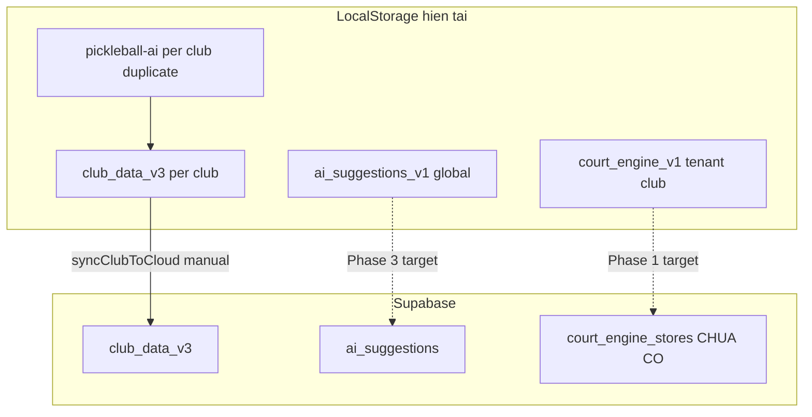

# Phase AI V5.2 SaaS — Giai đoạn 0: Kiểm kê & Phân công

**Ngày:** 2026-07-06  
**Mục tiêu kinh doanh:** Chuẩn bị bán thương mại + nhiều máy cùng lúc  
**Nhân lực:** 2 dev song song  
**Chiến lược bán:** Bán sớm một phần (không quảng bá multi-staff AI cho đến Court Engine cloud xong)

---

## 1. Tóm tắt cho người quyết định

| Câu hỏi | Trả lời |
|---------|---------|
| Bán được gì **ngay** (không đợi cloud AI)? | AI xếp sân (1 máy/chủ động sync), AI Balance giải, giải đấu, billing cơ bản |
| Bán **chưa nên quảng bá**? | Court Engine đa máy, Trợ lý thông minh (`VITE_ENABLE_AI_ENGINE` vẫn OFF) |
| Việc **gấp nhất**? | Court Engine lên Supabase (2 nhân viên cùng sân) |
| SQL đã có sẵn? | `ai_suggestions` (Sprint 7), `club_data_v3` — **chưa có** `court_engine_stores` |
| Thời gian ước lượng (2 dev) | ~4–5 tuần đến Go production AI đầy đủ |

---

## 2. Ma trận module AI → dữ liệu → cloud → code

### 2.1 AI Core V2 — Xếp sân (`src/ai/`)

| Hạng mục | Chi tiết |
|----------|----------|
| **Chức năng** | Scoring, pairing, waiting, balance, history, session xếp sân |
| **Engine chính** | `engine.js`, `scoring.js`, `pairing.js`, `waiting.js`, `balance.js` |
| **Dữ liệu lưu** | `history`, `waiting`, `sessions`, `policies`, `rules`, `tournament.seedPreview` |
| **Storage hiện tại** | Club blob v3 qua `src/ai/storage.js` → `src/domain/clubStorage.js` (localStorage key `pickleball-club-data-v3::{clubId}`) |
| **Cloud path** | `src/ai/cloudSync.js` → `syncClubToCloud()` / `pullClubFromCloud()` → bảng `club_data_v3` |
| **UI ghi** | `src/pages/SelectPlayers.jsx` → `commitScheduleResult()` (`src/ai/persist.js`) |
| **UI sync thủ công** | `src/pages/Settings.jsx` → `syncAIDataToCloud()` / `pullAIDataFromCloud()` |
| **Bảng Supabase** | `public.club_data_v3` (+ legacy `club_ai_data`) — SQL: `docs/supabase-club-v3.sql` |
| **RLS** | `docs/supabase-rbac.sql` (venue_id) — cần verify production |
| **Multi-device gap** | Sync **không tự động** sau xếp sân; máy B không thấy nếu máy A chưa sync |
| **V5.2 gap** | P1 — auto-sync sau commit; giảm duplicate `pickleball-ai::{clubId}` localStorage |
| **Tests** | `tests/ai-core.test.js`, `tests/scoring.test.js`, `tests/waiting.test.js`, `tests/persist.test.js`, `tests/engine.integration.test.js`, `tests/cloud-sync.test.js` |

**Luồng multi-device (mục tiêu):**

```
MayA: Xep san → commitScheduleResult → auto syncClubToCloud
MayB: Mo Xep san → pullClubFromCloud (hoac hydrate startup) → thay waiting/history
```

---

### 2.2 AI Balance — Giải cân bằng (`src/ai/balance.js` + tournament)

| Hạng mục | Chi tiết |
|----------|----------|
| **Chức năng** | Cân bằng trình độ/Elo khi tạo giải Official AI Balance Mode |
| **Engine** | `runBalanceEngine()` — cũng dùng trong `engine.js` xếp sân |
| **Dữ liệu lưu** | Kết quả nằm trong **tournament blob** (events, entries, groups) — club blob v3 |
| **Storage** | `domain/tournamentService.js` + club blob — không storage AI riêng |
| **Cloud path** | Cùng `club_data_v3` khi sync club |
| **UI** | `OfficialTournamentSetup.jsx` — `OFFICIAL_MODE.AI_BALANCE` |
| **Multi-device gap** | Thấp — giải thường 1 BTC; conflict khi 2 người sửa cùng tournament blob |
| **V5.2 gap** | P2 — phụ thuộc club cloud sync tổng thể |
| **Tests** | `tests/tournament-ai-balance.test.js` |

**Ghi chú bán sớm:** Có thể bán AI Balance **ngay** nếu khách chấp nhận 1 người điều hành giải hoặc sync club thủ công.

---

### 2.3 Court Engine — Vận hành sân (`src/features/court-engine/`)

| Hạng mục | Chi tiết |
|----------|----------|
| **Chức năng** | Check-in, queue, auto assignment, timer, transfer, referee, event log |
| **Dữ liệu lưu** | `sessions[]` mỗi session: `checkIns`, `queue`, `assignments`, `courtStates`, `events`, … |
| **Storage hiện tại** | `localStorage` key `pickleball-court-engine-v1::{tenantId}::{clubId}` — `courtEngineStorage.js` |
| **Active session** | `pickleball-court-engine-active-v1::{tenantId}::{clubId}` |
| **Cloud path** | **Stub only** — `SupabaseCourtEngineStore.js` (`cloudReady: false`, `syncToCloud` fail) |
| **Bảng Supabase** | **Chưa có** — design draft: `court_engine_stores`, `court_engine_active_sessions` (`docs/v5/PHASE_22_CLOUD_PERSISTENCE_DESIGN.md`) |
| **Env flag** | `VITE_COURT_ENGINE_STORE=local` (default) \| `supabase` (chưa hoạt động thật) |
| **UI** | `src/pages/CourtEnginePage.jsx` → `useCourtEngine` hook |
| **Service layer** | `courtSessionService.js`, `checkInService.js`, `queueService.js`, `autoCourtAssignmentEngine.js` — **tất cả gọi local storage** |
| **RBAC** | `courtEngineGuard.js`, `courtEngineContextGuard.js` |
| **Multi-device gap** | **BLOCKER** — máy A và B không chia sẻ session |
| **V5.2 gap** | **P0** — SQL + store thật + conflict + migrate wizard |
| **Tests** | `tests/court-engine.test.js` (29), `tests/court-engine-storage.test.js`, `tests/ui/court-engine.ui.test.jsx` |

**Payload session (fields cần sync cloud):**

```javascript
// src/features/court-engine/models/courtSession.js
{
  id, tenantId, clubId, name, sessionType, status,
  checkIns[], queue[], assignments[], refereeAssignments[],
  transferLogs[], events[], courtStates{}, config
}
```

**Luồng multi-device (mục tiêu):**

```
MayA: checkIn → saveCourtEngineStore → Supabase upsert (version++)
MayB: poll/subscribe → hydrate → UI refresh
Conflict: version mismatch → toast "Tai lai du lieu"
```

---

### 2.4 AI Assistant Sprint 7 — Trợ lý thông minh (`src/features/ai-assistant/`)

| Hạng mục | Chi tiết |
|----------|----------|
| **Chức năng** | Gợi ý seed, pairing, group, time, schedule validation, rule; summary workflow |
| **Cảnh báo** | `scheduleConflictDetector.js`, `courtOverloadDetector.js` (Phase 28–29) |
| **Dữ liệu lưu** | Suggestion records: type, status, inputSnapshot, outputPayload, confidence, TTL |
| **Storage hiện tại** | `localStorage` key `pickleball-ai-suggestions-v1` — **global, không scope club** |
| **Checklist UI** | `pickleball-ai-workflow-checklist-v1` — localStorage |
| **Cloud path app** | **Chưa nối** — không có `ai_suggestions` trong `src/` |
| **Bảng Supabase** | `public.ai_suggestions` — SQL: `docs/supabase-ai-assistant-sprint7.sql` (đã apply Gate 2 #13) |
| **Service** | `aiEngineService.js` → `saveSuggestion` / `getSuggestionById` / `applyAiSuggestion` |
| **RBAC** | `guards/aiAccessGuard.js` — management vs referee view-only |
| **Feature flag** | `VITE_ENABLE_AI_ENGINE=false` (production) |
| **UI** | `TournamentAiAssistantPanel.jsx` (Internal/Official setup), hub `/ai` (`AiHubPage` — chủ yếu link nav) |
| **Multi-device gap** | **BLOCKER** — gợi ý tạo trên máy A không thấy máy B |
| **V5.2 gap** | **P0** — Supabase repository + UI end-to-end |
| **Tests** | `tests/ai-assistant-sprint7.test.js` (~28), `tests/coaching-ai-phase28-29.test.js` (detectors) |

**Suggestion record shape (local, cần map sang SQL):**

| Field local | Column SQL |
|-------------|------------|
| `id` | `id` (uuid — cần generate UUID thay `ai-{timestamp}`) |
| `tenantId` | `tenant_id` |
| `tournamentId` | `tournament_id` |
| `type` | `type` |
| `status` | `status` |
| `inputSnapshot` | `input_snapshot` (jsonb) |
| `outputPayload` | `output_payload` (jsonb) |
| `confidence` | `confidence` |
| `createdBy` | `created_by` |
| `createdAt` | `created_at` |
| `appliedBy/At` | `applied_by`, `applied_at` |
| `dismissedBy/At` | `dismissed_by`, `dismissed_at` |
| `expiresAt` | `expires_at` |

---

### 2.5 Phụ — không phải AI engine (loại khỏi scope cloud AI)

| Module | Path | Ghi chú |
|--------|------|---------|
| Coaching | `src/features/coaching/` | Quản lý HLV/lớp — localStorage per club |
| Elo | `src/tournament/engines/eloEngine.js` | Input cho AI Balance/Assistant |
| `aiProvider` LLM | `src/features/ai-assistant/providers/aiProvider.js` | Optional external explain — không bắt buộc V5.2 |

---

## 3. Bản đồ phụ thuộc storage



---

## 4. Chiến lược “Bán sớm một phần”

### 4.1 Được phép quảng bá / bán ngay

| Tính năng | Điều kiện bán | Lưu ý cho khách |
|-----------|---------------|----------------|
| AI xếp sân | 1 máy hoặc sync thủ công (Cài đặt) | “Đồng bộ cloud qua Cài đặt nếu dùng nhiều máy” |
| AI Balance giải | Giải official setup | Cùng điều kiện club sync |
| Giải đấu / team tournament | Theo V5.2 pilot hiện tại | Không gọi là “AI đa máy” |
| Court Engine | **1 máy / 1 phiên** | Không quảng bá “2 nhân viên cùng lúc” |

### 4.2 Không bật / không quảng bá cho đến Go

| Tính năng | Flag | Lý do |
|-----------|------|-------|
| Trợ lý thông minh | `VITE_ENABLE_AI_ENGINE=false` | localStorage only |
| Court Engine multi-staff | `VITE_COURT_ENGINE_STORE=local` | Không sync cloud |
| Menu `/ai` hub đầy đủ | Ẩn khi flag OFF | Tránh dead routes |

### 4.3 Thông điệp sales tạm thời (đề xuất)

> “Hệ thống xếp sân thông minh và giải cân bằng đã sẵn sàng. Phiên bản điều phối sân đa thiết bị và trợ lý AI giải đấu sẽ có trong bản cập nhật [tháng X] — hiện dùng tốt trên một thiết bị điều hành.”

---

## 5. Phân công 2 dev song song (Giai đoạn 1–2)

### Dev A — Court Engine cloud (P0, Tuần 1–3)

| Tuần | Deliverable |
|------|-------------|
| 1 | SQL `docs/v5/PHASE_AI_COURT_ENGINE_CLOUD.sql` (mới) + apply staging |
| 2 | `SupabaseCourtEngineStore` read/write thật; wire `courtSessionService` qua `resolveCourtEngineStore` |
| 3 | Conflict version + migrate wizard + tests `court-engine-cloud.test.js` + QA 2 máy |

**Files sở hữu:** `src/features/court-engine/storage/*`, `courtSessionService.js`, SQL mới, tests court-engine cloud.

### Dev B — AI Core auto-sync + AI Assistant prep (Tuần 1–3 song song)

| Tuần | Deliverable |
|------|-------------|
| 1 | Audit wire `commitScheduleResult` → hook auto `syncClubToCloud` (feature flag `VITE_AI_AUTO_CLOUD_SYNC`) |
| 2 | `SuggestionRepository` interface + `SupabaseAiSuggestionStore` skeleton + map UUID |
| 3 | Switch `aiSuggestionStorage` → repository; tests supabase mock; UI list suggestions |

**Files sở hữu:** `src/ai/persist.js`, `src/pages/SelectPlayers.jsx`, `src/features/ai-assistant/services/*`, tests ai-assistant cloud.

### Điểm sync hàng ngày (2 dev)

- Thống nhất `tenant_id` lấy từ đâu (`resolveTenantIdForClub`, JWT claims)
- Pattern repository chung (local \| supabase factory) — copy từ team-tournament cloud nếu có
- Không đổi RBAC matrix mà không review chéo

---

## 6. Env & SQL checklist (inventory)

| Biến / SQL | Hiện tại Production | Mục tiêu Commercial AI |
|------------|---------------------|-------------------------|
| `VITE_RBAC_ENABLED` | `true` | Giữ `true` |
| `VITE_ENABLE_AI_ENGINE` | `false` | `true` sau Tuần 5 QA |
| `VITE_COURT_ENGINE_STORE` | `local` (default) | `supabase` sau Tuần 3 QA |
| `VITE_AI_AUTO_CLOUD_SYNC` | chưa có | `true` staging Tuần 2 |
| SQL #13 `ai_suggestions` | Applied (Gate 2) | Giữ |
| SQL `club_data_v3` | Applied | Giữ + verify RLS |
| SQL `court_engine_stores` | **Chưa có** | Dev A Tuần 1 |

---

## 7. Test inventory hiện có

| File test | Số test ước lượng | Cloud coverage |
|-----------|---------------------|----------------|
| `ai-core.test.js` | 8 | Không |
| `ai-assistant-sprint7.test.js` | 28 | Không (local only) |
| `court-engine.test.js` | 29 | Không |
| `court-engine-storage.test.js` | tenant keys | Local only |
| `cloud-sync.test.js` | 2 | Local mock cloud DB |
| `tournament-ai-balance.test.js` | có | Không |
| `coaching-ai-phase28-29.test.js` | detectors | Không |

**Cần thêm:** ~~`court-engine-cloud.test.js`, `ai-assistant-cloud.test.js`, `ai-auto-sync.test.js`~~ ✅ Đã có (2026-07-07)

---

## 8. Tiêu chí hoàn thành (cập nhật 2026-07-07)

- [x] Ma trận module → data → table → code path
- [x] Giai đoạn 1–5 code + SQL Production
- [x] Env Production ON (3 biến AI)
- [x] Deploy Production (`dpl_5JfZ4VXnczTE9NVcfJUi7HNQ2jiB`)
- [x] Backend smoke script pass
- [ ] Owner manual QA 2 máy (M1–M4 trong `PHASE_AI_V52_GA_REPORT.md`) — tùy chọn T+7

**Verdict:** ✅ **AI V5.2 SaaS GA** — xem `PHASE_AI_V52_GA_REPORT.md`

---

## 9. Ngoài scope / backlog sau GA

| Hạng mục | Ghi chú |
|----------|---------|
| Coaching cloud | LocalStorage — module riêng |
| LLM external explain | `aiProvider` optional |
| Checklist Realtime subscribe | Hydrate on panel open đủ GA |
| Staging Supabase SQL | Apply nếu Preview dùng project staging riêng |
