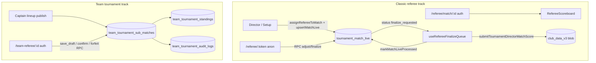

# REFEREE MODULE — CURRENT STATE AUDIT (V5)

**Ngày audit:** 2026-07-12  
**Phạm vi:** Mã nguồn, schema Supabase staging, route, RBAC/RLS, test  
**Ràng buộc:** Không sửa code, không migration, không deploy  
**Người thực hiện:** Codex audit (evidence-based)

---

## 1. Executive Summary

Module **Trọng tài** hiện tồn tại dưới **hai kiến trúc song song**:

| Track | Route chính | Auth | Backend | Mức hoàn thiện |
|-------|-------------|------|---------|----------------|
| **Classic live score** | `/referee/:token`, `/referee`, `/referee/match/:id` | Token anon + session REFEREE | `tournament_match_live` + 2 RPC | MVP một phần |
| **Team tournament** | `/team-referee/:tournamentId` | Session + RBAC | `team_tournament_*` + RPC TT-1B | MVP–Production một phần |

**Kết luận ngắn:**

- Có thể vận hành **giải nội bộ / phong trào** nếu BTC bật Director Mode online, chấp nhận thiếu validation luật pickleball và không có tranh chấp/khiếu nại.
- **Giải đồng đội** có portal trọng tài thật, validation rally scoring, draft/confirm/forfeit cloud — phù hợp staging TT-1B/TT-2 hơn classic.
- **Production thương mại:** **NO-GO** — thiếu transactional finalize, optimistic locking (classic), idempotency (classic), luồng khiếu nại, token lifecycle, và nhiều P0 data integrity.

**Điểm tổng:** **5.6 / 10** (MVP — giữa Prototype và MVP vận hành nội bộ)

**Phương án khuyến nghị:** **Phương án B** (Trọng tài điện tử Production), bắt đầu bằng phase R2–R5 tương đương scope tối thiểu Phương án A.

---

## 2. Phạm vi audit

### Đã kiểm tra

- `src/router.jsx`, guards (`authGuard.js`, `RouteAccessGate`, `operationalRoutePolicy.js`)
- Pages/components referee: `RefereeHub`, `RefereeScoreboard`, `RefereeSessionScoreboard`, `TeamRefereePortal`, `TournamentDirectorMode`, `RefereeAssignDialog`, `TournamentRefereeAssignPage`
- Domain: `matchLiveSync.js`, `refereeEngine.js`, `refereeStatusEngine.js`, `refereeSessionService.js`, `refereeMatchGuard.js`
- Team: `teamRefereeEngine.js`, `rallyScoringEngine.js`, `teamTournamentRpcService.js`
- SQL docs + **Supabase staging** (verified 2026-07-12): `tournament_match_live`, RPC `referee_*`, bảng `team_tournament_*`
- Tests: 47 test referee-focused **PASS** (`node --test` trên 6 file)

### CHƯA XÁC MINH

- Production Supabase (chỉ staging được query)
- Realtime publication trên staging (checklist có trong docs, chưa chạy smoke live)
- E2E mobile trên thiết bị thật (chỉ có unit/integration test + `docs/REFEREE-E2E.md` manual)
- Rating cập nhật khi referee finalize (logic rating tách module competition-core — chưa trace end-to-end trong audit này)

---

## 3. Kiến trúc hiện tại



**Source of truth:**

| Loại giải | Kết quả chính thức | Live/nháp |
|-----------|-------------------|-----------|
| Classic bracket/group | `club_data_v3` blob → `event.matches[]` | `tournament_match_live` |
| Daily play | blob → `tournament.settings` | `tournament_match_live` |
| Team tournament | `team_tournament_sub_matches` (+ blob mirror) | draft trên cloud + local UI state |

---

## 4. Inventory route/component

| Route | Component | Guard | Vai trò được vào | Backend thật | Trạng thái |
|-------|-----------|-------|------------------|--------------|------------|
| `/referee/:token` | `RefereeScoreboard.jsx` | **Public** (`authGuard` bypass) | Ai có token | RPC `referee_*` → `tournament_match_live` | **Hoàn chỉnh một phần** — live score + finalize request |
| `/referee` | `RefereeHub.jsx` | Auth-only route | `REFEREE`, `MATCH_UPDATE` | `listRefereeAssignments` + blob + live fetch | **Hoàn chỉnh một phần** |
| `/referee/match/:matchId` | `RefereeSessionScoreboard.jsx` | Auth + assignment guard | REFEREE assigned | Cùng RefereeScoreboard + token state | **Hoàn chỉnh một phần** |
| `/team-referee/:tournamentId` | `TeamRefereePortal.jsx` | Auth + portal access + team perms | REFEREE, TM, managers | Team RPC + blob orchestrator | **Hoàn chỉnh một phần–MVP** |
| `/tournament/referee-assign` | `TournamentRefereeAssignPage.jsx` | RBAC `TOURNAMENT_VIEW` | Managers | **Demo `buildDemoTeamData()`** | **Chỉ UI / mock** |
| `/tournament/match-reports` | `TournamentMatchReportsHub` | RBAC | Managers | Redirect → `/tournaments/:id/logs` | **Hub redirect** — không có biên bản điện tử riêng |
| `/tournament/director/:tournamentId` | `TournamentDirectorMode.jsx` | `DIRECTOR_USE` + `TOURNAMENT_UPDATE` | BTC/Director | Live sync + finalize queue + dispute reset | **Hoàn chỉnh một phần** |
| `/court-engine` | `CourtEnginePage.jsx` | `DIRECTOR_USE` | Director scheduling | Court engine (không scoring Supabase) | **Liên quan điều phối sân** |
| `/tournaments/:id/logs` | `TournamentEnginePage` tab logs | RBAC | Managers | Score log từ blob | **Lịch sử điều chỉnh** — không phải match report form |
| `/statistics?view=scoreboard` | `Statistics` | RBAC | REFEREE + others | CHƯA XÁC MINH live tie-in | **Menu alias** |

**Route không tồn tại:** `/referee/matches`, dispute route, scorekeeper route, `HEAD_REFEREE` route, token expiry route.

**Navigation:**

- Sidebar zone **Trọng tài** → `/referee`, QR scan, statistics (`navigationConfig.js`)
- `/team-referee` **không** có trong sidebar — deep link từ Team Setup / ops card
- In-page nav có **Phân công trọng tài** → page demo

---

## 5. Inventory database/API/RPC

### 5.1 Classic referee

| Database object | Loại | Mục đích | UI dùng | RLS | Test | Nhận xét |
|-----------------|------|----------|---------|-----|------|----------|
| `tournament_match_live` | Table | Live score staging | RefereeScoreboard, Director | Staff authenticated; anon qua RPC | `referee-rpc-security.test.js` | Staging verified; **không** có `version`, `confirmed_at`, `idempotency_key` |
| `referee_get_match_by_token` | RPC SECURITY DEFINER | Read scoped by token | RefereeScoreboard | Anon execute | 9 tests mock | Không trả `club_id`/`tournament_id` |
| `referee_update_match_score` | RPC SECURITY DEFINER | adjust/finalize + audit append | RefereeScoreboard | Anon execute | Có | `FOR UPDATE` row lock; chỉ `status=playing` |
| `club_data_v3` | Table | Tournament blob SSOT | Director finalize | Club-scoped | integration tests | Kết quả chính thức sau finalize |
| Referee roster | Blob field `tournament.settings.refereeRoster` | Danh sách TT | RefereeRosterPanel | N/A | `referee-engine.test.js` | Không có bảng `referee_assignments` |

### 5.2 Team tournament referee

| Database object | Loại | Mục đích | UI dùng | RLS | Test | Nhận xét |
|-----------------|------|----------|---------|-----|------|----------|
| `team_tournament_sub_matches` | Table | Sub-match score/status | TeamRefereePortal | TT RLS | `team-tournament-referee.test.js` | Có `result_confirmed_at`, `version` (TT-1B) |
| `team_tournament_audit_logs` | Table | Audit draft/confirm/forfeit | Cloud sync | TT RLS | Có | Actions: `team.match.result.*` |
| `team_tournament_command_log` | Table | Idempotency | RPC layer | TT RLS | TT-1C tests | `idempotency_key` NOT NULL |
| `team_tournament_forfeit_events` | Table | Forfeit SSOT | Forfeit RPC | TT RLS | Có | `forfeit_reason`, `version` |
| `team_tournament_save_sub_match_draft` | RPC | Lưu nháp | TeamRefereePortal | Auth | cloud tests | |
| `team_tournament_confirm_sub_match` | RPC | Xác nhận + aggregate | TeamRefereePortal | Auth | Có | `p_expected_version`, `p_idempotency_key` |
| `team_tournament_apply_forfeit` | RPC | Forfeit sub-match | TeamRefereePortal | Auth | Có | |

### 5.3 Không tồn tại (đã search toàn repo SQL)

`match_results`, `match_scores`, `match_games`, `match_events`, `disputes`, `referee_assignments`, `referee_tokens` (bảng riêng), `match_reports` (bảng).

### 5.4 Data model capability matrix

| Capability | Classic live | Team cloud |
|------------|-------------|------------|
| Một trận nhiều game | ❌ (single score pair) | ✅ BO1/BO3 games array |
| Phiên bản kết quả | ❌ | ✅ `version` column |
| Kết quả nháp | ❌ (chỉ live adjust) | ✅ draft RPC |
| Kết quả đã xác nhận | Director blob `completed` | ✅ `result_confirmed_at` |
| Kết quả tranh chấp | ❌ workflow | ❌ workflow |
| Người nhập/xác nhận | `audit_log` JSON actorName | RPC + audit table |
| Optimistic locking | ❌ | ✅ TT-1B |
| Idempotency | ❌ | ✅ command_log |
| Offline sync | ❌ blocked | ❌ blocked (score) |

---

## 6. Luồng nghiệp vụ hiện tại

### Luồng A — Phân công trọng tài

| Bước | Trạng thái | Bằng chứng |
|------|------------|------------|
| BTC chọn trận + TT | ✅ Classic | `RefereeAssignDialog` → `assignRefereeToMatch` + `upsertMatchLive` |
| TT nhận link/QR | ✅ | `buildRefereeUrl`, `RefereeQrDialog` |
| TT thấy đúng trận (session) | ⚠️ Một phần | `listRefereeAssignments` — match theo **tên fuzzy**, không ID |
| Không thấy trận ngoài phạm vi | ⚠️ Một phần | Token RPC scoped; session guard `isMatchAssignedToUser` fuzzy name |
| Page phân công riêng | ❌ Demo | `TournamentRefereeAssignPage` hardcoded demo data |
| Thu hồi / đổi TT | ⚠️ | Re-assign qua Director tạo token mới — **CHƯA XÁC MINH** revoke token cũ |
| Nhiều TT/trận | ❌ | Một `referee_token` / row |
| HEAD_REFEREE / SCOREKEEPER | ❌ Chưa tồn tại | Zero matches trong codebase |

**E2E phân công classic:** **Hoàn chỉnh một phần** (Director dialog → live row → token link). **Không** có notification push cho TT.

---

### Luồng B — Bắt đầu trận

| Capability | Trạng thái |
|------------|------------|
| Xác nhận VĐV/đội | ❌ Không có UI |
| Xác nhận sân | ⚠️ Chỉ hiển thị `court_label` |
| Xác nhận đội hình (team) | ✅ Block score nếu lineup chưa publish (`teamRefereeEngine`) |
| Trạng thái `playing` | ✅ Mặc định khi upsert live |
| Thời gian bắt đầu | ❌ Không có `started_at` |
| Chặn 2 TT cùng bắt đầu | ⚠️ RPC `FOR UPDATE` trên adjust — không có explicit start |

**E2E:** **Chưa hoàn chỉnh** — không có ceremony "bắt đầu trận" tách biệt.

---

### Luồng C — Nhập tỷ số

#### Classic (`RefereeScoreboard`)

| Rule | Hỗ trợ |
|------|--------|
| Live +1/-1 | ✅ |
| Best-of-1/3/5 | ❌ Single cumulative score |
| Points 11/15/21, win-by-2 | ❌ **Không validate** |
| Không hòa (finalize) | ⚠️ UI cho phép 5-5 finalize; director `allowDraw:false` reject sau |
| Không điểm âm | ✅ RPC `greatest(0,...)` |
| Per-game scores | ❌ |

#### Team (`TeamRefereePortal` + `rallyScoringEngine`)

| Rule | Hỗ trợ |
|------|--------|
| BO1 / BO3 | ✅ |
| Rally target + win-by-2 | ✅ `validateRallyScore` |
| Reject tie on confirm | ✅ Test PASS |
| Reject negative | ✅ Test PASS |

**Phân biệt:** Classic = **live cumulative score** (không phải pickleball rule engine). Team = **nhập tỷ số cuối game** + optional game list BO3.

---

### Luồng D — Lưu nháp

| Track | Lưu ở đâu | updated_at/by | Auto-save | Reload | Multi-device conflict |
|-------|-----------|---------------|-----------|--------|----------------------|
| Classic live | Supabase row (mỗi +1) | `updated_at`; actor trong `audit_log` | Mỗi click | ✅ Poll 4s | ⚠️ Last write wins (RPC lock per request) |
| Classic local draft | ❌ | — | — | — | — |
| Team | RPC `save_sub_match_draft` | Cloud + version | Manual "Lưu nháp" | ✅ Page reload via orchestrator | ✅ Version conflict TT-1B |
| Offline draft score | ❌ BLOCK | `offlineCapabilityMatrix` | — | — | — |

---

### Luồng E — Xác nhận kết quả

```text
Classic:
  TT "Chốt kết quả" → RPC status=finalize_requested
  → Director useRefereeFinalizeQueue (client dedup Set)
  → submitTournamentDirectorMatchScore (blob)
  → markMatchLiveProcessed (status=locked)
```

| Bước | Classic | Team |
|------|---------|------|
| Server validate | ⚠️ Chỉ status playing → finalize | ✅ `validateSubMatchScoreInput` + RPC |
| Khóa kết quả | ✅ live locked | ✅ `result_confirmed_at` |
| Cập nhật winner | ✅ blob match | ✅ sub_match + aggregate |
| Bracket/BXH | ✅ director engine | ✅ standings engine |
| Audit | ✅ JSON `audit_log` | ✅ `team_tournament_audit_logs` |
| Notification | ❌ | ❌ |
| **Single DB transaction** | ❌ **2–3 bước tách** | ⚠️ RPC internal — **CHƯA XÁC MINH** full transaction |
| Idempotency | ❌ | ✅ command_log |
| Double-click TT | ⚠️ RPC reject nếu không còn `playing` | ✅ idempotency key |
| Double finalize director | ⚠️ Client `processedIdsRef` only | ✅ RPC idempotency |

**Nguy cơ P0:** Director persist blob **fail** sau khi TT finalize → live ở `finalize_requested` nhưng bracket chưa cập nhật (hoặc ngược lại nếu mark processed trước persist — code gọi persist trước mark processed, nhưng không atomic).

---

### Luồng F — Sửa kết quả

| Ai | Classic | Team |
|----|---------|------|
| Sửa nháp/live | TT khi `playing`; Director override | Manager với `canManageTeam` |
| Sửa đã chốt | Director score dialog / override | Re-edit nếu manage permission |
| Lý do bắt buộc | ⚠️ `scoreNote` optional director | ⚠️ Một phần |
| Lịch sử before/after | ✅ `audit_log` + `scoreLog` blob | ✅ audit table |
| Recalc BXH/bracket | ✅ engine | ✅ engine |
| **Downstream inconsistency risk** | ⚠️ Cao nếu sửa sau bracket advance | ⚠️ Có test standings — edge cases CHƯA XÁC MINH |

---

### Luồng G — Bỏ cuộc và sự cố

| Status | Code/DB | UI referee | Ảnh hưởng BXH |
|--------|---------|------------|---------------|
| `forfeit` | ✅ `MATCH_STATUS.FORFEIT`, team `SUB_MATCH_STATUS` | Team: forfeit RPC | ✅ |
| `walkover` | ⚠️ Rating constants only | ❌ Referee UI | CHƯA XÁC MINH |
| `postponed` | ✅ `matchEngine.postponeMatch` | ❌ Referee UI | — |
| `cancelled` | Tournament level | ❌ Referee | — |
| `retired`, `abandoned`, `no_show`, `disqualified`, `replay_required` | ❌ Không tìm thấy | ❌ | — |
| Báo sự cố | ❌ | — | — |
| Ghi chú TT | ✅ Offline `referee_note` queue | Mobile | Audit only |

---

### Luồng H — Khiếu nại

**Chưa tồn tại** workflow end-to-end.

Có sẵn:
- UI label `DISPUTE` (`refereeStatusEngine.js`)
- Director **reset live** (`handleDisputeResetLive` → `resetMatchLiveForDispute`)
- Không có: VĐV gửi khiếu nại, deadline, file đính kèm, quyết định, khóa tranh chấp.

---

### Luồng I — Giải đồng đội (TeamRefereePortal)

| Capability | Trạng thái |
|------------|------------|
| Chỉ xem lượt đã publish | ✅ `isMatchupPublishedForReferee` |
| Block lineup chưa mở | ✅ `hasOfficialLineup` |
| Sub-match scoring | ✅ |
| Tổng điểm đội | ✅ `computeMatchupResult` |
| Dreambreaker | ✅ Panel + service |
| Dừng sớm khi đủ trận thắng | ⚠️ Engine có — **CHƯA XÁC MINH** UI stop early |
| Tie-break | ✅ Dreambreaker path |
| Forfeit sub-match / team | ✅ RPC |
| Admin override | ✅ Manager permissions |
| Audit từng lượt | ✅ |

**E2E team referee:** **Hoàn chỉnh một phần–MVP** (47 tests PASS trên engine; staging cloud cần TT rollout flags).

---

## 7. RBAC/RLS

### 7.1 Roles thực tế tồn tại (`roles.js`)

| Role yêu cầu audit | Tồn tại |
|--------------------|---------|
| SUPER_ADMIN / PLATFORM_ADMIN | ✅ alias |
| SYSTEM_TECHNICIAN | ✅ |
| TOURNAMENT_OWNER | ❌ (dùng TENANT_OWNER / TOURNAMENT_MANAGER) |
| TOURNAMENT_MANAGER | ✅ |
| HEAD_REFEREE | ❌ |
| REFEREE | ✅ |
| SCOREKEEPER | ❌ |
| TEAM_CAPTAIN | ✅ |
| PLAYER | ✅ |

### 7.2 Permissions thực tế

Không có namespace `referee.*`. Mapping thực tế:

| Permission audit | Thực tế | File |
|------------------|---------|------|
| referee.view_assigned_matches | `TOURNAMENT_VIEW` + session list | `refereeSessionService.js` |
| referee.update_score | `MATCH_UPDATE` | `rolePermissions.js` REFEREE |
| referee.confirm_result | Finalize = RPC; confirm team = `TEAM_MATCH_RESULT_MANAGE` | |
| referee.assign | `TOURNAMENT_UPDATE` (Director) | |
| referee.override_result | `TOURNAMENT_UPDATE` | `hasMatchCorrectionPermission` |

### 7.3 Lớp bảo vệ

| Lớp | Classic token | Classic session | Team |
|-----|---------------|-----------------|------|
| Route guard | Public | Auth-only | Auth + portal |
| UI guard | `guardRefereeMatchAction` (session mode) | ✅ | Permission engine |
| Backend | RPC token scope | RPC + name match | RPC + RLS |
| RLS | Anon **không** REST; staff policies | Same | TT policies |

### 7.4 Token security

| Câu hỏi | Kết luận |
|---------|----------|
| Token truy cập ngoài trận? | ❌ RPC filter `referee_token` |
| Token hết hạn? | ❌ **Không có** `expires_at` |
| Thu hồi token? | ❌ **Không có** revoke — assign mới tạo token mới |
| Plain text storage? | ✅ `referee_token` column + blob `match.referee.token` |
| Tái sử dụng sau trận? | ⚠️ Token vẫn valid cho read nếu row tồn tại — update blocked khi locked |
| IDOR / đoán token? | ⚠️ UUID ≥16 chars — entropy OK; **không** rate limit **CHƯA XÁC MINH** |
| UI chặn nhưng backend mở? | Token path: **không** UI guard (anon) — backend RPC only |

---

## 8. Realtime/offline

### Realtime

| Consumer | Cơ chế | Hoạt động |
|----------|--------|-----------|
| Referee token scoreboard | **Polling 4s** | ✅ `subscribeMatchLiveByToken` |
| Director / BTC | Supabase Realtime `postgres_changes` | ✅ `subscribeTournamentMatchLive` |
| TeamRefereePortal | **CHƯA XÁC MINH** dedicated realtime — likely refetch/poll via `useTeamTournamentPage` |
| Bracket/BXH live | Director refresh | ⚠️ Partial |
| Public live score | `LiveScorePreview.jsx` homepage | **Mock/demo** |

### Offline (`offlineCapabilityMatrix.js`)

| Thao tác | Offline | Queue | Retry | Chống trùng | Conflict |
|----------|:-------:|:-----:|:-----:|:-----------:|:--------:|
| Mở trận | ❌ | — | — | — | — |
| Nhập điểm | ❌ BLOCK | ❌ | — | — | — |
| Lưu nháp | ❌ | ❌ | — | — | — |
| Xác nhận | ❌ BLOCK | ❌ | — | — | — |
| Báo sự cố | ❌ | ❌ | — | — | — |
| Forfeit | ❌ | ❌ | — | — | — |
| Ghi chú TT | ✅ ALLOW | ✅ | ✅ | ⚠️ | ⚠️ |

PWA shell offline: ✅ (mobile module) — **không** áp dụng scoring.

---

## 9. Data integrity

### 9.1 Concurrent update

| Track | Cơ chế | UI conflict warning |
|-------|--------|---------------------|
| Classic RPC | `SELECT … FOR UPDATE` trong RPC | ❌ |
| Classic multi-tab TT | Last adjust wins per request | ❌ |
| Director + TT | Không version column | ❌ |
| Team TT-1B | `p_expected_version` | ⚠️ RPC error — UI handling **CHƯA XÁC MINH** |

### 9.2 Idempotency

| Scenario | Classic | Team |
|----------|---------|------|
| Double confirm | ⚠️ Second finalize RPC returns null (not playing) | ✅ command_log |
| Double BXH update | ⚠️ Director client Set dedup only | ✅ |
| Double bracket advance | ⚠️ Possible if queue re-run | ⚠️ |
| Double notification | N/A (no notifications) | N/A |

### 9.3 Transaction

Finalize classic **không** nằm trong một transaction DB:
1. RPC update live (Supabase)
2. persist blob (local + cloud sync)
3. markMatchLiveProcessed

Failure giữa (2) và (3) → **P0 inconsistency**.

### 9.4 Derived data

Kết quả classic được copy vào:
- `tournament_match_live` (staging)
- `event.matches[]` (SSOT)
- `match.scoreLog` (audit merge)
- Bracket nodes / standings (derived)

**Rebuild:** Có thể rebuild bracket từ matches — **CHƯA XÁC MINH** tooling rebuild production.

---

## 10. Audit và tranh chấp

### Actions có audit

| Action | Classic | Team |
|--------|---------|------|
| `adjust` / score update | ✅ `audit_log` JSON | ✅ |
| `finalized` | ✅ | ✅ confirm |
| `dispute_reset` | ✅ Director | ❌ |
| `admin_override` | ✅ Director | ✅ override |
| `forfeit` | ⚠️ blob status | ✅ forfeit_events |
| `referee.assigned` | ❌ identity audit | ❌ |
| `match.started` | ❌ | ❌ |
| `match.disputed` | ❌ | ❌ |

Identity `audit_logs` table: **không** ghi referee scoring actions.

Fields thường thiếu: `actor_id`, `tenant_id`, `IP` (chỉ `userAgent` trong JSON), `before/after` structured (partial trong log entry).

---

## 11. Test coverage

| Test file | Phạm vi | Số test | Kết quả | Thiếu |
|-----------|---------|--------:|---------|-------|
| `referee-rpc-security.test.js` | RPC token, fallback, shape | 9 | PASS | Live Supabase integration |
| `referee-engine.test.js` | Token, URL, roster | 10 | PASS | — |
| `referee-flow.integration.test.js` | Assign → live → director score | 4 | PASS | Cloud E2E |
| `referee-polish.test.js` | UI guard polish | 6 | PASS | — |
| `team-tournament-referee.test.js` | Team engine full | 14 | PASS | Cloud RPC live |
| `rally-scoring.test.js` | Validation rules | 4 | PASS | Freeze @20 |
| `mobile-phase8-hardening.test.js` | Offline block score | partial | PASS (file) | — |
| `identity-phaseB.test.js` | Public token route | partial | PASS (file) | — |
| `tournament-director.test.js` | Director score → standings | partial | PASS (file) | — |

**Mandatory scenarios (20 cases user list):**

| # | Scenario | Covered |
|---|----------|---------|
| 1 | TT không xem trận không giao | ⚠️ Partial (name fuzzy) |
| 2 | PLAYER không nhập điểm | ✅ RBAC tests |
| 3 | Token hết hạn | ❌ N/A — no expiry |
| 4 | Không xác nhận hòa | ✅ Team; ⚠️ Classic late reject |
| 5 | Không điểm âm | ✅ |
| 6 | Không sửa trận locked | ✅ RPC + guard |
| 7 | Admin override + lý do | ⚠️ Partial |
| 8 | Hai thiết bị cùng lưu | ❌ Classic |
| 9 | Double click confirm | ⚠️ Partial |
| 10 | Retry request | ⚠️ Team idempotency only |
| 11–12 | Offline / reconnect score | ❌ Blocked by design |
| 13–15 | Forfeit/walkover/dispute | ⚠️ Forfeit team only |
| 16 | Sửa sau bracket update | ❌ |
| 17–18 | Team sub-match / early stop | ✅ engine tests |
| 19 | Tenant leakage | ⚠️ `phase16-kn6-rls` partial |
| 20 | Mobile UX | ⚠️ Manual only |

---

## 12. UI/UX assessment

Đánh giá từ code (minHeight, dialogs, mobile nav) — **CHƯA XÁC MINH** trên thiết bị thật.

| Hạng mục | Điểm /10 | Ghi chú |
|----------|---------:|---------|
| Dễ nhận biết trận được giao | 7 | RefereeHub card + labels |
| Tốc độ nhập điểm | 8 | +1 button 56px |
| Kích thước nút bấm | 8 | Mobile touch targets |
| Tránh bấm nhầm | 6 | Confirm finalize; confirm decrement |
| Hiển thị người thắng | 5 | Classic: không highlight winner pre-finalize |
| Cảnh báo trước xác nhận | 7 | Dialog finalize |
| Hiển thị mất mạng | 4 | Không dedicated offline banner scoreboard |
| Khôi phục sau reload | 7 | Poll reload live row |
| Dùng ngoài sân | 6 | Light mode only — **CHƯA XÁC MINH** dark/high contrast |
| Accessibility | 5 | Basic MUI — không aria-live score |

Thiếu: undo stack, haptic, wake lock, one-hand mode optimization, sync pending indicator.

---

## 13. Danh sách P0/P1/P2/P3

| ID | Mức | Phát hiện | Bằng chứng | Ảnh hưởng | Đề xuất |
|----|-----|-----------|------------|-----------|---------|
| P0-01 | P0 | Finalize classic không transactional (live vs blob) | `useDirectorSync.js` + `markMatchLiveProcessed` | Bracket/BXH lệch live | RPC `finalize_match_result` transaction |
| P0-02 | P0 | Classic không optimistic locking / version | `tournament_match_live` schema staging | Ghi đè concurrent | Thêm `version` + conditional update |
| P0-03 | P0 | Classic finalize không idempotency | RPC finalize | Double bracket advance | `idempotency_key` + command log |
| P0-04 | P0 | Không validate pickleball score rules (classic) | `RefereeScoreboard` + RPC | Kết quả sai luật | Rule engine tại finalize |
| P0-05 | P0 | Token không expiry/revoke | `referee.js`, DB schema | Token leak perpetual | TTL + revoke on complete |
| P0-06 | P0 | Assignment fuzzy name match | `refereeSessionService.js` L10-22 | TT sai trận / lộ trận | Assign by `user_id` |
| P0-07 | P1 | Director dedup finalize client-only | `useRefereeFinalizeQueue` processedIdsRef | Double process tab refresh | Server-side idempotency |
| P0-08 | P1 | `/tournament/referee-assign` demo data | `TournamentRefereeAssignPage` L31-44 | BTC tưởng production | Wire real tournament hoặc hide route |
| P1-01 | P1 | Referee token path không RBAC | Public `/referee/:token` | Anyone with link scores | Deprecate; session-only |
| P1-02 | P1 | Không workflow khiếu nại | No dispute tables/routes | Không giải quyết tranh chấp | Phase R8 |
| P1-03 | P1 | Không notification TT/BTC | No push on assign/finalize | Vận hành chậm | Notification service |
| P1-04 | P1 | Match reports = logs redirect | `TournamentHubPages.jsx` | Không biên bản chính thức | Match report entity |
| P2-01 | P2 | HEAD_REFEREE / SCOREKEEPER absent | roles.js | Không phân vai TT | Role matrix v2 |
| P2-02 | P2 | Không walkover/retired UI | constants grep | Thiếu nghiệp vụ | Status engine extension |
| P2-03 | P2 | Team portal không sidebar link | navigation | Khó discover | Add nav entry |
| P2-04 | P2 | Polling 4s thay vì Realtime cho TT | `matchLiveSync.js` L596 | Lag multi-device | Realtime subscribe by token |
| P3-01 | P3 | Legacy token banner | RefereeScoreboard L295 | UX noise | Remove after migration |
| P3-02 | P3 | Public LiveScorePreview mock | `LiveScorePreview.jsx` | Marketing only | Connect real data |

**Tổng:** P0: **6**, P1: **4**, P2: **4**, P3: **2**

---

## 14. Điểm số hiện tại

| Nhóm | Trọng số | Điểm | Weighted |
|------|---------:|-----:|---------:|
| Nghiệp vụ trọng tài | 20% | 5.5 | 1.10 |
| UI/UX mobile | 15% | 7.0 | 1.05 |
| Backend và database | 15% | 6.0 | 0.90 |
| RBAC/RLS | 15% | 6.0 | 0.90 |
| Toàn vẹn dữ liệu | 15% | 4.5 | 0.68 |
| Offline/realtime | 10% | 5.0 | 0.50 |
| Audit và tranh chấp | 5% | 4.0 | 0.20 |
| Test và vận hành | 5% | 6.5 | 0.33 |
| **Tổng cộng** | **100%** | | **5.6** |

**Phân loại:** **MVP (5–7)** — có thể demo và pilot nội bộ; chưa đạt "có thể chạy giải thương mại" (8+).

---

## 15. Mức độ sẵn sàng vận hành

| Loại giải | Verdict | Điều kiện |
|-----------|---------|-----------|
| Giải nội bộ CLB | **CONDITIONAL YES** | RBAC staging ON; Director online; BTC giám sát finalize; chấp nhận thiếu dispute |
| Giải phong trào | **CONDITIONAL YES** | Tương tự nội bộ + team portal nếu giải đồng đội |
| Giải chính thức / thương mại | **NO** | P0 data integrity + audit + dispute + token lifecycle |
| Giải đồng đội | **CONDITIONAL YES** | Cloud TT-1B applied staging ✅; lineup workflow TT-2; QA smoke PASS |
| Production SaaS | **NO-GO** | Xem §19 |

---

## 16. So sánh ba phương án

### Phương án A — Hoàn thiện tối thiểu (giải nội bộ)

| Hạng mục | Nội dung |
|----------|----------|
| Mục tiêu | Sửa P0 classic; giữ kiến trúc blob + `tournament_match_live` |
| Phạm vi | Version column; transactional finalize RPC; assign by user_id; hide demo assign page; basic score validation (no draw) |
| File dự kiến | `matchLiveSync.js`, `supabase-match-live-v3.sql`, `useDirectorSync.js`, `refereeSessionService.js`, `RefereeAssignDialog.jsx` |
| Migration | `tournament_match_live.version`, `referee_assignments` JSON or user_id on row |
| Rủi ro | Thấp; ít thay UI |
| Phases | 2–3 (R2, R3, R5-lite) |
| Nghiệm thu | Double finalize không duplicate bracket; TT chỉ thấy assigned matches; staging RLS PASS |

### Phương án B — Trọng tài điện tử Production (khuyến nghị)

| Hạng mục | Nội dung |
|----------|----------|
| Mục tiêu | Unified result pipeline; reuse TT-1B patterns for classic |
| Kiến trúc | SSOT `match_results` or extend live row; `finalize_match_result` RPC; event log optional |
| API/RPC | `referee_*` v2 + `finalize_match_result`; idempotency command log shared |
| RLS | Token scoped + user assignment table |
| UI | Session-first; deprecate public token; realtime; offline queue future phase |
| Test | RLS suite + E2E mobile referee |
| Migration | Phased: v3 live → command log → dispute tables |
| Rollback | Feature flag `VITE_REFEREE_V2`; keep token read-only |

### Phương án C — Nền tảng chuyên nghiệp quy mô lớn

| Hạng mục | Nội dung |
|----------|----------|
| Mục tiêu | HEAD_REFEREE, scorekeeper, point-by-point event log, multi-venue, HA |
| Chi phí | Cao — 6+ phases, team riêng |
| Phù hợp | Sau B stable 2+ mùa giải production |

**Đánh giá:** **Phương án B** phù hợp nhất — team tournament đã có `version`, `idempotency_key`, audit log; mở rộng sang classic rẻ hơn viết lại (C) và đủ cho production (A không đủ dispute/realtime).

---

## 17. Phương án khuyến nghị

**Chọn Phương án B**, triển khai theo lộ trình incremental:

1. **R2 Data integrity P0** — port TT-1B patterns → classic live
2. **R3 RBAC assignment** — user_id-based assignment, deprecate public token write
3. **R5 Result finalize transaction** — single RPC
4. **R6 Team referee hardening** — realtime, early-stop UX
5. **R8 Dispute + match report** — before commercial

**Phase cần làm trước:** **R2 — Data integrity P0**

---

## 18. Roadmap triển khai

| Phase | Mục tiêu | Thay đổi chính | Test bắt buộc | Điều kiện GO |
|-------|----------|----------------|---------------|--------------|
| **R1** | Audit + khóa phạm vi | Tài liệu này; feature flags | — | Owner sign-off |
| **R2** | Data integrity P0 | `version`, idempotency, transactional finalize | Concurrent 2-device; double finalize | Zero duplicate bracket in staging |
| **R3** | RBAC/RLS trọng tài | Assignment table; revoke token | TT not assigned denied | RLS D4–D8 PASS |
| **R4** | Referee mobile workspace | Session-only scoring; offline banner | Mobile E2E smoke | REFEREE role QA |
| **R5** | Result finalize transaction | `finalize_match_result` RPC | Integration + rollback test | Atomic commit verified |
| **R6** | Team tournament referee | Realtime sub-match; stop early | `team-tournament-referee` + cloud smoke | TT-2 lineup gate PASS |
| **R7** | Realtime và offline | Token realtime; optional score queue | Reconnect test | Lag < 2s director |
| **R8** | Biên bản và tranh chấp | `disputes` table + workflow UI | Dispute E2E | BTC resolve flow |
| **R9** | QA staging → production | Runbook + rollback | Full REGRESSION + RLS | No P0 open |

---

## 19. Acceptance criteria (Production Ready)

Module **GO Production** khi:

- [ ] Không còn P0 mở
- [ ] RLS test PASS (manual + automated)
- [ ] Hai thiết bị không ghi đè (version conflict UI)
- [ ] Double submit không duplicate BXH/bracket
- [ ] Finalize trong một transaction
- [ ] Locked result không sửa trái phép
- [ ] Override có lý do + audit đầy đủ
- [ ] Offline không duplicate (score vẫn blocked hoặc queue safe)
- [ ] Realtime không leak cross-tenant
- [ ] Team aggregate score đúng
- [ ] Bracket/BXH rebuild được từ SSOT
- [ ] E2E mobile referee PASS
- [ ] Rollback plan + incident runbook

**Verdict hiện tại:** **NO-GO**

---

## 20. Kết luận GO / CONDITIONAL GO / NO-GO

| Quyết định | Trạng thái |
|------------|------------|
| Pilot nội bộ có giám sát BTC | **CONDITIONAL GO** |
| Giải phong trào / đồng đội staging | **CONDITIONAL GO** |
| Giải thương mại / Production SaaS | **NO-GO** |

---

## Bảng tóm tắt cuối báo cáo

| Nội dung | Kết luận |
|----------|----------|
| Có thể chạy giải nội bộ | **CONDITIONAL** |
| Có thể chạy giải thương mại | **NO** |
| Có thể chạy giải đồng đội | **CONDITIONAL** |
| Có thể chạy Production | **NO** |
| Điểm hiện tại | **5.6/10** |
| P0 | **6** |
| P1 | **4** |
| Phương án khuyến nghị | **B** |
| Phase cần làm trước | **R2 — Data integrity P0** |
| Điều kiện để GO | P0 closed + transactional finalize + assignment RBAC + dispute MVP |

---

## Phụ lục A — Chức năng UI chi tiết (Classic RefereeScoreboard)

| Chức năng | UI | Validation | API/RPC | DB | Audit | Test | Vận hành thực tế |
|-----------|:--:|:----------:|:-------:|:--:|:-----:|:----:|:----------------:|
| Danh sách trận | Hub ✅ | ⚠️ | ✅ | ✅ | — | ✅ | ✅ |
| Chi tiết trận | ✅ | — | ✅ | ✅ | — | ✅ | ✅ |
| Bắt đầu trận | ❌ | — | — | — | — | — | ❌ |
| Nhập tỷ số live +1 | ✅ | ⚠️ | ✅ | ✅ | ✅ | ✅ | ✅ |
| Lưu nháp | ❌ (live only) | — | — | — | — | — | N/A |
| Xác nhận kết quả | ✅ | ⚠️ | ✅ | ✅ | ✅ | ✅ | ⚠️ |
| Hoàn tác | ⚠️ -1 confirm | ✅ | ✅ | ✅ | ✅ | ✅ | ✅ |
| Walkover/forfeit | ❌ | — | — | — | — | — | ❌ |
| Hủy/hoãn | ❌ | — | — | — | — | — | ❌ |
| Báo sự cố | ❌ | — | — | — | — | — | ❌ |
| Ghi chú TT | Mobile ✅ | — | offline queue | audit | ✅ | ✅ | ⚠️ |
| Biên bản điện tử | ❌ | — | — | — | — | — | ❌ |
| Xác nhận VĐV/đội trưởng | ❌ | — | — | — | — | — | ❌ |
| Tranh chấp | ❌ | — | — | — | — | — | ❌ |
| Mở khóa/sửa (TT) | ❌ locked | ✅ | ✅ | ✅ | ✅ | ✅ | Director only |
| Lịch sử chỉnh sửa | ⚠️ Director logs | — | — | blob | ✅ | ✅ | ⚠️ |
| Offline/sync indicator | ❌ | — | — | — | — | — | ❌ |
| Realtime live | ⚠️ Poll 4s | — | ✅ | ✅ | — | — | ⚠️ |

---

## Phụ lục B — Evidence files (trích dẫn chính)

- Router: `src/router.jsx` L404, L454–456, L520, L582–584
- Public token: `src/auth/authGuard.js` L32–34
- RPC RLS: `docs/supabase-match-live-rls.sql`
- Finalize queue: `src/tournament/useMatchLiveScores.js` L69–97
- Offline block: `src/features/mobile/services/offlineCapabilityMatrix.js` L26–29
- Team validation: `src/features/team-tournament/engines/rallyScoringEngine.js`
- Demo assign page: `src/pages/tournament/TournamentRefereeAssignPage.jsx` L31–44
- Staging DB verified: `tournament_match_live` 18 columns; RPC `referee_get_match_by_token`, `referee_update_match_score`; 15 `team_tournament_*` tables

---

*End of audit — no code changes performed.*
