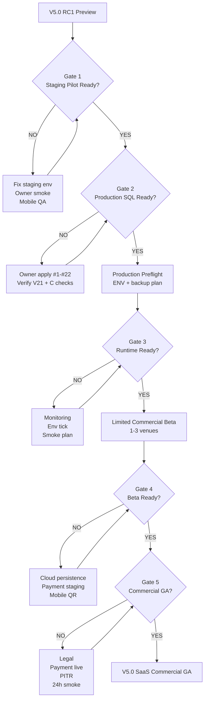

# V5.0 — Commercial GA Master Plan

**Ngày:** 2026-07-04  
**Branch:** `v5-platform-edition`  
**Version:** `5.0.0-rc1` — V5.0 SaaS Preview RC1  
**Mục tiêu:** Điều phối từ **Preview RC1** → **Commercial GA Candidate**  
**Không deploy Production · Không bật payment live · Không apply SQL thay owner**

---

## 1. Current status

| Dimension | Verdict |
|-----------|---------|
| Product maturity | V5.0 SaaS MVP / Preview RC1 (audit 68/100) |
| Automated gates | ✅ 769/769 tests, build PASS, lint 0 errors |
| Staging pilot | ⚠️ CONDITIONAL — script BLOCKED, owner smoke PENDING |
| Production SQL | ⏳ NOT STARTED — empty Production DB |
| Commercial GA | ⛔ **NO-GO** — P0 blockers open |

---

## 2. What is already done

- Phase 17 RC1 tag `v5.0.0-rc1`
- Phase 18 Production Readiness docs
- Phase 19A apply pack + Production project confirmed
- Phase 20 pilot hardening: billing lock, OperationalRouteGate, court tenant keys
- Phase 20B acceptance docs + staging scripts
- Staging QA: KN-6 closed, 11E 21/21 PASS
- Phase 21: reconciliation #21/#22, blocker register, cloud/payment design

---

## 3. What must not be repeated

- Phase 20/20B plan or duplicate checklists
- Re-run automated test-only reports without owner actions
- New features outside commercial blockers
- UI menu changes unrelated to commercial readiness
- Production deploy / SQL apply / payment live without owner approval
- Mark #21/#22 PASS without owner evidence
- Mark Commercial GA with open P0/P1 blockers

---

## 4. Commercial release gates

### Gate 1 — Staging Pilot Ready

**PASS khi:**

| Check | Status Phase 21 |
|-------|-----------------|
| Staging env verify PASS | ⏳ `npm run test:verify-staging-env` — BLOCKED nếu key invalid |
| Billing tenant mapping PASS | ⏳ BLOCKED (credentials) |
| Owner login PASS | ⏳ Manual |
| Billing trial/active PASS | ⏳ Manual |
| Court Engine PASS | ✅ Unit tests; device manual ⏳ |
| Mobile ≥1 OS PASS | ⏳ Manual |

### Gate 2 — Production SQL Ready

**PASS khi:**

| Check | Status Phase 21 |
|-------|-----------------|
| #21 PASS (V21-1 → V21-8) | ⏳ NEEDS APPLY |
| #22 PASS (C0 → C7) | ⛔ BLOCKED until #21 |
| Apply pack updated | ✅ Phase 21 reconcile |
| No production env flags bật sai | ✅ Designed OFF |
| Rollback reviewed | ⏳ Owner tick |

### Gate 3 — Production Runtime Ready

**PASS khi:**

| Check | Status Phase 21 |
|-------|-----------------|
| Vercel Production env đầy đủ | ⏳ Owner |
| API/billing/payment flag plan | ✅ `PHASE_21_PRODUCTION_PREFLIGHT_PLAN.md` |
| Smoke test script/plan | ✅ 24h plan documented |
| Monitoring | ⏳ Not implemented |
| Backup | ⚠️ Free/Nano limitation |

### Gate 4 — Commercial Beta Ready

**PASS khi:**

| Check | Status Phase 21 |
|-------|-----------------|
| Court Engine cloud hoặc pilot limitation accepted | ⏳ Design Phase 22 |
| Payment staging pass | ⏳ Phase 23 |
| Mobile QR Android + iPhone | ⏳ Manual |
| Tenant lock pass | ✅ Code; prod verify ⏳ |
| Support runbook pass | ⏳ Partial |

### Gate 5 — Commercial GA

**PASS khi:**

| Check | Status Phase 21 |
|-------|-----------------|
| Production smoke 24h pass | ⏳ |
| Payment live pass | ⛔ Phase 23 |
| Backup/PITR pass | ⛔ |
| Legal docs pass | ⛔ |
| Monitoring pass | ⏳ |
| No P0/P1 blocker | ⛔ 15 blockers registered |

---

## 5. Workstreams A–G

| WS | Tên | Deliverable Phase 21 | Status |
|----|-----|----------------------|--------|
| **A** | Staging Pilot Closure | `verify-staging-env-preflight.mjs` + npm script; master status update | ✅ Script; ⏳ run blocked |
| **B** | Production SQL #21/#22 | `PHASE_21_PRODUCTION_SQL_RECONCILIATION.md` + apply pack fix | ✅ |
| **C** | Production Preflight Design | `PHASE_21_PRODUCTION_PREFLIGHT_PLAN.md` | ✅ |
| **D** | Commercial Blocker Register | `V5_COMMERCIAL_GA_BLOCKER_REGISTER.md` | ✅ |
| **E** | Cloud Persistence Plan | `PHASE_22_CLOUD_PERSISTENCE_DESIGN.md` | ✅ Design |
| **F** | Payment Commercial Plan | `PHASE_23_PAYMENT_COMMERCIAL_PLAN.md` | ✅ Design |
| **G** | Master Plan | File này + `PHASE_21_COMMERCIAL_READINESS_REPORT.md` | ✅ |

---

## 6. Blocker register summary

**P0 open:** B01, B02, B03, B07, B08, B11, B12  
**P1 open:** B04, B05, B06, B09, B10, B13, B15  
**P2:** B14 (lint warnings)

Chi tiết: `V5_COMMERCIAL_GA_BLOCKER_REGISTER.md`

---

## 7. Decision tree

### Pilot staging (hiện tại)

**CONDITIONAL GO** — automated PASS; chờ owner staging env + smoke + 1 mobile OS.

### Production preflight

**NO-GO** — SQL not started; Gate 1 chưa PASS đầy đủ.

### Limited commercial beta

**NO-GO** — sau Gate 3 + payment staging + cloud/pilot acceptance.

### Commercial GA

**NO-GO** — P0 blockers; audit 68/100.

---

## 8. Go/No-Go rules

| Decision | Rule |
|----------|------|
| **Pilot staging 1 sân** | Gate 1 partial OK — owner script PASS + smoke core + 1 mobile |
| **Production Preflight start** | Gate 1 PASS + owner approve SQL apply Batch A start |
| **Production deploy (19B)** | Gate 2 + Gate 3 + owner signature |
| **Commercial beta** | Gate 4 — payment staging, mobile QR both OS, runbook |
| **Commercial GA** | Gate 5 — zero P0, legal, payment live, PITR/backup |
| **Agent autonomy** | Docs + scripts only — never deploy/apply/enable live |

---

## Staging pilot status (Workstream A)

| Item | Status |
|------|--------|
| `npm run test:verify-staging-env` | ⏳ BLOCKED/PENDING — cần `.env.local` staging hợp lệ |
| `npm run test:verify-billing-tenant-mapping` | ⏳ BLOCKED — Phase 20B Unregistered API key |
| Owner smoke 17 mục | ⏳ PENDING — `PHASE_20B_OWNER_STAGING_SMOKE_CHECKLIST.md` |
| Mobile Android | ⏳ PENDING |
| Mobile iPhone | ⏳ PENDING |

---

## Production SQL status (Workstream B)

| Migration | Production | Staging evidence |
|-----------|------------|------------------|
| #21 11E | NEEDS APPLY | ✅ PASS 2026-07-03 |
| #22 KN-6 | BLOCKED (needs #21) | ✅ PASS 2026-07-03 |

Reconcile: `PHASE_21_PRODUCTION_SQL_RECONCILIATION.md`

---

## Tham chiếu

| File | Mục đích |
|------|----------|
| `docs/v5/PHASE_21_COMMERCIAL_READINESS_REPORT.md` | Phase 21 verdict |
| `docs/v5/PHASE_19A_PRODUCTION_SQL_APPLY_PACK.md` | SQL apply owner tick |
| `docs/v5/PHASE_20B_VERIFICATION_REPORT.md` | Phase 20B baseline |
| `docs/v5/V5_SAAS_COMPLETION_ROADMAP.md` | Historical roadmap |
