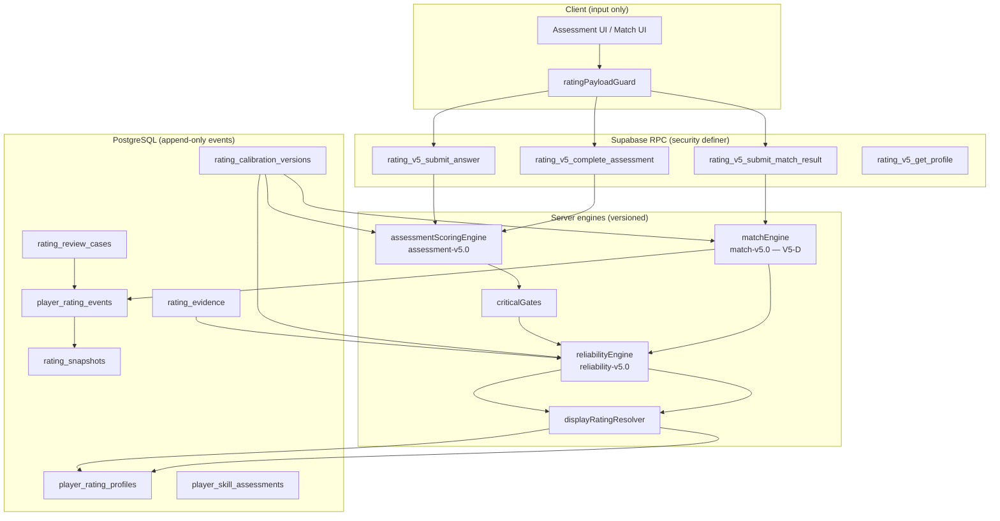
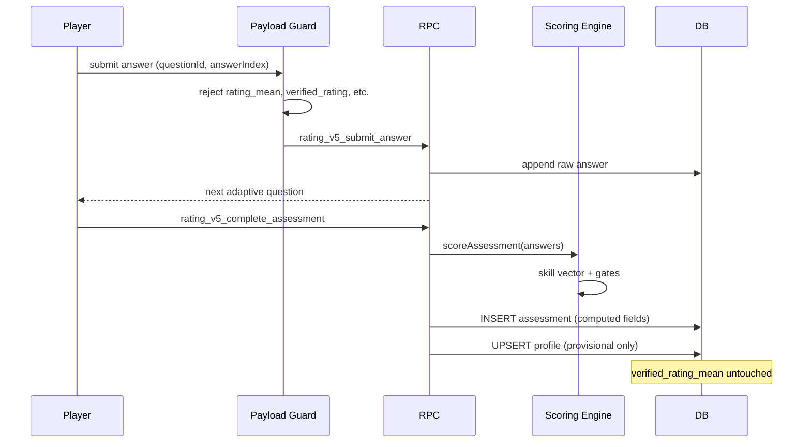
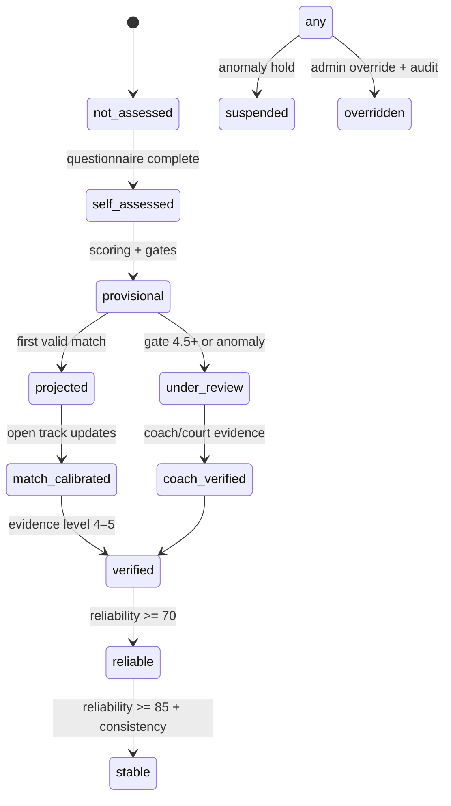
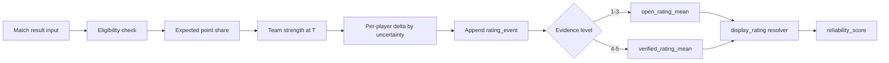

# V5-A — Architecture

## Component diagram

## Data flow — assessment

## Rating lifecycle

## Evidence flow

| Level | Source | Updates open? | Updates verified? |
|------:|--------|:-------------:|:-----------------:|
| 0 | None | — | — |
| 1 | Self assessment | prior only | — |
| 2 | Unverified external | yes | — |
| 3 | Player confirmed | yes | — |
| 4 | Club/coach/court | yes | yes |
| 5 | Pick_VN tournament | — | yes |

## Match update flow (V5-D design)

## ADRs

| ADR | Decision |
|-----|----------|
| [ADR-001](adr/ADR-001-server-authoritative-rating.md) | Server computes all canonical rating values |
| [ADR-002](adr/ADR-002-open-verified-tracks.md) | Separate open and verified rating tracks |
| [ADR-003](adr/ADR-003-singles-doubles-profiles.md) | Independent singles/doubles profiles per tenant+player |
| [ADR-004](adr/ADR-004-continuous-rating-scale.md) | 1.5–6.0 internal mean; display rounds to 0.1 only |
| [ADR-005](adr/ADR-005-v2-coexistence.md) | V2 tables frozen; no auto-migration |

## Foundation tables (9/9)

Canonical registry: [`V5-FOUNDATION_9_TABLES.md`](./V5-FOUNDATION_9_TABLES.md)
