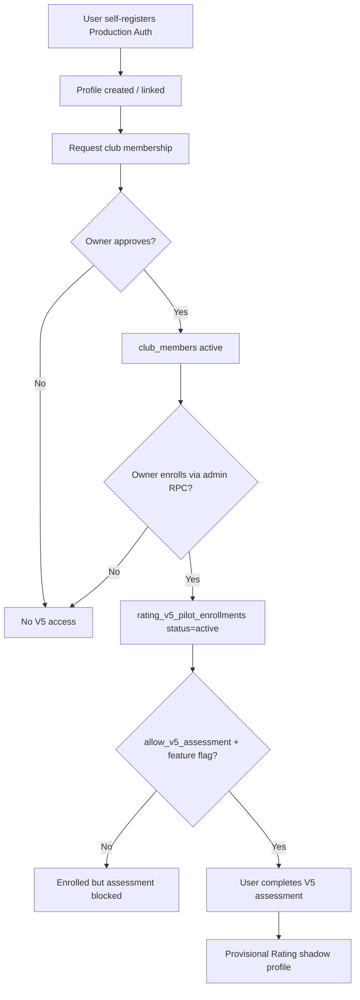

# V5-P1 — Club Membership → Enrollment Flow

**Cohort:** `club-rating-v5-production-pilot`  
**Max members:** 40 (owner club only)

## End-to-end flow



## Step details

### 1. Self-register (Production Auth)

- User signs up on `https://pickleball-scheduler-eight.vercel.app` (observed Production URL — owner confirm)
- Supabase Auth creates `auth.users` + trigger creates `profiles`

### 2. Player profile

- `profiles.id` = auth user id
- Role typically `PLAYER`
- `venue_id` / club linkage via club membership tables

### 3. Club membership

Tables:

- `club_membership_requests_v42` — pending request
- `club_members` — active membership after owner approval

Owner approves via club management UI or RPC.

### 4. Owner enrollment (mandatory for V5)

**Only** admin/owner with `rating_v5.calibration_manage`:

```sql
select rating_v5_admin_upsert_pilot_enrollment(
  p_player_id := '<profile_uuid>',
  p_tenant_id := '<club_tenant_id>',
  p_cohort_label := 'club-rating-v5-production-pilot',
  p_status := 'active',
  p_notes := 'Wave A slot N'
);
```

PLAYER **cannot** self-enroll.

### 5. Assessment access gates

All must be true:

| Gate | Source |
|------|--------|
| `VITE_PICK_VN_RATING_V5_ENABLED=true` | Frontend (P1-C) |
| `allow_v5_assessment=true` | `rating_v5_rollout_config` |
| Active enrollment | `rating_v5_pilot_enrollments` |
| `rating_v5_assert_pilot_gate` | Server RPC / Edge |

### 6. Provisional result

- Assessment stored in `player_skill_assessments` (`is_shadow=true`)
- Event in `player_rating_events`
- Profile updated with `source_assessment_id` traceability
- UI: **Rating V5 — Điểm trình độ tạm tính** (not Verified)

## Eligibility checks (enroll script)

| Check | Query concept |
|-------|---------------|
| Auth exists | `profiles.id` |
| Club member | `club_members` where `club_id` = owner club |
| Not disabled | `profiles.status = 'active'` |
| No duplicate | unique `(player_id, cohort_label)` |
| Not outside club | manual owner review |

## Wave limits

| Wave | Max enrolled |
|------|--------------|
| A | 5 |
| B | 15 |
| C | 40 |

## What does NOT grant access

- `player_rating_profiles.rollout_cohort` alone
- Staging enrollment
- Feature flag without enrollment
- Enrollment without `allow_v5_assessment`
