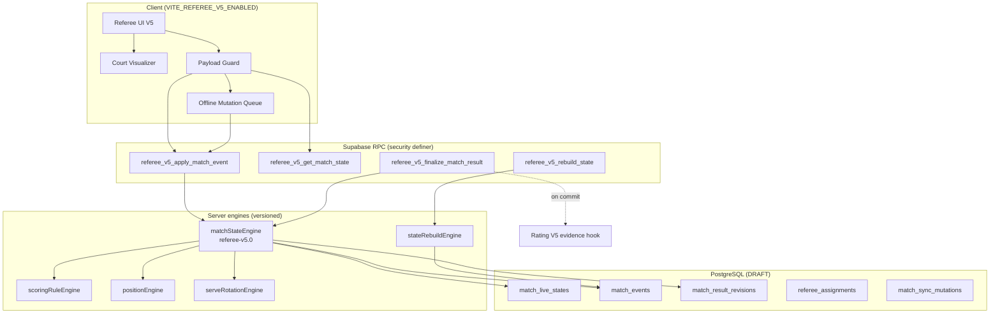

# Referee V5-A — Architecture

**Feature flag:** `VITE_REFEREE_V5_ENABLED=false` (default)  
**Module path (proposed):** `src/features/referee-v5/`  
**Coexistence:** Legacy `/referee*` unchanged when flag off

---

## 1. Design principles

1. **Server-authoritative match state** — client sends intents, not computed fields.
2. **Event-sourced history** — append-only `match_events`; current state = snapshot + replay.
3. **Rule engine is pure** — side-out, rally, singles isolated rule sets.
4. **UI is a projection** — court visualizer reads `match_state`, never owns truth.
5. **Rating V5 integration at finalize only** — official result → rating evidence (design hook).
6. **Feature-flagged rollout** — no route changes in V5-A; new routes behind flag in V5-C+.

---

## 2. Layer diagram



---

## 3. Layer responsibilities

| Layer | Responsibility | Must NOT |
|-------|----------------|----------|
| **Referee UI** | Render state, capture intents, confirmations | Compute server/receiver/winner |
| **Court visualizer** | Map `match_state.participants` → NEAR/FAR + LEFT/RIGHT | Store independent positions |
| **Match state engine** | Apply event → new state + version | Skip rule engine |
| **Scoring rule engine** | Points, game/match end, freeze rules | Know UI layout |
| **Position engine** | Player court_side/court_end after rally | Guess receiver from UI |
| **Serve rotation engine** | Server 1/2, side-out, rally serve order | Mix side-out with rally rules |
| **Event store** | Append-only sequence, revert refs | UPDATE/delete events |
| **Realtime sync** | Broadcast state version bumps | Send full write access to viewers |
| **Offline queue** | Ordered mutations + idempotency keys | Finalize offline (default off) |
| **Result finalization** | Single transaction: lock + bracket + rating hook | Split across client steps |
| **Audit & dispute** | Immutable audit + dispute state machine | Allow silent override |

---

## 4. Source of truth model

```text
match_events     = append-only intent + outcome log (canonical history)
match_live_state = materialized snapshot (version, fast read)
match_result     = official locked outcome after finalize_match_result
```

**Client payload (allowed):**

```json
{
  "eventType": "RALLY_WON",
  "winningTeamId": "team-a",
  "clientMutationId": "uuid",
  "expectedVersion": 17
}
```

**Server-owned (rejected from client):**

```text
serving_player_id, server_number, participant positions,
team_a_score, winner_id, locked_at, rating_applied
```

---

## 5. Feature flag integration

```javascript
// Proposed — NOT IMPLEMENTED in V5-A
export function isRefereeV5Enabled() {
  return import.meta.env.VITE_REFEREE_V5_ENABLED === "true";
}
```

| Flag off | Flag on |
|----------|---------|
| Legacy RefereeScoreboard | Optional `/referee-v5/match/:id` (V5-C+) |
| `tournament_match_live` scoring | Parallel read; migration path in V5-E |
| No position UI | Court visualizer |

---

## 6. Integration points

| System | Integration |
|--------|-------------|
| Legacy referee | Read-only bridge during migration; dual-write forbidden |
| Team tournament | Sub-match = separate `match_id` scope in V5-G |
| Tournament Director | Subscribe `match_live_states` version |
| Rating V5 | `finalize_match_result` → `rating_evidence` row (V5-H) |
| Identity RBAC | `REFEREE` + assignment table |

---

## 7. ADRs

| ADR | Title |
|-----|-------|
| [ADR-001](./adr/ADR-001-referee-state-source-of-truth.md) | Referee state source of truth |
| [ADR-002](./adr/ADR-002-event-driven-match-state.md) | Event-driven match state |
| [ADR-003](./adr/ADR-003-scoring-rule-engine.md) | Scoring rule engine |
| [ADR-004](./adr/ADR-004-player-position-and-court-orientation.md) | Player position & court orientation |
| [ADR-005](./adr/ADR-005-realtime-offline-conflict-strategy.md) | Realtime & offline conflict |
| [ADR-006](./adr/ADR-006-result-finalization-and-idempotency.md) | Finalization & idempotency |

---

## 8. Proposed module layout (V5-B+)

```text
src/features/referee-v5/
  constants/
  engines/
    matchStateEngine.js
    scoringRuleEngine/
      sideOutDoubles.js
      rallyDoubles.js
      singlesSideOut.js
    positionEngine.js
    serveRotationEngine.js
    stateRebuildEngine.js
  guards/
    refereeV5PayloadGuard.js
  services/
    refereeV5RpcService.js
    refereeV5OfflineQueue.js
  ui/
    CourtVisualizer.jsx
    RefereeV5Scoreboard.jsx
  hooks/
    useMatchStateSubscription.js
```

---

## 9. Roadmap reference

See `V5-A_FINAL_VERDICT.md` § Phase roadmap.

---

*Architecture design only — no code deployed.*
