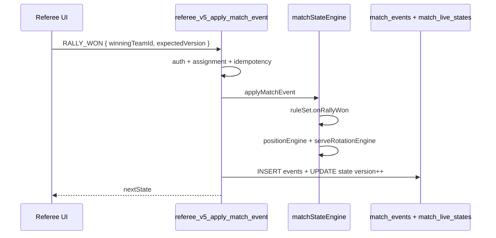

# Referee V5-C — Match State Engine Specification

**Engine version:** `referee-v5.0`  
**Status:** Design (V5-A)

---

## 1. Overview

`matchStateEngine` is the single entry point for applying events:

```javascript
applyMatchEvent(currentState, event, ruleSet) → {
  ok: boolean,
  nextState: MatchLiveState,
  emittedEvents: MatchEvent[],
  error?: string
}
```

Pure function + RPC wrapper for persistence.

---

## 2. State object

```typescript
interface MatchLiveState {
  id: string;
  version: number;
  status: MatchStatus;
  gameNumber: number;
  teamAId: string;
  teamBId: string;
  teamAScore: number;      // rally or game score
  teamBScore: number;
  teamASideOutScore?: number;  // side-out only
  teamBSideOutScore?: number;
  serverNumber?: 1 | 2;
  servingTeamId: string;
  servingPlayerId: string;
  receivingTeamId: string;
  receivingPlayerId: string;
  servingCourtSide: "LEFT_SERVICE_COURT" | "RIGHT_SERVICE_COURT";
  receivingCourtSide: "LEFT_SERVICE_COURT" | "RIGHT_SERVICE_COURT";
  servingCourtEnd: "NEAR_END" | "FAR_END";
  receivingCourtEnd: "NEAR_END" | "FAR_END";
  serveDirection?: string;  // derived — see V5-B §4.2
  teamAEnd: "NEAR_END" | "FAR_END";
  teamBEnd: "NEAR_END" | "FAR_END";
  participants: MatchParticipantPosition[];
  scoringFormat: ScoringFormat;
  courtOrientation: "REFEREE_PHYSICAL_VIEW";
}
```

---

## 3. Rule sets

| ID | Format | Engine module |
|----|--------|---------------|
| `side_out_doubles_v1` | Traditional doubles side-out | `sideOutDoubles.js` |
| `side_out_singles_v1` | Singles side-out | `singlesSideOut.js` |
| `rally_doubles_v1` | Rally scoring doubles | `rallyDoubles.js` |
| `rally_singles_v1` | Rally singles | `rallySingles.js` |

Selection via `scoringFormat.ruleSetId` on match/discipline.

**Current codebase:** only `rallyScoringEngine.js` validates **final** scores — no rally-by-rally, side-out rotation, or diagonal receiver logic. **NOT IMPLEMENTED.**

---

## 3.1 serveRotationEngine (mandatory)

After **every** state transition affecting serve, call:

```javascript
function recomputeServeContext(state) {
  const server = getParticipant(state, state.servingPlayerId);
  const receiverResult = resolveReceiver(state); // V5-B §4–5
  if (!receiverResult.ok) return receiverResult;

  const receiver = getParticipant(state, receiverResult.receivingPlayerId);
  state.receivingTeamId = receiver.teamId;
  state.receivingPlayerId = receiver.playerId;
  state.servingCourtSide = server.courtSide;
  state.receivingCourtSide = receiver.courtSide;
  state.servingCourtEnd = server.courtEnd;
  state.receivingCourtEnd = receiver.courtEnd;
  state.serveDirection = buildServeDirection(server, receiver);
  setExclusiveServerReceiverFlags(state.participants, server.playerId, receiver.playerId);
  return validateServeSnapshot(state); // V5-B §10
}
```

**Client payloads must not include** `receiving_player_id`, `serve_direction`, or court sides — RPC strips and recomputes.

---

## 4. Side-out doubles rules

### 4.1 Score display (UI)

Side-out games often shown as **5 – 3 – 1**:

```text
teamAScore – teamBScore – serverNumber
```

Where first two are **side-out points** (only serving team can score on serve hold).

Engine fields:

```text
team_a_side_out_score, team_b_side_out_score, server_number
```

### 4.2 Rally won — serving team

```javascript
function onServingTeamWinsRally(state) {
  incrementSideOutScore(state, state.servingTeamId);
  switchPartnersCourtSide(state, state.servingTeamId);
  recomputeServeContext(state); // receiver may change: e.g. D → C
  checkGameComplete(state);
}
```

### 4.3 Rally won — receiving team

```javascript
function onReceivingTeamWinsRally(state) {
  if (state.serverNumber === 1) {
    state.serverNumber = 2;
    // same team serves, other partner — positions unchanged
    selectServer2Player(state);
  } else {
    sideOut(state);
    state.serverNumber = 1;
    selectInitialServerForTeam(state, newServingTeamId);
  }
  recomputeServeContext(state);
  // NO point awarded (default side-out)
}
```

Owner decision required for variants where receiving team scores (see §19 owner review).

### 4.4 Game complete

Configurable `pointsToWin` (11/15/21), `winBy` (2), `maximumScore` optional cap.

Reuse validation patterns from `rallyScoringEngine.getRallyWinner` for **game-ending** check only.

---

## 5. Rally scoring rules

Separate module — **must not call side-out rotation helpers**.

### 5.1 Rally won

```javascript
function onRallyWonRallyScoring(state, winningTeamId) {
  incrementRallyScore(state, winningTeamId);
  applyRallyServeRotation(state, winningTeamId);  // format-specific
  applyPartnerSwitchIfConfigured(state);
  checkSideSwitchMilestone(state);  // e.g. at 11 in MLP doubles
  checkFreezeRules(state);          // e.g. freeze @20
  checkGameComplete(state);
}
```

Port from existing:

- `targetScore`, `winBy`, `freezeAt`, `sideSwitchAt` (`rallyScoringEngine.js`)
- `rotationPoints` hint (team constants) — implement in V5-B

### 5.2 Even/odd serve side (rally doubles)

When configured:

```text
serving_team_score % 2 === 0 → RIGHT_SERVICE_COURT
serving_team_score % 2 === 1 → LEFT_SERVICE_COURT
```

Applied to server position before serve.

---

## 6. Singles rules

| Aspect | Behavior |
|--------|----------|
| Participants | 1 per team |
| Server 1/2 | **N/A** |
| Serve side | Even/odd score → left/right service court |
| Partner switch | **N/A** |
| End switch | Both players swap `court_end` on ENDS_SWITCHED |

Same engine pipeline, different rule set.

---

## 7. Team tournament hierarchy

```text
team tie (matchup)
  └── sub-match (individual match_id in V5)
        └── game (game_number 1..N)
              └── rally (events)
```

- Each **sub-match** = isolated `match_live_states` row.
- Sub-match finalize → `match_result_revisions` → aggregate to team tie engine (existing `teamResultEngine` pattern).
- Referee portal shows published lineup only (reuse `teamRefereeEngine.hasOfficialLineups`).

---

## 8. Event application flow



---

## 9. Undo (EVENT_REVERTED)

Policy (proposed default — **owner approval required**):

| Rule | Default |
|------|---------|
| Scope | Last non-revert event only |
| Time limit | None during `in_progress` |
| After game complete | Denied unless HEAD_REFEREE |
| After match locked | Denied |
| Mechanism | Append `EVENT_REVERTED` → rebuild snapshot to `state_version_before` |

Implementation: `stateRebuildEngine.revertToVersion(state, targetVersion)`.

---

## 10. Match lifecycle events

| Event | When |
|-------|------|
| `MATCH_STARTED` | After lineup/court confirm |
| `GAME_COMPLETED` | Rule engine detects game end |
| `MATCH_COMPLETED` | All games won per best_of |
| `RESULT_CONFIRMED` | After finalize RPC |

---

## 11. Integration with legacy

When `VITE_REFEREE_V5_ENABLED=false`, legacy `adjustMatchLiveScore` continues. No dual-write.

Migration phase (V5-E): optional projection from V5 state → legacy live row for Director compatibility.

---

*Specification only — engine NOT IMPLEMENTED.*
