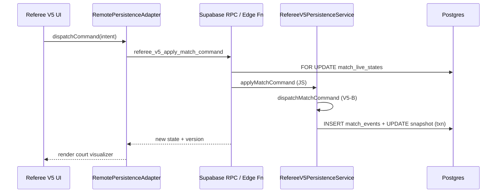

# V5-D — Persistence Architecture

**Status:** DRAFT COMPLETE  
**Feature flag:** `VITE_REFEREE_V5_ENABLED=false`

---

## 1. Architecture choice: Approach C

| Option | Verdict |
|--------|---------|
| A. Server action/API + JS engine | ✅ Supported |
| B. Edge Function + JS engine | ✅ **Recommended for Supabase** |
| C. Postgres RPC transaction shell + JS transition | ✅ **Implemented in V5-D** |

Postgres RPC performs:

- Authentication check (`auth.uid()`)
- Assignment authorization
- Row lock (`SELECT … FOR UPDATE`)
- Optimistic version / sequence check
- Idempotency cache lookup
- Append event + update snapshot (via service role from Edge Function)

**Domain transition** runs exclusively in `RefereeV5PersistenceService` using V5-B `dispatchMatchCommand`.

No second scoring implementation in SQL.

---

## 2. Data flow



---

## 3. Source of truth

| Layer | Authority |
|-------|-----------|
| `match_events` | Append-only audit + replay |
| `match_live_states.state_payload` | Performance snapshot |
| UI local state | Display only — reload on conflict |

Verification: `verifySnapshotMatchesReplay()` compares snapshot JSON to `rebuildMatchState(initial, events)`.

---

## 4. Module layout

```
src/features/referee-v5/
  persistence/
    RefereeV5PersistenceService.js   # Transactional command application
    InMemoryMatchRepository.js       # Test double / local integration
    validateCommandPayload.js
    validatePersistedState.js
    refereeV5Authorization.js
    errors.js
  adapters/
    LocalPrototypeAdapter.js         # Flag-off prototype (V5-C)
    RemotePersistenceAdapter.js      # Staging integration path
  services/
    refereeV5RpcService.js             # Supabase RPC client
```

---

## 5. Optimistic locking

Client sends `expectedVersion` + `expectedSequence`.

Server rejects with `MATCH_STATE_CONFLICT` when stale.

Client must `reloadState()` — no silent merge.

---

## 6. Idempotency

Every mutation requires `clientMutationId` + `idempotencyKey`.

Duplicate key returns cached `response_payload` with `duplicate: true`.

No second event, version bump, audit, or notification.

---

## 7. Undo

`UNDO_LAST_EVENT` uses same RPC path.

Creates `EVENT_REVERTED` append-only record; does not delete prior events.

Blocked when match locked or event already reverted.

---

## 8. Finalize

`finalizeMatchResult` transaction:

1. Auth + assignment
2. Version check + idempotency
3. Replay verification
4. Insert `match_result_revisions`
5. Lock `match_live_states`
6. Audit

**Hooks (design only in V5-D):**

- `onBracketResultApplied(matchId, revision)` — idempotent, not wired
- `onRatingEvidenceCreated(revision)` — disabled when rating flag off

---

## 9. Legacy isolation

| Module | Path | Changed |
|--------|------|---------|
| Legacy referee | `matchLiveSync.js`, token RPCs | **No** |
| Referee V5 | `src/features/referee-v5/` | New persistence layer only |

---

## 10. Test coverage (in-memory)

`tests/referee-v5/referee-v5-persistence.test.js` — **50/50 PASS**

Simulates: auth, concurrency, idempotency, undo, finalize, RLS intent helpers.

Supabase integration + RLS: **NOT RUN** (draft phase).
