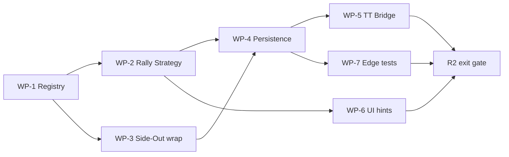

# REFEREE V5-R1C — Implementation Roadmap

**Phase:** R1-C — Architecture & Rules Spec  
**Date:** 2026-07-13  
**Status:** APPROVED (Owner 2026-07-13)  
**Next execution phase:** R2 (not started in R1-C turn)

---

## 1. Phase overview

| Phase | Scope | Status |
|-------|-------|--------|
| R1-A | Official rules research | ✅ COMPLETE |
| R1-B | Engine & code audit | ✅ COMPLETE |
| **Owner Review** | Approved decisions | ✅ COMPLETE |
| **R1-C** | Architecture spec pack | ✅ COMPLETE (this doc set) |
| R2 | Rally doubles implementation | ⏳ READY TO START (separate GO) |
| R3+ | Singles, 15/21 config tests, DreamBreaker, freeze | Future |

---

## 2. R2 scope (locked by owner)

### In

- `ScoringStrategyRegistry` + `Usap2026ProvisionalRallyDoublesStrategy`
- Wrap / alias `SideOutDoublesStrategy` (no behavior change)
- Refactor `matchStateEngine.applyRallyWin` → registry
- USAP 2026 provisional doubles, **11 / win by 2**
- Early best-of match termination
- TT provision mapping fix (P0-06)
- Legacy side-out replay explicit profile (P0-04)
- ≥25 rally tests + 43 side-out regression PASS
- Presentation hints (hide S1/S2 for rally)

### Out

- Singles rally
- DreamBreaker
- Freeze scoring
- UI format picker
- SQL migration apply (deferred — audit first)
- Deploy production

---

## 3. R2 work packages

### WP-1 — Registry foundation

| Task | Files (expected) | Depends |
|------|------------------|---------|
| Define `ScoringStrategy` interface | `engines/scoring/ScoringStrategy.js` | — |
| Implement registry | `engines/scoring/ScoringStrategyRegistry.js` | WP-1 |
| `buildRuleConfig(state)` | `engines/scoring/ruleConfig.js` | Contract |
| Wire `matchStateEngine` | `matchStateEngine.js` | WP-1, WP-2 |

**Exit:** No `if/else scoringFormat` outside registry.

### WP-2 — USAP Rally strategy

| Task | Notes |
|------|-------|
| New `Usap2026ProvisionalRallyDoublesStrategy` | Replace prototype logic |
| Position + service per R1-A sources | Not prototype |
| Side-switch milestone | Wire `applySwitchEnds` |
| Game + match completion | 11/2, early best-of |
| Deprecate direct `rallyScoringEngine` import | Keep file until tests pass |

**Exit:** Rally fixture tests green.

### WP-3 — Side-Out preservation

| Task | Notes |
|------|-------|
| Register existing side-out as strategy | Thin wrapper |
| Run 43 regression tests | Gate |
| Legacy replay profile | Explicit SIDE_OUT when `scoringSystem` absent |

**Exit:** Zero side-out regression.

### WP-4 — Persistence & replay

| Task | Notes |
|------|-------|
| Persist `scoringSystem`, `scoringVariant` on new matches | Required fields |
| Optional `ruleSetId` | Recommended |
| Replay uses registry.resolve | P0-04 fix |
| Reject new match without format | No silent fallback |

### WP-5 — Team Tournament bridge

| Task | Notes |
|------|-------|
| Map `scoringSystem` → V5 state | P0-06 |
| Map `targetScore` → `pointsToWin` | Default 11 |
| Integration tests IT-01..IT-06 | See TT integration doc |
| Verify official result 2-0 / 2-1 | Early termination |

### WP-6 — UI presentation (minimal R2)

| Task | Notes |
|------|-------|
| `getPresentationHints` consumer | Hide server 1/2 for rally |
| Rally score line format | Not `formatSideOutScoreLine` |
| Format label | USAP 2026 Rally |

**Not in R2:** full visualizer redesign.

### WP-7 — Edge & finalize

| Task | Notes |
|------|-------|
| Rally replay hash tests | P0-05 |
| Finalize path unchanged structurally | Scores only |
| No Edge engine fork | Client + shared validation |

---

## 4. Suggested R2 sequence

---

## 5. R2 exit gate

| Gate | Criteria |
|------|----------|
| G-01 | 43 side-out tests PASS |
| G-02 | ≥25 rally tests PASS |
| G-03 | TT provision IT-01..06 PASS |
| G-04 | Legacy replay IT PASS |
| G-05 | No silent format fallback |
| G-06 | Owner profile 11/2 doubles verified |
| G-07 | Documentation updated (R2 completion report) |

---

## 6. Post-R2 (not scheduled)

| Item | Phase |
|------|-------|
| pointsToWin 15/21 full test matrix | R2.1 or R3 |
| Singles rally | R3 |
| DreamBreaker format | Separate |
| Freeze / MLP | Separate profile |
| DB migration (if audit requires) | Integration |
| Production deploy | After QA |

---

## 7. Migration note

**Decision: DEFERRED** (ADR-R-006). R2 may proceed with JSON state extension. SQL apply only after data audit in integration phase.

---

## 8. References

- `V5-R1_OWNER_DECISIONS.md`
- `V5-R1C_MATCH_FORMAT_CONTRACT.md`
- `V5-R1C_RALLY_STRATEGY_DESIGN.md`
- `V5-R1C_TEAM_TOURNAMENT_INTEGRATION.md`
- `V5-R1B_RISK_REGISTER.md`

**Code changes:** DOCUMENTATION ONLY (this phase)
