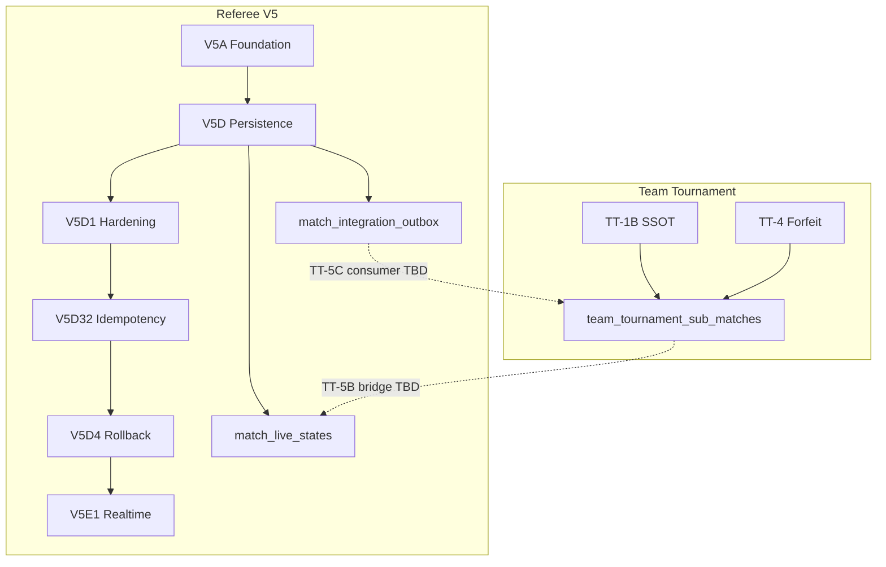

# TT-5 Preparation — Migration Dependency

**Phase:** TT-5 PREPARATION  
**Date:** 2026-07-13  
**Verification:** MCP `execute_sql` on staging + production (2026-07-13)

---

## Referee V5 migrations

| Migration | SQL file | Staging | Production | Dependency | Cần cho TT-5 |
|-----------|----------|--------:|-----------:|------------|-------------:|
| **V5A** | `PHASE_V5A_REFEREE_FOUNDATION.sql` | **Applied** | No | — | **Yes** |
| **V5D** | `PHASE_V5D_REFEREE_PERSISTENCE.sql` | **Applied** | No | V5A | **Yes** |
| **V5D1** | `PHASE_V5D1_REFEREE_HARDENING.sql` | **Applied** | No | V5D | **Yes** |
| **V5D32** | `PHASE_V5D32_IDEMPOTENCY_UNDO.sql` | **Applied** | No | V5D1 | **Yes** |
| **V5D4** | `PHASE_V5D4_ATOMIC_ROLLBACK.sql` | **Applied** | No | V5D32 | **Yes** |
| **V5E1** | `PHASE_V5E1_REALTIME_SYNC.sql` | **Applied** | No | V5D4 | **Yes** |

### Staging evidence

| Phase | Evidence |
|-------|----------|
| V5-D.2 | `docs/v5/qa-evidence/phase-v5d2/VERIFY_REPORT.json` — 12/12 PASS, 6 tables |
| V5-D.3 | `docs/v5/qa-evidence/phase-v5d3/EDGE_DEPLOY_REPORT.json` |
| V5-D.4 | `docs/v5/qa-evidence/phase-v5d4/` |
| V5-D.4.1 | `docs/v5/qa-evidence/phase-v5d41/HTTP_18_OF_18_REPORT.json` |
| V5-E1 | `docs/v5/qa-evidence/phase-v5e1/MULTI_DEVICE_SYNC_REPORT.json` |

### Staging objects confirmed (MCP)

**Tables:**

```text
match_live_states
match_events
match_game_states
match_participant_positions
match_result_revisions
match_integration_outbox
match_sync_mutations
match_disputes
match_incidents
```

**RPCs:**

```text
referee_v5_get_match_state
referee_v5_apply_match_command
referee_v5_finalize_match_result
referee_v5_commit_match_transition
referee_v5_commit_match_finalization
referee_v5_current_user_has_assignment
referee_v5_is_super_admin
referee_v5_match_state_id
referee_v5_deny_match_events_mutation
```

**Realtime (V5E1):**

- `match_live_states` member of `supabase_realtime` publication — **confirmed**

### Production (MCP)

- Zero `match_*` referee tables
- Zero `referee_v5_*` RPCs
- **Production untouched** — PASS

---

## Team Tournament migrations (integration context)

| Phase | SQL file | Staging | Production | TT-5 dependency |
|-------|----------|--------:|-----------:|-----------------|
| TT-1B | `PHASE_TT1B_TEAM_TOURNAMENT_SSOT.sql` | Applied | Applied | **Yes** — SSOT |
| TT-2B | `PHASE_TT2B_LINEUP_DEADLINE_SERVER_TIME.sql` | Applied | Partial | Indirect |
| TT-2C | `PHASE_TT2C_*.sql` | Applied | Partial | Indirect |
| TT-2D | `PHASE_TT2D_RANDOMIZE_LOCK_WORKFLOW.sql` | Applied | Partial | Indirect |
| TT-2E | `PHASE_TT2E_ATOMIC_PUBLISH_WORKFLOW.sql` | Applied | Partial | Indirect |
| TT-3 | `PHASE_TT3_LINEUP_OVERRIDE.sql` | Applied | Partial | Indirect |
| TT-4 | `PHASE_TT4_FORFEIT_WITHDRAWAL.sql` | Applied | Partial | Indirect — forfeit may interact with V5 DECLARE_FORFEIT |

### Staging-only TT tables (vs production)

```text
team_tournament_command_log
team_tournament_forfeit_events
team_tournament_dreambreaker_states
team_tournament_lineup_revisions
team_tournament_sync_mismatch
```

---

## Cross-stack dependency graph



---

## TT-5 migration work (not applied — future phases)

These are **design placeholders**, not executed in preparation:

| Object | Phase | Purpose |
|--------|-------|---------|
| Bridge column or mapping table | TT-5B | `sub_match_id` ↔ V5 `match_id` |
| Outbox consumer RPC | TT-5C | Write confirmed results to `team_tournament_sub_matches` |
| Assignment sync | TT-5B | Map TT referee role → V5 assignment helper |
| Deprecation flags | TT-5D | Disable legacy `refereeConfirmSubMatch` path |

**No SQL applied in TT-5 preparation.**

---

## Migration inventory verdict

```text
Migration inventory: PASS (audit complete)

Staging Referee V5:  V5A → V5E1 confirmed
Production Referee:  Not applied (correct)
TT staging:          Core + extended tables present
TT production:       Lag vs staging (expected)
Git SQL files:       Untracked on working tree (reproducibility gap)
```

---

## Apply order for integration environment

When TT-5 integration branch is deployed to staging:

1. Team Tournament migrations through TT-4 (already applied)
2. Referee V5 V5A → V5E1 (already applied on staging)
3. TT-5B+ integration migrations (future — not in preparation)

**Do not re-apply** V5 migrations on staging without rollback rehearsal unless object drift detected.
