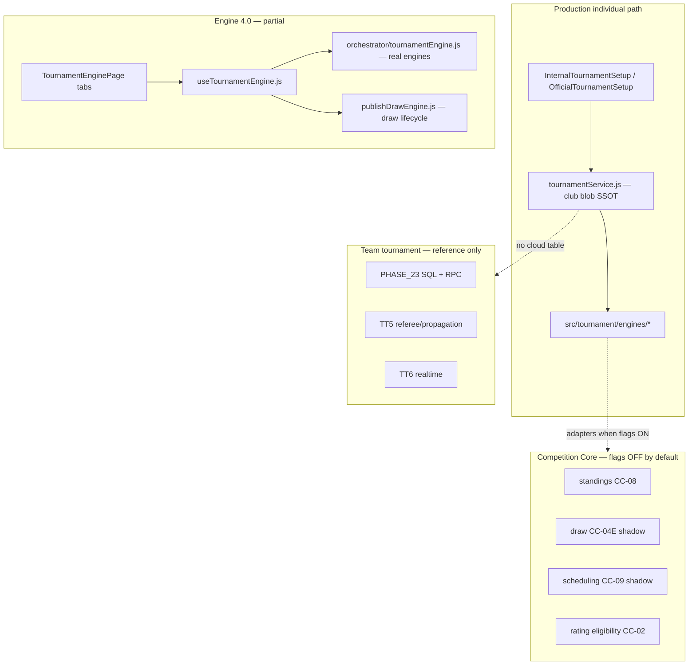

# S1 — Individual Tournament: Current State

**Sprint:** Tournament V5 Sprint 1 — Individual Tournament  
**Phase:** 1 in progress · **S1-A/B/C/D/E/F/G implemented 2026-07-14** — S1-G awaiting owner review  
**Date:** 2026-07-14  
**Branch audited:** `feature/competition-core-standardization` (working tree)  
**Audit type:** Read-only — no runtime code modified

---

## Executive summary

Individual tournaments in Pickleball Scheduler Pro are implemented primarily as **legacy club-blob flows** (`internal_tournament`, `official_tournament`), not as a dedicated V5 cloud module comparable to **team tournament** (Phase 23/25 + TT5/TT6).

| Metric | Value |
|--------|-------|
| **Current completion (functional baseline)** | **~78%** |
| **V5 Sprint 1 DoD compliance (strict)** | **~52%** |
| **Primary production path** | `InternalTournamentSetup.jsx`, `OfficialTournamentSetup.jsx` |
| **Parallel / partial path** | `TournamentEnginePage.jsx` + `src/features/tournament-engine/` |
| **Foundation layer (flag-gated)** | `src/features/competition-core/` |
| **Team reference (not individual)** | `src/features/team-tournament/`, TT5/TT6 docs |

The **~78%** figure reflects what BTC can already run end-to-end on the legacy path: create tournament → add entries → seed/draw → group RR → knockout bracket → director/referee scoring → basic standings. The remaining **~22%** is concentrated in V5 product gaps: player registration portal, registration lifecycle, Rating V5 wiring, draw/schedule publish-lock, Referee V5 + server propagation, canonical standings/tie-break in UI, and cloud reliability parity with team tournament.

---

## Architecture snapshot

---

## Modes in scope

| Mode | Constant | Status |
|------|----------|--------|
| Internal tournament | `internal_tournament` | **Primary** — single-event CLB giải |
| Official tournament | `official_tournament` | **Primary** — multi-event, open/AI balance |
| Daily play | `daily_play` | Separate product — out of S1 DoD |
| Team tournament | `team_tournament` | Out of S1 scope — reference for parity |

Event types (all six) are defined in `src/models/tournament/constants.js`: đơn nam/nữ, đôi nam/nữ, đôi nam nữ, đôi tự do.

---

## Completion by area

Scoring: COMPLETE = 100%, PARTIAL = 60%, NOT STARTED = 0%, OUT OF SCOPE = excluded.

| # | Area | Completion | Verdict |
|---|------|------------|---------|
| 1 | Khởi tạo giải | **72%** | Create + statuses + event types OK; registration window, individual eligibility/fees/regulations persistence missing |
| 2 | Đăng ký | **48%** | Organizer manual add OK; no player portal, workflow states, partner invite, payment |
| 3 | Seeding & Draw | **68%** | Core algorithms solid; Rating V5 seed, draw publish/lock, Engine UI wiring missing |
| 4 | Thể thức thi đấu | **82%** | RR + group→KO + final strong; 3rd place generation, KO-only partial; Swiss/DE contract-only |
| 5 | Lịch & sân | **65%** | Schedule generation + director courts OK; individual publish/lock, min-rest enforcement, BTC reschedule UI gaps |
| 6 | Trọng tài & kết quả | **62%** | Classic token referee + director finalize OK; Referee V5, correction workflow, server propagation missing |
| 7 | Xếp hạng & tie-break | **70%** | Legacy W/L/points/diff OK; H2H/mini-table canonical not in production UI; awards/withdrawn mock |
| 8 | Rating V5 integration | **45%** | Eligibility library complete; seed/post-match/singles not wired to individual runtime |
| 9 | UX/UI | **74%** | BTC desktop + bracket readable; player mobile portal, public page, mock config pages weak |
| 10 | Security & reliability | **68%** | Token RPC RLS OK; no individual cloud idempotency, version conflict, Referee V5 assignment scope |

**Weighted average (areas 1–10): ~78%**

---

## Key modules and files

### Initialization & lifecycle

| Module | Path | Notes |
|--------|------|-------|
| Tournament service | `src/domain/tournamentService.js` | Status machine: draft → registration → ready → active → completed / cancelled |
| Constants | `src/models/tournament/constants.js` | Event types, match stages, tournament levels |
| Create UI | `src/pages/tournament/TournamentHome.jsx`, `TournamentCreatePage.jsx` | Creates internal/official in club blob |
| V5 nav | `src/config/v5Menu/tournamentInPageNav.js` | In-page nav; `?event=` preselect not consumed by create flow |
| Official engine | `src/tournament/engines/officialTournamentEngine.js` | Multi-event, open entries, AI balance |
| Internal engine | `src/tournament/engines/internalTournamentEngine.js` | Single-event CLB flow |

### Registration (organizer-only today)

| Module | Path | Notes |
|--------|------|-------|
| Entry model | `src/models/tournament/entry.js` | Status `active` only — no pending/waitlist |
| Validation | `src/tournament/engines/validationEngine.js` | Gender, duplicate-in-event |
| Setup UI | `OfficialTournamentSetup.jsx`, `InternalTournamentSetup.jsx` | Manual add, pair builder |
| Rating verify (legacy) | `src/features/pick-vn-rating/components/TournamentRegistrationRatingPanel.jsx` | Manual BTC verify — not V5 gate |
| Config pages (team demo) | `src/pages/tournament/config/*` | Fee, regulations, age/gender — not wired to individual blob |

### Seeding, draw, formats

| Module | Path | Notes |
|--------|------|-------|
| Seed engine | `src/tournament/engines/seedEngine.js`, `src/features/tournament-engine/engines/seedEngine.js` | Elo/skill — not Rating V5 |
| Draw engine | `src/features/tournament-engine/engines/drawEngine.js` | Balanced groups, club penalty heuristic |
| Open random | `src/tournament/engines/openConditionalRandomEngine.js` | Official open draw |
| Bracket | `src/tournament/engines/bracketEngine.js`, `src/pages/tournament.bracket.logic.js` | Group→KO sync |
| Fixtures RR | `src/pages/tournament.fixtures.logic.js` | Round-robin rounds + BYE for RR |

### Schedule & courts

| Module | Path | Notes |
|--------|------|-------|
| Schedule engine | `src/tournament/engines/scheduleEngine.js` | Group stage schedule |
| Court assignment | `src/features/tournament-engine/engines/courtAssignmentEngine.js` | Importance-based |
| Director | `src/features/tournament/director/TournamentDirectorMode.jsx` | Live sync, finalize queue |
| Publish (team only) | `src/features/team-tournament/engines/publishScheduleEngine.js` | Not individual |

### Results, standings, rating

| Module | Path | Notes |
|--------|------|-------|
| Ranking (legacy prod) | `src/tournament/engines/rankingEngine.js` | 4-key sort — no H2H |
| Standings (canonical) | `src/features/competition-core/standings/` | CC-08 — `STANDINGS_V2` flag off |
| Match engine | `src/tournament/engines/matchEngine.js` | Postpone, forfeit engine |
| Referee classic | `src/pages/referee/RefereeScoreboard.jsx` | Token RPC |
| Referee V5 | `src/features/referee-v5/` | Team-wired only |
| Rating eligibility | `src/features/competition-core/rating/isMatchRatingEligible.js` | Library complete |
| Rating V5 | `src/features/pick-vn-rating-v5/` | Assessment pilot — doubles only |
| Elo on finalize | `src/domain/tournamentLifecycle.js` | Blob Elo — not Rating V5 events |

### Tests (individual-relevant)

27 files matching `tests/tournament*.test.js` — core coverage on engines, bracket, seeding, open doubles/random, director, internal flow. Team-only: `tournament-phase25.test.js`. Competition-core: `competition-core-standings-cc08.test.js` (#31 individual mapper).

---

## Status vocabulary mapping

| Owner checklist | Code constant | Gap |
|-----------------|---------------|-----|
| draft | `TOURNAMENT_STATUS.DRAFT` | Aligned |
| open (registration) | `REGISTRATION` | Partial — no registration window gating |
| closed (registration) | *(none)* | **Missing explicit status** |
| in-progress | `ACTIVE` | Semantic overlap only |
| completed | `COMPLETED` | Aligned |
| cancelled | `CANCELLED` | Aligned |

---

## Team tournament parity gap (reference)

Team tournament has cloud SQL (`docs/v5/PHASE_23_TEAM_TOURNAMENT.sql`), eligibility/fees engines, TT5 referee integration, TT5-C result propagation, TT5-D correction, TT6 realtime. **None of these are ported to individual tournaments.** S1 must either generalize team patterns or build an `individual-tournament` cloud module.

---

## Dependencies (read-only)

| Dependency | Status for S1 | Notes |
|------------|---------------|-------|
| Competition Core CC-01–CC-10 | ✅ Merged on integration branch | Flags default OFF |
| Referee V5 | ✅ Staging for team | Individual out of TT-5 scope per handoff |
| Rating V5 | ⚠️ Doubles assessment pilot | Singles blocked (`SINGLES_NOT_IMPLEMENTED`) |
| Identity RBAC | ✅ | `TOURNAMENT_VIEW/UPDATE`, `DIRECTOR_USE`, `MATCH_UPDATE` |
| Private pairing rules | 🔄 PR5 in progress (untracked) | Not blocking S1 pilot |

---

## Audit methodology

1. Codebase search across `src/pages/tournament/`, `src/tournament/engines/`, `src/features/tournament-engine/`, `src/features/competition-core/`, `src/features/referee-v5/`, `src/features/pick-vn-rating-v5/` (read-only).
2. Test inventory: `tests/tournament*.test.js`, `tests/competition-core-*.test.js`.
3. Docs cross-reference: team tournament TT5/TT6 audits, competition-core CC audits, referee-v5 handoff.
4. No Supabase schema changes applied; staging/production MCP not invoked (audit-only).

---

## Next step

Owner review of gap matrix → approve implementation batches (S1-A … S1-H) in `S1_INDIVIDUAL_IMPLEMENTATION_PLAN.md`.
