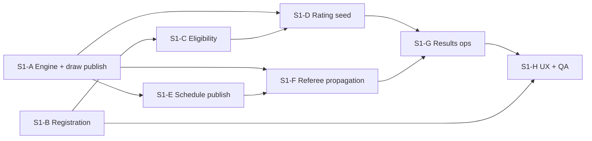

# S1 — Individual Tournament: Implementation Plan

**Sprint:** Tournament V5 Sprint 1  
**Date:** 2026-07-14  
**Prerequisite:** Owner approval of gap matrix (Phase 1 complete)

---

## Strategy

Port proven **team tournament patterns** (Phase 23, TT2E, TT5, TT6) to **individual match granularity** rather than rebuilding from scratch. Keep **club blob** as fallback until cloud module lands; prefer **incremental vertical slices** over horizontal layer rewrites.

**Non-goals this sprint:** Swiss, Double Elim, TV/livestream, public API, team tournament changes, Rating V5 file edits (consume only).

---

## Batch overview

| Batch | Theme | Closes gaps | Est. effort |
|-------|-------|-------------|-------------|
| **S1-A** | Engine wiring + draw publish foundation | S1-GAP-308, 303, 305, 304 | 1 week |
| **S1-B** | Registration lifecycle (blob-first) | S1-GAP-002, 004, 005, 006, 012 | 1.5 weeks |
| **S1-C** | Eligibility + fees + config pages | S1-GAP-003, 009, 010, 007, 008 | 1 week |
| **S1-D** | Rating V5 seed + standings canonical | S1-GAP-301, 081, 076, 070, 071 | 1 week |
| **S1-E** | Schedule publish + min rest | S1-GAP-502, 501, 503, 505 | 1 week |
| **S1-F** | Referee + result propagation | S1-GAP-061, 062, 063, 067, 069, 100 | 2 weeks |
| **S1-G** | Results ops + awards + withdrawal | S1-GAP-064, 072, 074, 401, 068 | 1 week |
| **S1-H** | UX polish + player portal + QA | S1-GAP-091, 092, 090, 093, 094, 101, 102 | 1.5 weeks |

**Optional / parallel:** S1-GAP-001 (cloud module) — start design in S1-A; implement if owner prioritizes multi-device over blob-first pilot.

---

## S1-A — Engine wiring & draw publish

### Goals
- Tournament Engine UI runs real seed/draw/schedule engines
- Draw publish/lock lifecycle exists for individual

### Tasks
1. Replace `runPlatformEngineWorkflow` calls in `useTournamentEngine.js` with `runSeedEngine`, `runDrawEngine`, `runScheduleEngine` from `orchestrator/tournamentEngine.js`.
2. Add `settings.draw.{publishedAt, publishedBy, snapshot}` on tournament blob.
3. Implement `publishDrawEngine.js` (adapt `TEAM_TOURNAMENT_TT2E_ATOMIC_PUBLISH.md` pattern).
4. Guard redraw: block when `publishedAt` set unless owner `forceRedraw` with audit.
5. Extend `engineRunLog.js` / workflow history for BTC seed/draw edits (actor, diff).

### Files (primary)
- `src/features/tournament-engine/hooks/useTournamentEngine.js`
- `src/features/tournament-engine/orchestrator/tournamentEngine.js`
- `src/pages/tournament/engine/tabs/EngineSeedTab.jsx`
- New: `src/tournament/engines/publishDrawEngine.js`

### Exit
- `npm test` — `tournament-engine.test.js` PASS
- Manual: publish draw → bracket immutable

---

## S1-B — Registration lifecycle

### Goals
- Registration window + status `ready` = closed
- Entry workflow states
- Player self-registration (MVP)

### Tasks
1. Extend `TOURNAMENT_STATUS` or add `registrationClosedAt` on settings.
2. Extend `entry.js`: `pending | approved | rejected | waitlisted | cancelled`.
3. Build `registrationEngine.js` — approve, reject, waitlist promote, cancel.
4. Player registration page (mobile-friendly) — singles + doubles pair form.
5. Partner invite: generate token link; confirm binds second player.
6. Fix nav preselect: read `?event=` on `TournamentCreatePage` / type individual hub.
7. Registration lock timestamp before draw.

### Files (primary)
- `src/models/tournament/entry.js`
- `src/domain/tournamentService.js`
- New: `src/features/individual-tournament/engines/registrationEngine.js`
- New: `src/pages/tournament/IndividualRegistrationPage.jsx`
- `src/config/v5Menu/tournamentInPageNav.js`

### Exit
- New tests: `tests/individual-tournament-registration.test.js`
- E2E: register → approve → lock

---

## S1-C — Eligibility, fees, regulations

### Goals
- Config pages persist to individual tournament blob
- Hard gates at registration

### Tasks
1. Generalize `eligibilityEngine.js` from team — accept individual event context.
2. Wire `TournamentEligibilityPage`, `TournamentAgeRulesPage`, `TournamentGenderRulesPage`, `TournamentFeePage`, `TournamentRegulationsPage` to selected tournament (not demo team data).
3. Integrate `validateEligibility` + schedule conflict detector as registration hard gate.
4. Wire `TournamentRegistrationRatingPanel` → Rating V5 eligibility when flag on.

### Files (primary)
- `src/features/team-tournament/engines/eligibilityEngine.js` → extract shared
- `src/pages/tournament/config/*.jsx`
- `src/features/competition-core/constraints/`

### Exit
- Extend `tournament-phase25.test.js` patterns for individual
- Config round-trip test

---

## S1-D — Rating V5 seed + canonical standings

### Goals
- Seed uses Rating V5 for doubles events
- Production UI uses CC-08 standings

### Tasks
1. Add `ratingV5SeedAdapter.js` — read profile `display_rating`, `reliability_score`.
2. Update `seedEngine.js` + `tournamentEngineAdapter.js` to prefer V5 when available.
3. Enable `STANDINGS_V2` adapter path in `OfficialTournamentSetup`, `InternalTournamentSetup`, `BracketGroupStandingsPanel`.
4. Remove legacy-only sort from production path (keep fallback behind flag).

### Files (primary)
- `src/features/tournament-engine/engines/seedEngine.js`
- `src/features/competition-core/standings/adapters/standingsRuntimeAdapter.js`
- `src/tournament/engines/rankingEngine.js` (delegate)

### Dependencies
- Rating V5 doubles profiles on staging
- **Do not edit** `src/features/pick-vn-rating-v5/` — consume RPC/API only

### Exit
- `competition-core-standings-cc08.test.js` #31 PASS in UI path
- Seeding test with V5 fixture

---

## S1-E — Schedule publish & min rest

### Goals
- Individual schedule publish/lock
- Min rest enforced in primary schedule engine

### Tasks
1. Generalize `publishScheduleEngine.js` for individual match lists.
2. Replace `TournamentPublishSchedulePage.jsx` demo with real tournament loader.
3. Add `minRestMinutes` to tournament settings; enforce in `scheduleEngine.js` per participant.
4. BTC match ops: reschedule court/time in director or setup (minimal panel).

### Files (primary)
- `src/features/team-tournament/engines/publishScheduleEngine.js`
- `src/tournament/engines/scheduleEngine.js`
- `src/pages/tournament/TournamentPublishSchedulePage.jsx`

### Exit
- Publish schedule → director sees stable slots
- Min rest violation → schedule error

**Status (2026-07-14):** ✅ Implemented — see `S1E_IMPLEMENTATION_REPORT.md`. STOP FOR OWNER REVIEW.

---

## S1-F — Referee & result propagation

### Goals
- TT5-grade reliability for individual matches
- Referee V5 or hardened classic path

### Tasks
1. Design SQL: extend `referee_assignments` or add `individual_match_assignments` (mirror TT5-D).
2. Replace mock `TournamentRefereeAssignPage` with real assignment UI.
3. Bridge individual finalize → outbox → standings recompute (adapt TT5-C).
4. Port correction workflow RPCs (TT5-D) for individual `match_id`.
5. Server idempotency on finalize command log.
6. Wire Referee V5 page for individual events OR document classic + assignment row hybrid.

### Files (primary)
- `docs/v5/team-tournament/tt5/` (reference)
- `src/features/referee-v5/services/refereeV5RpcService.js`
- `src/tournament/engines/tournamentDirectorEngine.js`
- New SQL migration in `docs/v5/tournament-final/sprint-1-individual/sql/`

### Exit
- Staging: two devices finalize same match → single standings update
- Correction request → review → recompute PASS

---

## S1-G — Results ops

### Goals
- Walkover, withdrawal, third place, awards

### Tasks
1. Individual walkover UI (adapt `TeamForfeitDialog`).
2. Individual withdrawal engine + wire `TournamentWithdrawalPage`.
3. Generate third-place match in `bracketEngine.js` when `settings.includeThirdPlace`.
4. Wire `TournamentAwardsPage` to individual standings.
5. Deepen audit: link to Referee V5 event log when available.

### Exit
- Forfeit → standings correct
- Awards preview matches bracket final

---

## S1-H — UX polish & QA

### Goals
- Player mobile portal
- Remove mock traps
- Pilot QA sign-off

### Tasks
1. Individual player portal (`/tournament/my` or mobile route).
2. Public read-only bracket route (post-publish) — P1 if timeboxed.
3. Fix standings labels; empty/loading/error on all S1 pages.
4. Realtime: enable polling fallback parity for individual referee.
5. Optimistic version on tournament blob save.
6. Execute full S1 test plan; file evidence JSON.

### Exit
- `v5-menu-audit.test.js` extended for individual
- Owner staging smoke checklist signed

---

## Dependency graph

---

## Risk register

| Risk | Mitigation |
|------|------------|
| Rating V5 singles not ready | Owner waiver; pilot doubles-only |
| Cloud module scope creep | Blob-first pilot; S1-GAP-001 optional track |
| Referee V5 production objects missing | Staging-only pilot; classic fallback |
| Breaking legacy internal tournaments | Feature flag `VITE_INDIVIDUAL_TOURNAMENT_V5_ENABLED` |
| Team tournament regression | No edits to team RPC paths; shared engines behind adapters |

---

## Rollback

Each batch ships behind feature flag. Rollback = disable flag + revert SQL migration (document per batch in `sql/ROLLBACK_S1_*.sql`).

---

## Owner decision points

1. **Blob-first vs cloud-first** for registration (S1-B vs S1-GAP-001)
2. **Referee V5 vs classic+assignments** for pilot (S1-F)
3. **Singles waiver** for Rating V5 (S1-D)
4. **Public page** in or out of pilot (S1-H)

Stop for owner review after Phase 1 (this document set).
